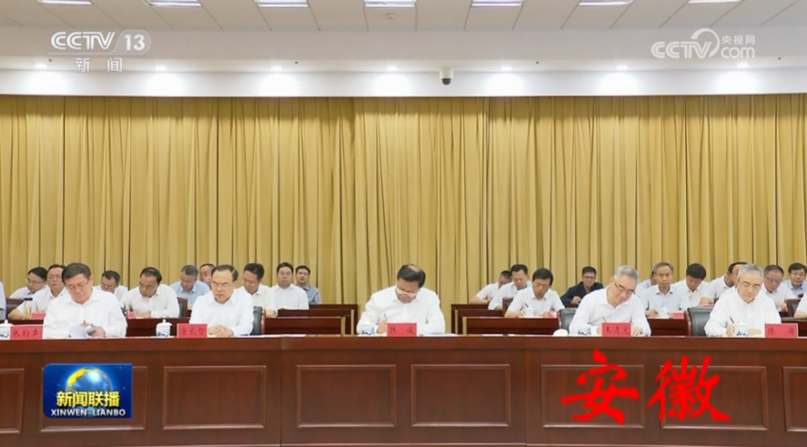
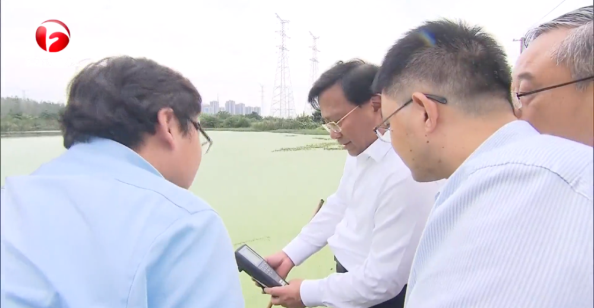
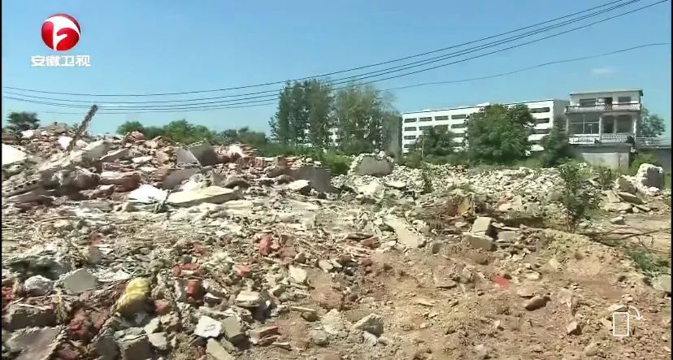

# 安徽省委书记临时停车暗访：蹲下身现场检测后，面色凝重提要求

**撰文 | 余晖**

据《安徽新闻联播》报道，8月30日至31日，安徽省委书记韩俊调研期间外出暗访。据报道，他暗访的地点是安徽滁州市，聚焦的重点是生态环保。

就在他暗访的前一天，8月29日，安徽省委、省政府在合肥召开全省生态环境保护大会。

**压力尚未根本缓解**

生态环保问题，一直是中央关注的焦点问题之一。

今年7月17日至18日，全国生态环境保护大会在北京召开。

这是时隔五年之后，我国再度召开全国生态环境保护大会。上一次全国生态环境保护大会召开的时间是2018年5月18日至19日。

在今年的大会上，中共中央总书记、国家主席、中央军委主席习近平对我国目前的环保形势作了最新判断：

**我国生态环境保护结构性、根源性、趋势性压力尚未根本缓解** 。

我国经济社会发展已进入加快绿色化、低碳化的高质量发展阶段，生态文明建设仍处于 **压力叠加、负重前行** 的关键期。

习近平对地方各级党委和政府提出了要求。

“地方各级党委和政府要坚决扛起美丽中国建设的政治责任，抓紧研究制定地方党政领导干部生态环境保护责任制，建立覆盖全面、权责一致、奖惩分明、环环相扣的责任体系”。

《新闻联播》画面显示，这次会议以电视电话会议形式召开，各省区市和计划单列市、新疆生产建设兵团党政主要负责同志等参会。

在安徽，安徽省委书记韩俊、省长王清宪、省政协主席唐良智等通过视频参会。

**全省部署后，省委书记暗访**

8月29日上午，安徽省委、省政府召开了全省生态环境保护大会。

出席会议的有安徽省委书记韩俊、省长王清宪、省政协主席唐良智、省委副书记程丽华等。

会议现场还播放了2023年第一、二季度长江（安徽）经济带生态环境警示片。

韩俊分析了安徽省生态环境保护工作面临的形势——

要清醒认识到，安徽省生态环境保护 **历史欠账尚未还清** ，稳中向好的基础 **还不牢固** ，量变到质变的拐点 **尚未到来**
，仍处于压力叠加、负重前行的关键期，处于 **补齐生态保护欠账、解决突出生态环境问题的攻坚期** 。

他提到，要开展群众“家门口”问题专项整治、突出问题整改质量提升、环境基础设施补短板、垃圾分类以及生态环境风险隐患排查整治5个专项行动，解决生态环境领域顽瘴痼疾。

8月30日至31日，安徽省委书记韩俊赴滁州市调研先进光伏和储能产业发展和文物保护、文化传承发展等情况。

调研期间，他暗访了生态环保问题。

一同参加暗访的还有安徽省委常委、秘书长、政法委书记张韵声，安徽省委常委、副省长费高云。

**蹲下来现场检测**

滁州市南谯区腰铺镇腰铺社区的二陈大塘黑臭水体问题，群众反映强烈。 **8月30日下午，韩俊在这里临时停车，现场勘查。**

《安徽新闻联播》还披露了现场画面。

韩俊现场勘查， **发现水塘长满浮萍，由于生活污水处理不到位、造成水体富营养化严重，水塘周边存在农药废弃物、生活垃圾倾倒现象，环境问题突出** 。

韩俊与路过的群众交谈，询问“水塘臭了几年”“生活污水是怎么处理的”。

随后，他蹲在塘边仔细察看，并现场检测水质。

他面色凝重地说， **要把解决突出生态环境问题作为民生优先领域，有利于百姓的事再小也要做，危害百姓的事再小也要除。**

他说，要统筹做好农村改厕、垃圾集中收集处理和污水处理等工作，建立定期调度机制，拉单挂账、倒排工期、压实责任，以“一任接着一任干”的韧劲，
**坚决啃下农村环境治理“硬骨头”。**

之后，他走进社区，与当地居民面对面拉家常、话家事，对群众集中反映的急难愁盼问题，当场要求地方和有关部门梳理出清单，尽快研究解决。

8月31日上午，韩俊随机到凤阳县府城镇夫子郢村， **发现路面坑洼不平、破损严重，建筑垃圾随意堆放，村户普遍使用旱厕，村民房屋外生活污水直排** 。

韩俊挨户察看排污管道设施，并与当地村民亲切交谈，仔细询问他们的收入、住房、医保等情况。

他指出，要以实施“千村引领、万村升级”工程为引领， **高标准推进村庄清洁行动，推进农村厕所革命**
，积极推进生活污水治理设施扩容提标，完善垃圾收运处置体系，持续改善农村路容路貌，动员群众参与、形成治理合力，以环境的干净整洁提升农民幸福指数，加快建设彰显徽风皖韵的宜居宜业和美乡村。

他还提到， **对于突出生态环境问题，各级党政主要负责同志要亲自现场核查，亲自包保推动解决。**

**资料 ｜ 新华社 安徽日报 安徽新闻联播 央视等**

**【版权声明】本文著作权归政知新媒体独家所有，未经授权，不得转载。**

