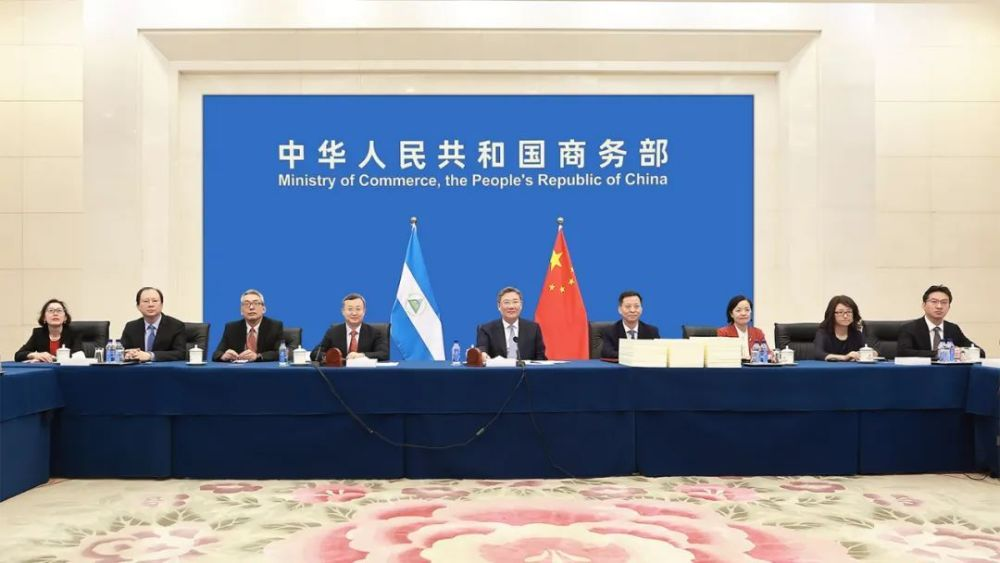

# 尼加拉瓜与中国签署自贸协定，自此成中国第28个自贸伙伴

【环球时报报道 记者
倪浩】8月31日，中国和尼加拉瓜正式签署自贸协定。这是中国对外签署的第21个自贸协定，尼加拉瓜自此成为中国第28个自贸伙伴，也是继智利、秘鲁、哥斯达黎加、厄瓜多尔之后中国在拉美地区的第5个自贸伙伴。

_中国与尼加拉瓜正式签署自贸协定 图源 商务部_

商务部部长王文涛与尼加拉瓜总统投资、贸易和国际合作顾问劳雷亚诺当天分别在北京和马那瓜代表中尼两国政府，通过视频方式签署《中华人民共和国政府和尼加拉瓜共和国政府自由贸易协定》。协定签署后，双方将分别履行各自国内程序，推动协定早日生效实施。

商务部国际司负责人表示，中尼两国经济互补性强，贸易投资合作潜力巨大。中尼自贸协定有利于持续释放中尼两国复交红利，将为两国企业创造更好的营商环境，进一步激发双边贸易投资合作潜力，推动中尼经贸合作进一步提质升级，不断增进两国人民和企业福祉。

尼加拉瓜“19数字”信息平台报道称，代表尼政府与中国签署协定的劳雷亚诺表示，尼中自贸协定的签署对尼加拉瓜是一个历史性事件，意味着从此将打开一个巨大市场的大门，与中国的公司和企业家们建立广泛的联系。一同出席签署活动的尼财政和公共信贷部部长阿科斯塔表示，中国经济增长速度快、人口多、市场广阔，与中国签署自贸协定极具经济价值。他今年6月曾表示，与中国的自贸协定可以使尼国内生产总值多增长至少2个百分点。

根据商务部发布的信息，中尼自贸协定涵盖货物贸易、跨境服务贸易和投资、规则等领域。在货物贸易关税减让方面，中尼双方最终零关税产品占总体税目比例均超过95%。协定生效后，尼产的牛肉、虾、咖啡、可可、果酱、花生等产品进入中国市场时，关税将逐步降至零；同时，中国产的汽车（包含新能源汽车）、摩托车、电池、光伏组件、服装和纺织品等大多数产品进入尼方市场时，关税也将逐步削减取消。

商务部表示，中尼自贸协定表现出诸多特色和亮点，创造了多个“首次”。例如，双方在技术性贸易壁垒章节合作条款中纳入计量标准领域合作，这在中国与拉美国家自贸协定中尚属首次。

商务部研究院研究员白明告诉《环球时报》记者，2021年实现复交后，双方扫清政治因素的阻碍，于2022年7月启动自贸协定谈判，一年内完成谈判，然后签署协定，经贸关系与外交关系形成了良性互动。这将大大推动两国贸易投资自由化和便利化，进一步释放两国经贸合作的广阔空间。

