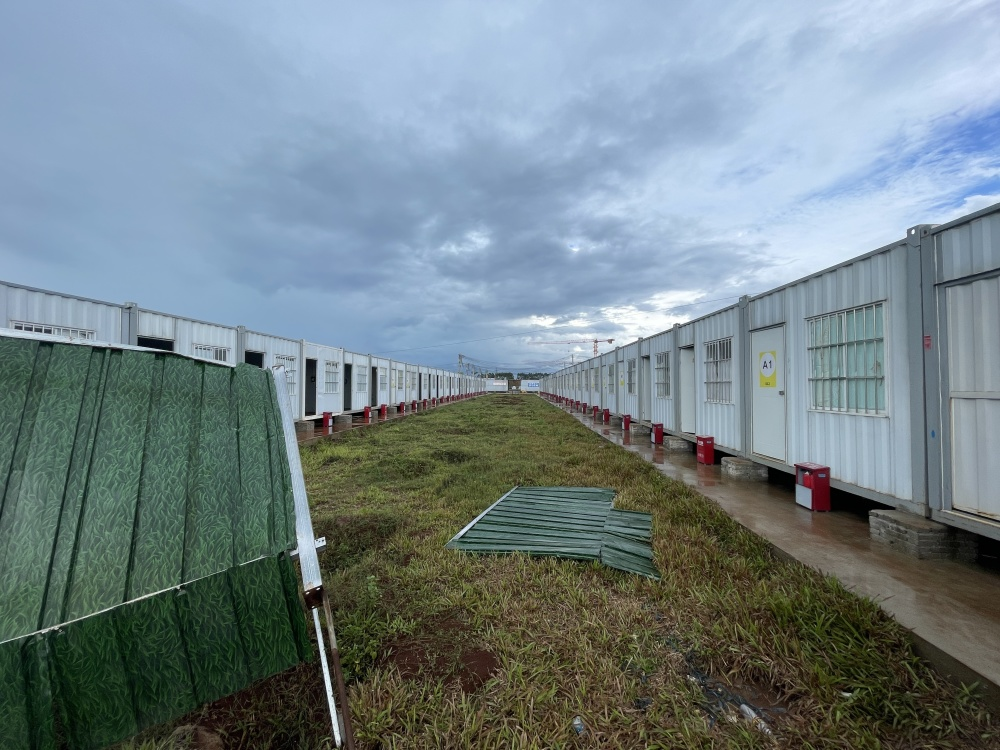
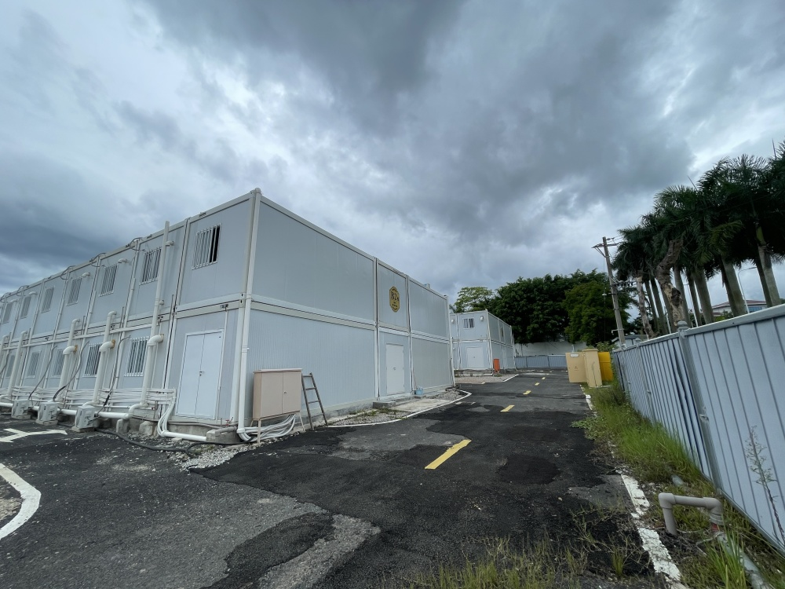
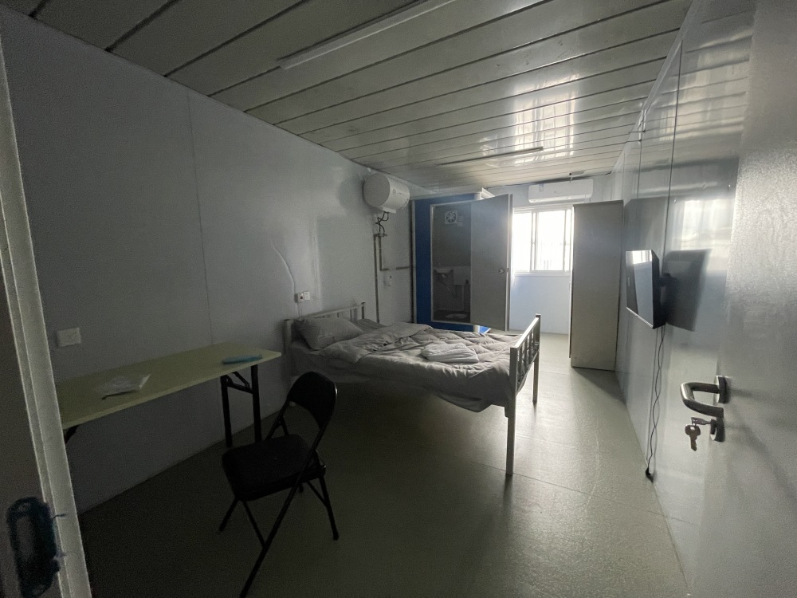

# 拆除还是改造？闲置的方舱医院如何处理，仍是地方政府面前待解的难题

界面新闻记者 | 李科文 陈杨

界面新闻编辑 | 谢欣

不久前，在海南省人大召开常委会会议，海南省审计厅厅长刘劲松于会上披露，在对2022年海南全省疫情防控资金安排管理使用绩效进行审计后发现，存在防疫物资和相关设施保管不善等问题。

刘劲松报告称，9个方舱医院拆除的设备材料物资露天堆放，造成损毁浪费；5个市县5586间隔离板房闲置，涉及3.70亿元，1个县隔离板房配套的196台空调和电视丢失；9个市县的665个核酸采样亭闲置，可确认价值2938.04万元；12个市县部分防疫物资已过期或即将过期，可确认价值6124.53万元。

方舱医院与隔离点在疫情期间发挥了集中收治与隔离的作用。特别是方舱医院，作为平台的功能承接着为了最大限度实现对患者的应收尽收、应治尽治的要求，实现了构建疫情防控救治工作与正常医疗体系之间的平衡。

不过，现存的大部分新建方舱医院是2022年11月后以集中搭建的活动板房形式出现的。随着疫情防控政策调整，这些方舱医院刚建设完毕，有的甚至都未曾投入使用就被“遗弃”。

如何处理这些闲置的方舱医院，面临着法律与国有资产流失两大难题，摆在地方政府面前的，依然是一个待解的难题。

闲置的方舱如今怎么样了？

八月的海南岛，阶段性的季风雨连绵倾泻而下。

雨后，有初起的薄雾，环岛的公路慢慢更暗下来。车窗外的树影也变得更加浓密。四周望不到像内陆地区的连绵葱绿的山岭，取而代之是一片片密密麻麻，又难以具名的热带作物。

从海口市出发前行超过60公里，能看见留有被雨水冲刷痕迹的白色活动板房排列整齐地凸起。整个区域内铺设了水泥路，车辆沿着规划的指示线能顺利通行，雨水会顺着地势流入周边的泥地，泥泞中会留下行人足迹的印记。

相当于10个标准足球场大小的临高县金牌港方舱医院就建在这里。

_临高县金牌港方舱医院_

据新华社海南频道报道，临高县集中隔离点应急项目占地面积约100亩，新建集装箱板房1200间，其中200套医疗配套用房，提供同时满足1000人的集中隔离需求，设有医疗室、会议室、备餐室等场所，功能齐全，每间屋内配备空调、热水器、整体卫浴、无线网络、全套床品。

临高县金牌港方舱医院最初的设想是为了在疫情期间尽可能接纳和治疗更多的新冠患者。现实是，该隔离点投入使用没多久，便因防控政策调整而休舱。

虽然目前，临高县金牌港方舱医院由临高县旗下的国资平台公司金牌港园区开发建设有限公司代理运营，但界面新闻记者在现场观察到，活动板房和配套设施仍大面积的空置。

推开一些没有锁的门可以发现，这些板房隔间的内部空间不大，有的地面上还散落着烟头，在盛夏的海南混合着微弱的潮湿味道。或许曾有一些人在此暂时栖身，隔间里的时间仿佛依旧定格在某个瞬间。

一位临高县金牌港园区开发建设有限公司相关负责人表示，现在在临高县金牌港方舱医院入住的有拆迁户、拆迁安置小区的建设单位，还有一个职业技术教育机构。该项目内的单间以300元/月向外公开出租，以月度缴纳租金，按半年起为期签合同。入住后，租户自己拉电表，正常缴纳电费即可。

实际上，在海南岛内兴建的方舱医院均以活动板房的形态搭建、且配套齐全，它们大多位于远离城市核心的广阔平地。更早之前，在这亩亩空地上，有村民种植的热带经济作物、有零星凸起的坟包；也有已被规划，但长满杂草一直待开发的工业用地。

它们是在海南全省在疫情期间深挖隔离点资源期间被选中的。2022年8月同样是一个盛夏，海南省第五十三场新冠肺炎疫情防控工作指挥部新闻发布会上宣布，海南采取三项措施加强隔离点储备和管理。其中，儋州、东方、万宁、临高、乐东等市县启动板房建设。

据《海南日报》当时的报道，海南省协调各市县全力以赴挖掘酒店、学校、安居房、养老公寓等隔离点资源，来确保“应转尽转、应隔尽隔”。同时根据疫情发展情况，及时启动了板房和方舱医院的建设，海口、三亚和儋州等地，有12所方舱医院已经相继投入使用。

如今，像临高县金牌港方舱医院这样，尚有代理公司管理运营的项目并不是普遍现象，就在位于离临高县金牌港开发区南边60多公里的儋州市，其辖区内的部分方舱医院项目不仅从未实际投入使用，至今也无人管理运营，属于名副其实的被遗弃了。

位于儋州市体育馆的西侧的“一场两馆”应急集中隔离点便是其中之一，建设场地没有临高县金牌港方舱医院宽阔，但建设的做工与相对应的配套设施更为精细。

沥青路铺满了“一场两馆”应急集中隔离点的整个院区，成品钢结构的拼装集装箱整齐排列，建筑层数从地上1至2层逐级而起。屋顶积蓄的雨水时而滴落，走过集装箱内的行廊需略加留意以免滑倒。隔间内的空调、热水器和床上用品等配套设施没有使用痕迹，地面上还摆放着未拆开包装的热水壶。

_儋州市“一场两馆”应急集中隔离点_

据儋州广播电视台微信公众号“这里是儋州”，“一场两馆”应急集中隔离点的项目总占地面积33193平方米，总建筑面积17198.71平方米，箱体总数量为952套，其中隔离标准间数量为600间。

实际上，儋州市“一场两馆”应急集中隔离点先开工后补建设流程。据儋州政府官网，“一场两馆”应急集中隔离点项目的初步设计及概算的批复是于2023年2月17日才核准的。初步设计及概算文件显示，该项目总投资为7773.21万元，其中建安工程费为6701.87万元，工程建设其他费为844.94元，预备费为226.40万元。

界面新闻统计儋州市政府的公开信息粗略估计，在儋州市，与“一场两馆”应急集中隔离点相同的方舱医院共有4座方舱医院，除此之外海包括位于儋州滨海新区和洋浦地区的儋州市一号方舱医院、二号方舱医院和三号方舱医院。

问及这些方舱医院后续运营管理如何处理。儋州市政府相关工作人员称，不久后它们都将被拆除，场地将被复原。

善后面临两大困难

关于方舱医院后续该如何管理与处置这一问题，目前似乎还是一个死结。

根据国务院联防联控机制2022年12月发布的规定，各地要按照人口规模，将符合条件的方舱医院提标改造为亚（准）定点医院，其他方舱医院仍然保留。对此，据《财新》的报道，广州市一名卫健系统官员表示，这意味着方舱医院不能轻易拆除。

“遗留问题怎么去解决，实际上是看各个地方政府对中央文件理解程度与执行力。不太可能出现拆不了的情况。”北京圣运律师事务所管委会主任王有银律师表示，各地政府可能考虑的是建设成本的问题。

此外，方舱医院在一建一拆之间，不仅要考虑是否符合法律规定，还要考虑是否会出现国有资产流失。

_临高县金牌港方舱医院的隔间内_

王有银介绍，这涉及到方舱建设的资金来源和土地的使用方式。占地建设的方舱医院有政府出资的，也有通过行政协议方式由社会资金共建。其中，政府出资为建设主体的多是行政事业单位，建筑物属于国有资产。社会资金共建所有权和使用权主要看行政协议的约定。

此外，占地的情形也主要分为两类，一类是临时征用建设占地，一类是经过征收程序后进行的长久建设占地。

因此，不同占地类型的方舱在后期处置时，也会有不一样的方案。王有银表示，占用临时用地的方舱医院需要严格遵循《自然资源部关于规范临时用地管理的通知》的规定，报批使用土地，使用期限一般不超过两年，临时用地期限届满，需要拆迁，使用部门还要落实恢复土地原状责任。

而经过征收程序后用于方舱医院使用的土地在后续的拆除或者改造中，则需要履行国有资产处理及用地、规划等审批手续。针对方舱的改造、处分应当参照《行政事业性国有资产管理条例》《行政单位国有资产管理暂行办法》及地方性规定等依法履行审批手续进行具体处理。

王有银表示，对于利用政府储备用地建设“方舱”的情况，一般采用划拨方式，如果拆除的话，政府可以收回国有土地使用权，土地恢复原状后交由原储备机构。如果不拆除，而是改变使用用途，则需要根据具体用途采用继续划拨或者补交土地出让金以国有土地出让的方式进行。

实际上，方舱医院按照使用场景与期限大致可以分为三类，分别是临时应急救治方舱医院、半永久式方舱医院与永久性方舱医院。建设方式又分为改造和新建两种。

据民生证券研报，改造和新建分别对应每个方舱的床位价造价为3.7万和9.3万元/个，若方舱医院建设方式中新建和改造各占比一半，一个床位建设费将达到6.5万元/个。

曾有参与方舱建设的相关负责人向界面新闻介绍，方舱医院建设的成本及耗费依据现实情况与后续用途而定，目前公开资料显示的单床位建造成本从三万到十几万不等，因其包括许多可选配的自动化的诊疗设备及辅助智能化设备，因此无法简单估算其单床位造价。

据国卫办规划函﹝2022﹞254号，关于印发方舱医院设计导则（试行）的通知，其中指出方舱医院应统筹考虑日常和应急使用需要，合理确定使用功能。平时可做日常设施使用，应急时能够快速、顺畅转化为医疗收治设施，做到平急结合，应急优先。

现在来看，大部分以活动板房结构搭建的方舱医院，如今未能实现承接平急结合的场景要求。

 _儋州市“一场两馆”应急集中隔离点的隔间内_

王有银表示，虽然当初建设方舱时，其是为永久设施还是临时设施还未可知，但一旦建成后，如今可能会有一部分搬迁、一部分拆除、还有一部分转正的情况。例如建了方舱医院但未投入使用，拆除又显得有些浪费，可以选择出让给其他医院。对于政府建设的方舱医院，财产处置会较为复杂，必须进行立项更改或者规划更改。

若原本土地用途为医疗卫生用地，现在建的方舱医院又用于医院，用地性质不会改变。如果交给公立医院使用，可能政府会发布文件将其划拨给公立医院。如果交给民营医院使用，用地性质也不会改变，政府会通过拍卖等国资委程序进行处理。

而若土地原本用于商业或者公共绿地、住宅，拆除后必须恢复原状。像位于儋州滨海新区和洋浦地区的儋州市一号方舱医院、二号方舱医院和三号方舱医院其总造价高达2.03亿元。到了2023年8月，儋州市又公开招标1340万元拆除。该方舱医院的占用地便是该区的规划用地。

王有银表示，若不拆除并需要继续使用，首先需要规划部门和土地主管部门对土地性质与用途进行变更。比如出售给企业用作仓库，则被视为工业用地。政府在这方面主要依据土地利用总体规划进行判断，并依法履行各项程序，如有必要，还需要进行听证会，以听取附近相关利害关系人的意见。

