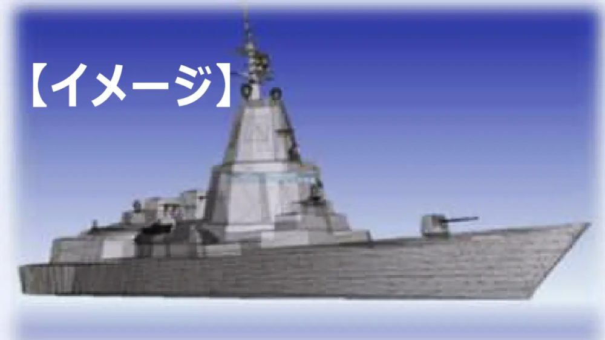
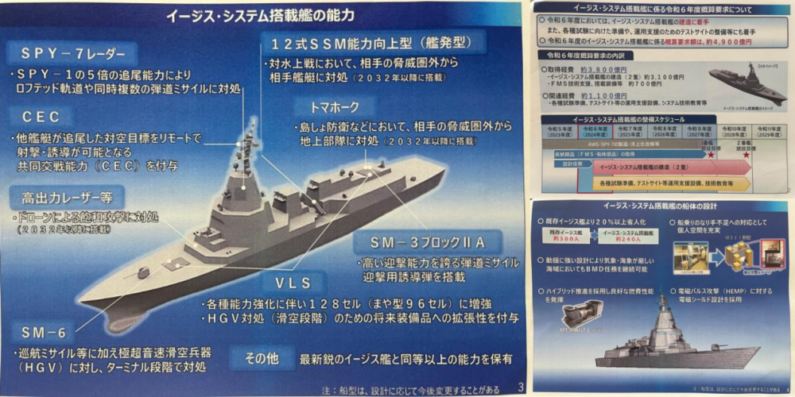
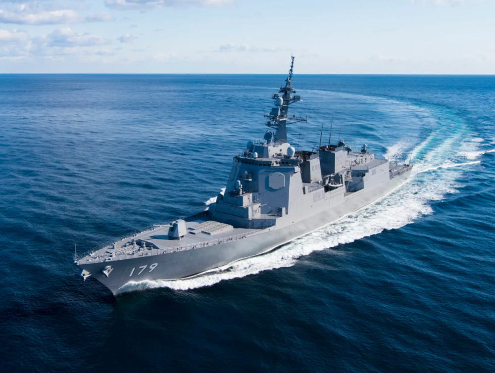
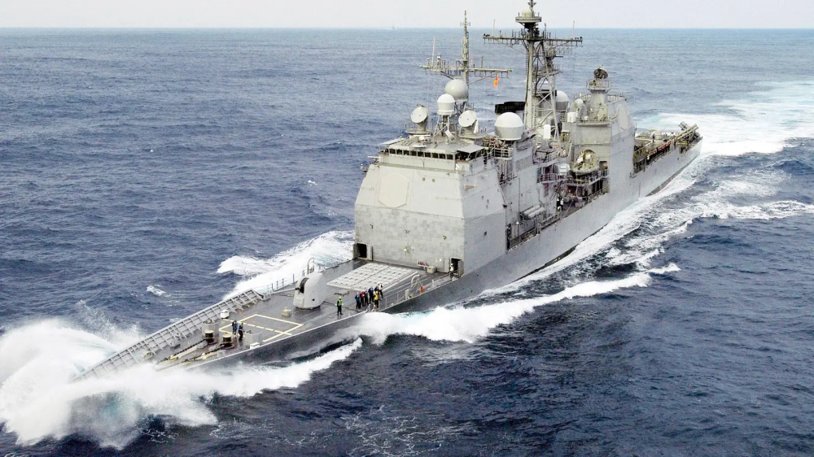
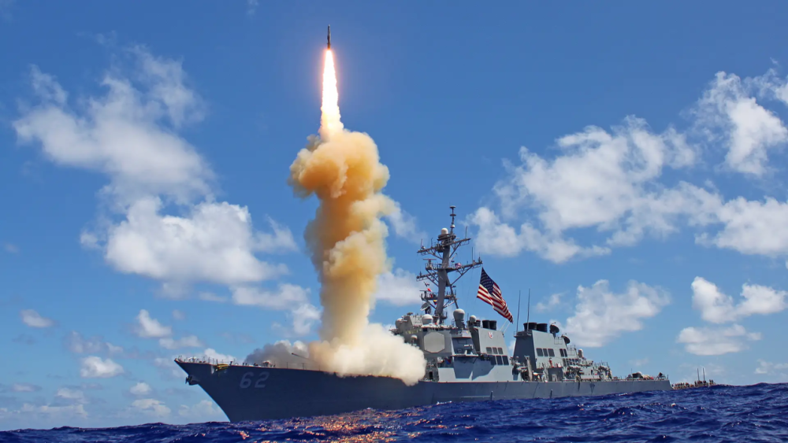
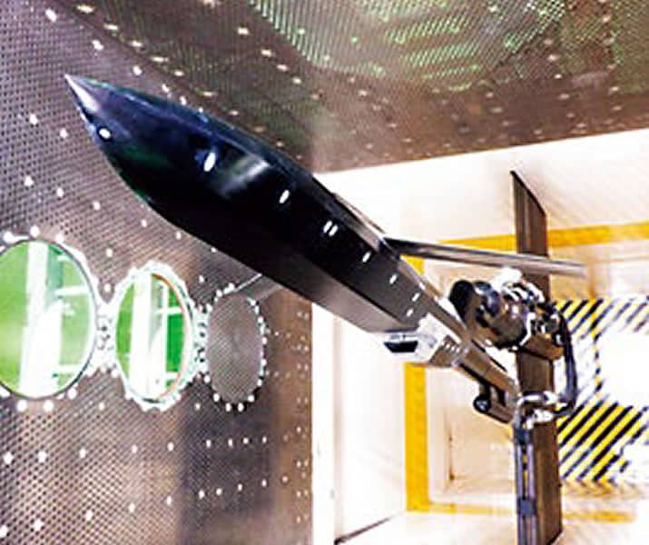
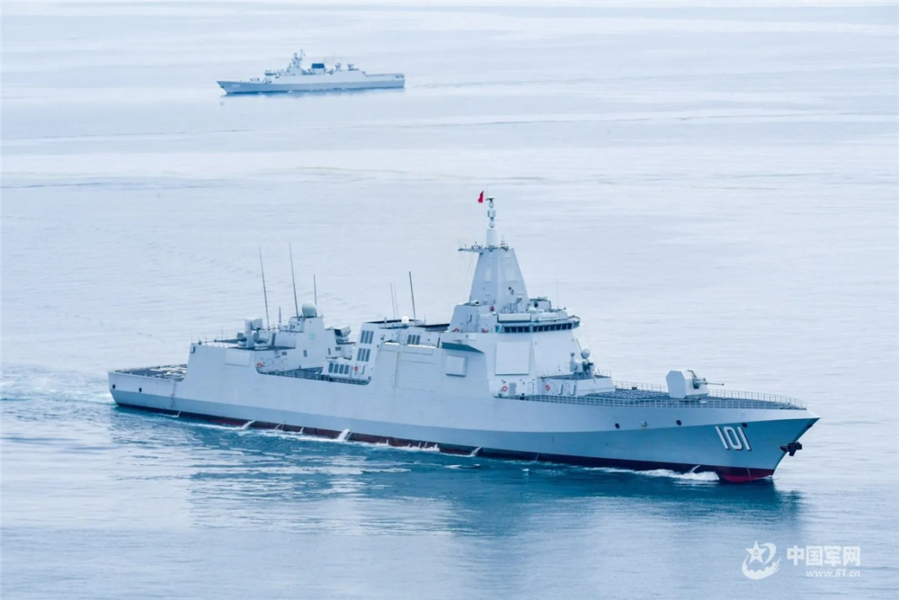
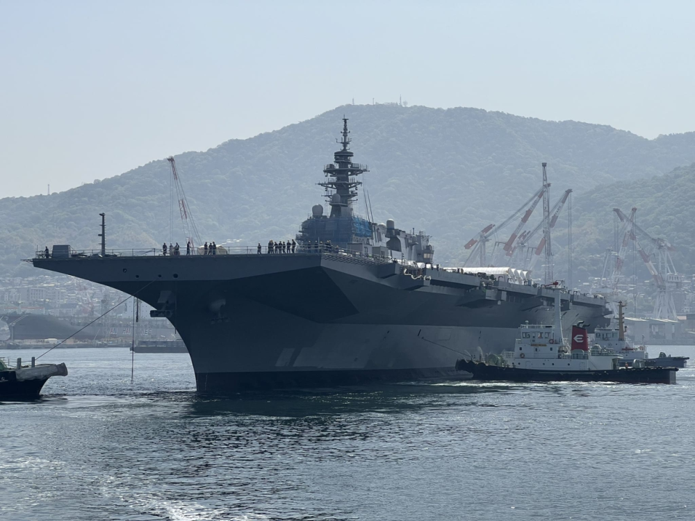
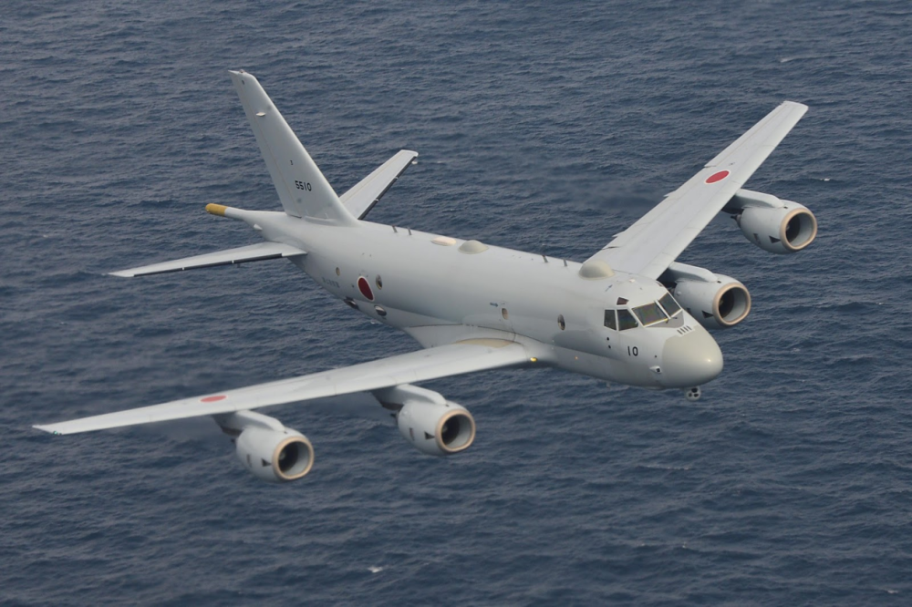
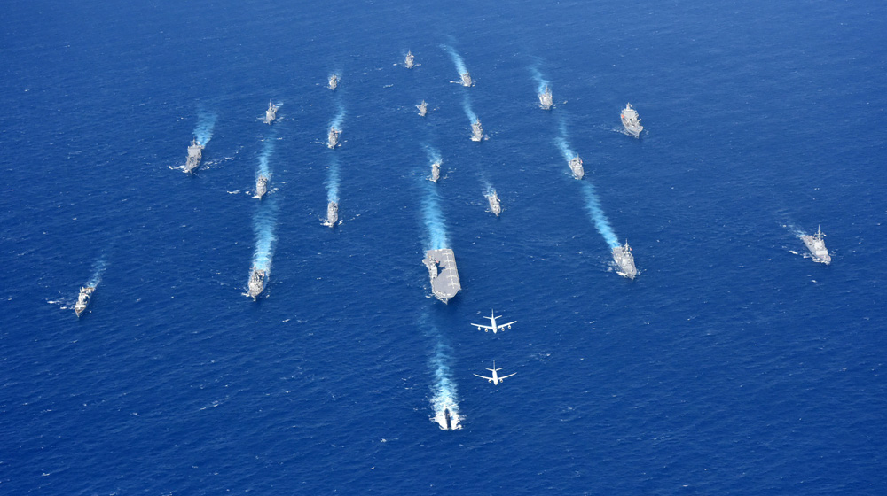

# 日本“战后最大水面战舰”细节披露，美媒将其与中国055型驱逐舰对比

【环球网报道 见习记者
黄泽佳】据美国“动力”网站当地时间8月31日报道，在日本防卫省当天提出的防卫预算申请当中，披露了日本新一代“宙斯盾系统搭载舰”（ASEV）的更多细节。报道提到，日本新型“宙斯盾系统搭载舰”将成为“日本战后最大水面作战舰艇”，其设计类似多用途导弹巡洋舰，在尺寸上与中国海军的055型“超级驱逐舰”类似。“动力”网站称，日本2024财年防卫预算总额达到约526亿美元，反映出日本试图与中国在军事能力上“保持同步”。

 _日本“宙斯盾系统搭载舰”概念图
图源：美国“动力”网站_

报道提到，根据日本2024财年防卫预算当中最新披露的细节，日本“宙斯盾系统搭载舰”的整体设计类似日本海上自卫队现役的“摩耶”级驱逐舰。并将美制AN/SPY-7雷达布置于舰桥顶部的塔状结构，尽量抬高以增加探测距离。报道称，“宙斯盾系统搭载舰”的长度为190米，型宽25米，标准排水量12000吨。而日本现役的“摩耶”级驱逐舰标准排水量为8200吨，美军“提康德罗加”级巡洋舰的标准排水量（原文如此）则为9600吨。报道还称，根据日本防卫省的说法，“宙斯盾系统搭载舰”的吨位将是美国海军“阿利•伯克”级驱逐舰的1.7倍。

 _日本“摩耶”级驱逐舰、美国“提康德罗加”级巡洋舰与美军“伯克”级驱逐舰 资料图 图源：美国“动力”网站_

报道还称，与最初设计方案中的弹道导弹防御专用舰艇不同，修改后的“宙斯盾系统搭载舰”用途更广泛。这种大型水面舰艇将装备128单元垂直发射装置，而“摩耶”级则为96单元。该舰将能够发射“标准-3
BlockIIA”反导拦截弹以及“标准-6”多用途舰空导弹。“标准-6”具备有限的高超音速导弹拦截能力，并且可以攻击水面目标。此外，日本防卫省还声称，“宙斯盾系统搭载舰”将装备研发中的改进型12式反舰导弹，该弹采用隐身外形设计，射程超过1000公里。“动力”网站还认为，随着日本从美国购买“战斧”巡航导弹，这种导弹也可能会装备日本的新型舰艇，用于对陆和对海远程打击。

 _日本研发中的隐身巡航导弹，日本声称其为12式反舰导弹改进型 资料图
图源：日本防卫省网站_

除了各种导弹之外，“动力”网站还报道称，“宙斯盾系统搭载舰”将装备一门Mk45型127毫米舰炮，并将在2032年搭载用于反无人机的高功率激光武器。与此同时，这种大型舰艇只需要约240名船员，低于上一代“摩耶”级驱逐舰的300名。“动力”网站认为，目前日本自卫队正面临严重的招募困难，提高自动化程度以降低舰员人数变得很有必要。

 _055型驱逐舰首舰南昌舰 资料图 图源：中国军网_

“动力”网站还声称，中国的海上实力正在甩开日本，出于对中国人民解放军海军的“担忧”，日本正在打造一支由多用途水面舰艇组成的舰队。日本的新型“宙斯盾系统搭载舰”与中国海军的055型“超级驱逐舰”（原文如此）尺寸类似，但日本的新型战舰更侧重于反导任务，中国055型驱逐舰的多用途能力更强，既可为航母打击群护航，也可在解放军水面作战群当中扮演核心角色。除此之外，由于中国“惊人”的造船能力，055型驱逐舰的建造数量将会更多。

 _“加贺”号准航母 资料图 图源：“海军新闻”网站_

“动力”网站还提到，除了两艘“宙斯盾系统搭载舰”外，日本2024财年防卫预算中的关键计划还包括建造12艘基于“最上”级的新型4500吨级护卫舰，并将对两艘“出云”级直升机航母进行进一步改装，使其能够搭载F-35B短距起飞和垂直降落（STOVL）隐形战机。日本还将开发基于川崎P-1反潜巡逻机的新型电子战飞机，并与美国共同开发用于拦截高超音速导弹的反导拦截弹（GPI）。

_日本川崎公司研发的P-1反潜巡逻机 资料图 图源：俄罗斯“军事观察”网站_

在日本发布2024财年防卫预算后，英国路透社曾表示，日本在二战期间的侵略行为使其至今仍与一些亚洲邻国关系紧张。尽管日本自1947年开始实行“和平宪法”，但乌克兰危机、日本对中朝等国的态度及其在台湾问题上的立场正在“改变”日本的思维方式。

_日本海上自卫队 资料图 图源：日本防卫省网站_

此前，日本政府通过2023年版《防卫白皮书》，将中国定位为日本“前所未有的最大战略挑战”，称中方大幅增加国防费、加快军力发展，在东海、南海“单方面改变现状”，中俄在日周边海空域开展联合行动，并称中国大陆军事活动“威胁台海和平稳定”。

中国国防部新闻发言人谭克非对此回应称，中国军队始终是维护世界和平稳定的坚定力量，从未挑战谁，更没有威胁谁。反而是日方近年来不断突破“和平宪法”约束和“专守防卫”原则，大幅增加防卫开支，鼓吹发展所谓“反击能力”，在军事扩张的道路上越走越远，追随个别大国搞有针对性的“小圈子”，给地区和世界和平、安全与稳定带来严重挑战。

他强调，台湾是中国的台湾，一个中国原则事关中日关系政治基础，是不可逾越的底线。日方在台湾问题上对中国人民负有严重历史罪责，近年来不但不反躬自省，反而不断干涉中国内政，违反国际关系基本准则，违背中日四个政治文件精神，破坏中日关系政治基础，加剧台海地区局势紧张，这是极其错误和危险的。

“我们敦促日方深刻汲取历史教训，停止不负责任的言行，摒弃以邻为壑的零和对抗思维，树立正确的对华认知，在台湾等重大问题上重信守诺，在军事安全领域谨言慎行，以实际行动推动双边关系回到正确轨道。”谭克非说。

