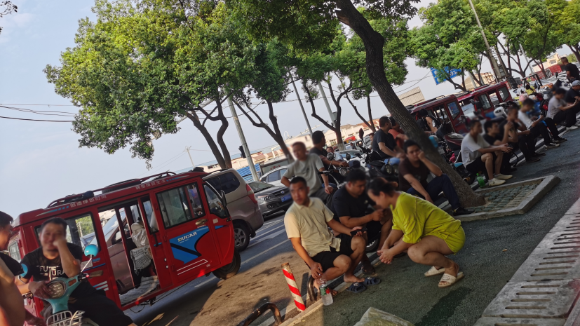
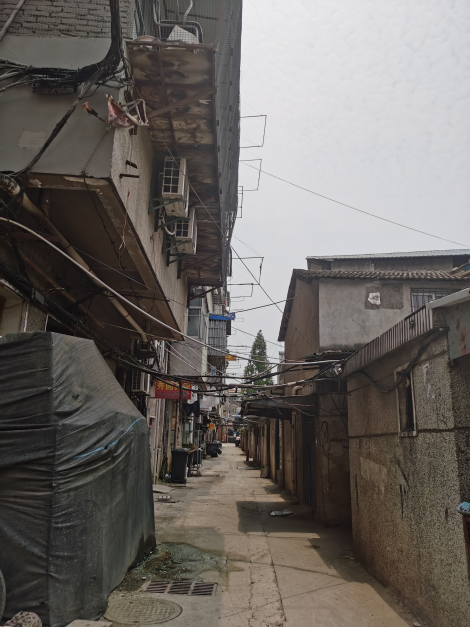
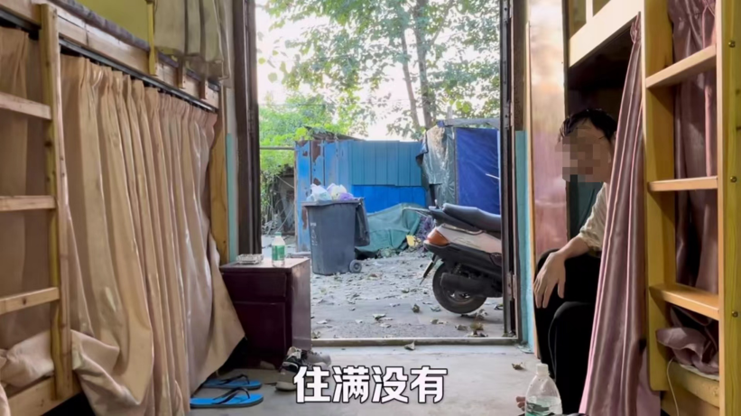
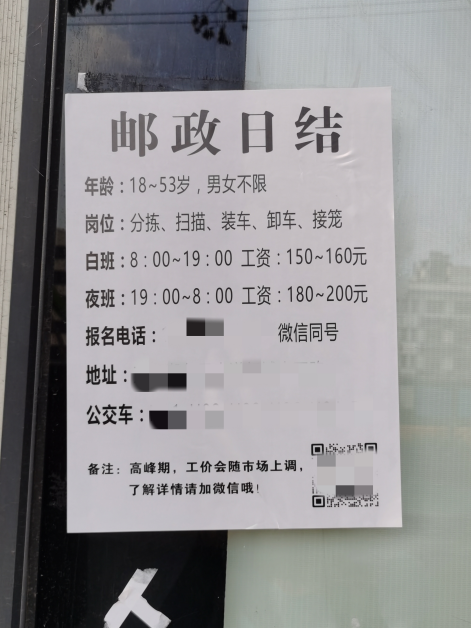

# 武汉版“三和大神”：睡树林，一袋馒头吃一天，衣服和手机充电线是全部家当

**核心要点：**

  * _1_ 北京马驹桥、上海车墩、昆山中华园、成都二仙桥、青岛崂山路......在全国各地大型物流转运中心周边，几十个日结大神的“基地”已经成形。这些日结基地是足够边缘的，它收留了大批量流入城市而又无家可归的农村底层人士。
  * _2_ 按照15块钱一晚的住宿标准，每个月450的住宿费只需要打两至三天工就能赚出来，然而事实并非如此。这些流落在外的人大部分兜里都掏不出20块钱，他们因为身体条件、背负债务等多种原因来到麻岭，一袋子馒头吃一天，露天睡觉也睡不好。
  * _3_ 如果一家物流企业给日结工人开的单日工资为350，50元会作为回扣返利给企业主管，70-100元会作为抽成在劳务公司分利，剩下的200元（甚至不到）才会流向工人。一位在麻岭干了十年的劳务告诉笔者，他每晚的收益在3000至5000元，所以很多劳务富得流油，早在武汉市中心买了几套房。
  * _4_ 每年夏天，在高温与重劳力的叠加下，都会发生几起亡人事件。由于日结工人不具备劳动关系，没有办法走工伤程序，大多数的死者家属也不愿意走漫长的司法流程，所以政府只能积极争取企业的补偿金额，多做私下调解的工作。

**田雅馨 武汉大学社会学院**

每天清晨五点、下午四点两个时间段，农业银行门口就会陆陆续续聚集一群农民工人，几个劳务坐着小马扎登记他们的信息。等到上班前一个小时，劳务联系的“麻木”（三轮车）就会成群结队地把工人们拉到几公里以外的物流园区，开启长达12小时的重苦力劳动。这样的景象已经持续了近十年。

_日结工人傍晚于农业银行集合_

和全国城郊的境遇相似，随着武汉城市边界的扩展，21世纪初的麻岭也历经征地拆迁和招商引资，产业集群的工业园区成功落地，拆一代从农民摇身一变为食租者，湖北周边的农民工涌入麻岭务工，工业城、村改居、农民工的三方格局就此达成。而物流园区由于其平台经济的属性，快递订单紧密地与线上消费量绑定在一起，每日波动的用工量规定了物流园区为节约生产成本而聘用日结工人的用工模式。这批依托快递集散点而前来的农民工人，逐渐与当地配套设施融合在一起，形成了独特的日结文化。2018年一部拍摄深圳三和人才市场的纪录片《三和人才市场：中国日结1500日元的年轻人们》点燃了网络舆论，也将这群隐没于城市边缘的“日结大神”正式拉进人们的视野。如今，三和人才市场已经改名为奋斗者广场，然而“流亡”的日结大神并没有消失。北京马驹桥、上海车墩、昆山中华园、成都二仙桥、青岛崂山路......在全国各地大型物流转运中心周边，几十个日结大神的“基地”已经成形。这些日结基地是足够边缘的，它收留了大批量流入城市而又无家可归的农村底层人士。然而它们也占据着中心位置。日结文化经由网络生态的加工、扭曲已然发生形变，它俨然与当下年轻人的困境遥相呼应，躺平、摆烂、佛系、低欲望、叛逆、朋克......不属于日结大神的标签叠加在这个边缘的群体之上，将其真实的结构性困境掩藏起来。笔者于暑期调研的麻岭，也同样是日结大神的典型片断，它既是现实的，也变成了舆论的，既是陷入困境的，也是逃离苦难的，既是农村底层群众的“流放地”，在某种程度，它也成为了他们存放意义的“救济所”。

**一、何谓“大神”？**

“大神”绝非一同质群体，日结工人们又可以划分为三个类别。第一类，以90、00后为主力的“挂逼”，他们常年混迹于网吧，做一天休三天，饿了就去附近买点吃的，一碗素粉5块钱，一个馒头5毛钱，够管一天。他们是真正意义上的“大神”，网络舆论集中讨论的二代农民工困境、青年人摆烂现象、宁愿流浪不愿进黑厂，也主要针对这部分二十出头的年轻人。他们依然有希望，只要他们想，他们就能找到一份体面但可能不喜欢的工厂工作，摆脱“挂逼”身份走上社会正轨。第二类，以找活为目的的短期过渡人群，他们平时有长期固定的工作，有些人当厨师，有些人开货车，有些人在老家工地做事，只是受限于就业环境周期性地赋闲在家。他们在家里待不住，又想要找点活干，于是途径各种渠道找到了麻岭，来这边打几天零工再回去做事。他们年轻结构不固定，不过大多已婚生子，再不济也有了交往的女朋友，他们有稳定的未来预期，有需要承担的家庭责任。

真正值得注意的第三类人群，是由80后构成的光棍群体、三无人员、负债人群。麻岭是个藏龙卧虎的地方，很多人过去犯过事，蹲过局子，十多年后被放出社会，已经成了黑名单成员，只要查身份证的工作他们基本都进不去，于是他们就缩到工地上，或长期驻足于日结基地。还有一部分人好赌，他们也是最近正火的电信诈骗的主要参与群体，受朋友蛊惑玩起了网络游戏，最开始赚到了几千块的甜头，就开始“孤注一掷”，直到负债上十万，心一下子散掉了，安稳的工作既赚不到快钱，人负债后也没有心气踏实过日子了，也就来到了麻岭。前面这两种人和普通的80后基本都是农村光棍，高额的婚姻成本和中部地区婚姻低地的残酷现实将大批家庭条件不好、赚钱能力一般的农村男性甩出了婚姻列车，他们无儿无女，无压力无负担，也没什么生活动力。中国人是绝对的社会性动物，从来不会为了自己而活。这些光棍没有家庭责任，人一下子就不知道为了什么而活，赚到钱也不知道给谁花，辛苦受罪一生也无法留个后，人的精神气一下子没了，也就半推半就地来到了麻岭。

来到麻岭的人很难走出去，常驻一年的大有人在，有好多还是资历五年以上的老“大神”。有常年在这的受访者告诉笔者，在这待了一年以上的人，大多精神都已经不太正常，你和他聊天，他也只会木讷地看一看你再走开。他曾经见过一个人，刚来的时候拖着行李箱，几年后改拿手提包，去年他再见到那人，那人手拎着一个帆布袋，里面装着两套换洗衣服和一个手机充电线，这就是他仅剩的全部家当。一次笔者在零工驿站群访时，一位在座椅躺着睡觉的男人突然高声说到：“这里的人都是‘活死人’！他已经死了，活着的死人。”当笔者再次追问什么是“活死人”的时候，他答道：“谁都想勤奋，谁都想成为正常人。这里80%都是没有家庭的人，大部分人没有动力，没有责任，叫他拼命地干，他怎么干得下去呢？如果你是父母的骄傲，你才有动力。人要有希望，不然就消沉下去了，一辈子就那么回事。”

**二、流浪的生活**

在麻岭，本地人和外地人形成了泾渭分明而又同居共食的独特风景。本地人大多是拆迁户，孩子小的都搬到了离主城更近的吴区，留下来的靠把房子廉价出租给农民工而过上了不劳而获的幸福生活。相反，那些长居此处的外地人则是社会真正的边缘人群。一街之隔，本地人活跃于主镇街，外地人则挤在隔街的老房子里。这里的房子条件不好，但胜在便宜，不开空调的话15元一晚，包空调包水电的房子则20块一晚，一般每间房子有8-12人居住，房子里除了几张上下铺，基本没有其他家具。

_日结工人居住的出租楼房_

_日结工人居住的出租平房（图片来源：麻岭抖音网红视频）_

但是还有少部分人，由于穷困潦倒而选择睡在公共场所。去年由区政府投资建成的零工驿站本意是成为代替劳务的中介平台，然而劳务与工业园区、“麻木”司机、本地房东已经形成了根深蒂固的利益链条，工人也难以跨越劳务进厂工作，因此，零工驿站目前的最大用处，是为无家可归的日结工人提供免费住宿。每天早上7点，驿站开门后，就会有日结工人躺在椅子上或地上睡觉。驿站早上11点到下午3点会定时打开空调，里面还有厕所、充电口，还没有蚊虫叮咬，对于工人来说这委实是个不错的住所。

_麻岭零工驿站_

驿站下班以后，这部分无处可去的日结工人会选择在驿站附近的小树林，以及离这里不远的麻岭公园里睡觉。按照15块钱一晚的住宿标准，每个月450的住宿费只需要打两至三天工就能赚出来，然而事实并非如此。这些流落在外的人大部分兜里都掏不出20块钱，他们因为身体条件、背负债务等多种原因来到麻岭，一袋子馒头吃一天，露天睡觉也睡不好。等第二天想去做日结，日结的活他们基本上还做不好。有一句流传在打工人之中的话：“物流就是把女人当男人，把男人当牛干”，女人在物流园基本负责扫码、分拣等轻活，男人则被派到大货车里装车、卸货。笔者也曾在物流园体验过日结工作，里面的主管会拿着大喇叭监工，一旦发现谁干活不得劲就会催促工人赶紧干活。被分派到装车、卸货的男工更加辛苦，大热天的货车里只有两台小风扇，他们基本是光着膀子做工十小时。这样的强度，如果没有一个好身体，是根本没办法坚持下来的。于是这群人就形成了恶性循环，他们不能吃好睡好，也就没有力气干活，也就赚不到钱，也就不能吃好睡好。于是一小拨始终找不到工作的人，成为了公园常客。

_在麻岭公园睡觉的日结工人_

“流浪”，既是身体的流浪，亦是心灵的流浪。在新自由主义盛行的中国社会，精英阶层出现了单身社会的趋向，大都市的知识分子宁可享乐主义、消费主义，也不愿意被家庭负担捆绑，然而如果将目光投射于基层社会，则会发现“家庭”意义的倒错，单身对于农村男性来说是个惩罚。毋宁说，相对于精英群体的个人主义，乡村的价值归属依然是家庭本位的，家庭缔结的失败直接导致了农村男性心理归属的失能。这很大程度，但不完全地，与麻岭兴盛的娱乐产业形成了互构。对于全国各地来说都是如此，娱乐产业是大神文化很重要的组成部分。麻岭有一大一小两处娱乐场所，大片是香港路，小片则是出租房屋周边。这两处地方成了日结工人的吸金库，麻岭90%的男人，前脚干苦力赚到一点钱，后脚就撒到了休闲娱乐场所。

**三、劳务、“兔子”与政府**

十年来，麻岭迎来送往，每天都有新面孔到来，也有老面孔离开，然而一些相对稳定的关系慢慢沉淀下来，并形成围绕劳务、“兔子”与政府三大主体展开的社会情境。

_公交站张贴的日结招聘广告_

麻岭有近十个物流园区，每个物流园的单日用工量在固定工300人、日结工600人上下波动。为了应付超额日结工需求，物流园将招聘任务外包给劳务中介。在麻岭常年招工的劳务有五家，他们几乎垄断了往物流园送工人的业务，也占据了价格谈判的高地。如果一家物流企业给日结工人开的单日工资为350，50元会作为回扣返利给企业主管，70-100元会作为抽成在劳务公司分利，剩下的200元（甚至不到）才会流向工人。一位在麻岭干了十年的劳务告诉笔者，他每晚的收益在3000至5000元，所以很多劳务富得流油，早在武汉市中心买了几套房。所有人都知道抽成规则，但工人也没什么办法。没有本事的日结工人依赖于劳务提供的工资机会，而有本事的工人则转向成为“兔子”。

农业银行的转角是一片小树林，这些工人与日结工人一样整天待在外面等活，但他们基本上不去做日结，而是等着大货车来此处拉散工，去做一些工地小工、灌水泥袋子、清扫仓库的活，日结工资在300-350元之间。这给了一些有本事的人工作机会。他们也常年生活于此，但他们慢慢地在做小工的过程中积累了社会关系，从其他日结工人中脱颖而出，有能力越过劳务中介的垄断，另辟蹊径地找到干活的路子。这些小工头不仅可以联系到用散工的工头，还可以把附近几个兄弟带上一起做事，他们就被称为“兔子”。麻岭的“兔子”有十多个，他们逐渐形成了自己稳定的小团体，3-5个人结成稳定的搭子，有活就互相叫着去干，每次干个10小时就能赚350左右，“兔子”还能从中抽成30元/人左右。这些“兔子”无疑是麻岭的能人，然而他们也走不出麻岭。笔者问过一位家在武汉黄陂的“兔子”，既然这么有能力，为什么不去其他地方做事，他对自己的经历讳莫如深，只讲他是来这里玩的，“不玩也没办法”。他来这里也有三年了，过年也没有回到家。他知道自己的生活状态不正常，但也没办法，他离不开麻岭。

_等待散活的工人_

笔者调研期间，最常被问到的一句话是：“你这个调研有什么用？”这里所有的人都知道那部火了的三和大神纪录片，有人说，这就是富了导演穷了他们，也有人说，十年前，麻岭是那个麻岭，十年后，麻岭依然是那个麻岭。作为流动人口，他们很难被归属到政府管辖范围。区政府去年试图打造零工驿站，购买三方服务零差价地为日结工人提供工作机会，然而蛋糕早就被几家劳务分完，政府想要以行政力量撬动市场行为属实不易。这片由市场主导的土壤难以被政府介入，它成为治理的灰色地带，政府只有发生突发事件时才能发挥补充性作用。每年夏天，在高温与重劳力的叠加下，都会发生几起亡人事件。由于日结工人不具备劳动关系，没有办法走工伤程序，大多数的死者家属也不愿意走漫长的司法流程，所以政府只能积极争取企业的补偿金额，多做私下调解的工作。

**四、流放地还是救济所？**

城市治理面临更加复杂的情境。一方面，日结工人无疑是最需要被妥善安置的群体，他们规模庞大，且隐匿于城市边缘地带，加之多数工人没有家庭责任、没有上进动力，从客观条件上看，他们确实构成社会稳定的潜在威胁。然而，日结群体几乎没有形成牢固的社会关系，大多数人彼此照面却不知其姓名，偶尔闲聊后又形同陌路，其松散、陌生的程度基本无法构成社会行动的有力单元。另一方面，日结工人自身也在呼唤政府的到场。他们面临的困境与政府治理的以往案例不同，作为具有亲属、拥有劳动能力的成年男性，他们不可能被吸纳进政策保障的行列。他们的“病”不在经济，而在心理。社会需要组织起来才能形成秩序，而组织的最基本单元，不像涂尔干所构想的职业群体和社会分工，这种有机团结可以达成经济联合体，却无法形成社会长治久安的秩序。社会最基本的组织单元在家庭，正是家庭构成了社会稳定的“压舱石”。然而现代社会奔跑之迅速，将大批农村男性远远抛在了身后。人心散了，行动就会涣散，慢慢地他们就与日结文化签署了契约。在这里，做一天休三天也没什么不好，没钱了就去做点工，有点钱就去娱乐场所转一转，反正一人吃饱全家不愁，生活也就这样了。

所以如何去定义麻岭，以及像这样的几十个日结基地？它们属实是“流放地”，将那些被社会定义为失败的农村光棍、三无人员、负债人群流放在无人问津的角落，平日干最苦力的活消耗其精力，使其维持在能够再生产自身的最低水平。然而它们也确实构成了日结人群的“救济所”，同样境遇的人群聚集于此，在其他地方找不到工作的人，在这里至少能够找到工作。这里的配套设施也很完善，既能够去做物流，有点本事的还能去做散工，网吧、饭店、娱乐一应俱全，在这里游荡总比回什么都没有的农村要强。我们首先必须精准定位日结基地的性质，才能够对其做出妥善的安排。过去大多时候，治理手段是粗糙的，将三和人才市场改为奋斗者广场，将日结工人们赶跑，景观没有了，现象却还在，那些睡在桥洞里的流浪人群还在。现在，治理呼唤一种更加精细的、柔性的、关怀的技术，呼唤一种可以跨越属地管理的僵化模式，采取更加符合流动社会的动态管理模式。以日结群体这个城市数一数二棘手的治理难题作为抓手，去思考社会究竟需要什么样的治理，治理想要建构什么样的社会，也许是缓慢却行之有效的方式。

