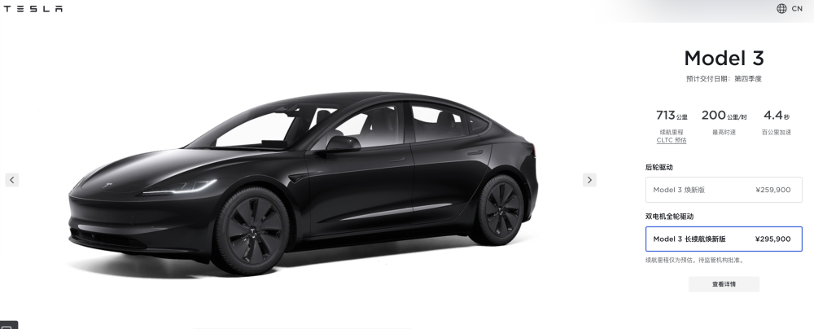

# 涨2.8万元！特斯拉新款Model 3售25.99万元起，官网已开卖四季度交车

腾讯汽车讯 9月1日消息，特斯拉官网今日正式上线新款Model 3，Model
3焕新版售价25.99万元。续航606公里，最高时速200公里/时，百公里加速6.1秒。Model
3长续航焕新版，售价29.59万元，续航713公里，最高时速200公里/时，百公里加速4.4秒。这是特斯拉Model
3六年来的首次大改款车型。腾讯新闻特斯拉官号第一时间发布了新车售价的消息。

_焕新版售25.99万元，官网截图_

_长续航焕新版售29.59万元，官网截图_

_新款Model 3正面，来源：特斯拉官网_

_新车实拍图_

此前，传闻称新款Model
3对车头进行了重新设计，头灯造型更加犀利，LED日行灯也更有辨识度。前包围造型借鉴了Roadster的设计元素，整体更加简洁，并取消了雾灯。

_新车内饰_

新款Model 3将搭载HW 3.5硬件，并移除车身所有雷达，采用纯视觉路线。车内将取消换挡杆，转而采用与Model
S/X相同的换挡方式。另外，车内还将取消木纹饰板，增加扬声器数量，车内座椅也将增加通风功能。

 _后排新增屏幕_

在官方消息发布之前，媒体普遍猜测新车将会比老款售价有所下降，可能会来到20万左右，但没想到的是新款的售价相比老款还上涨了2万元。

