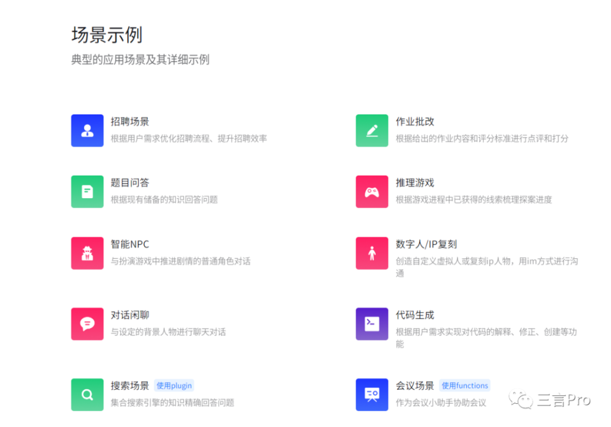
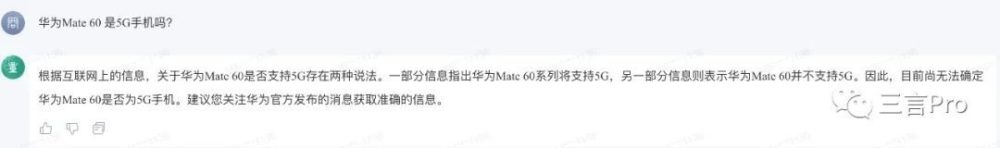
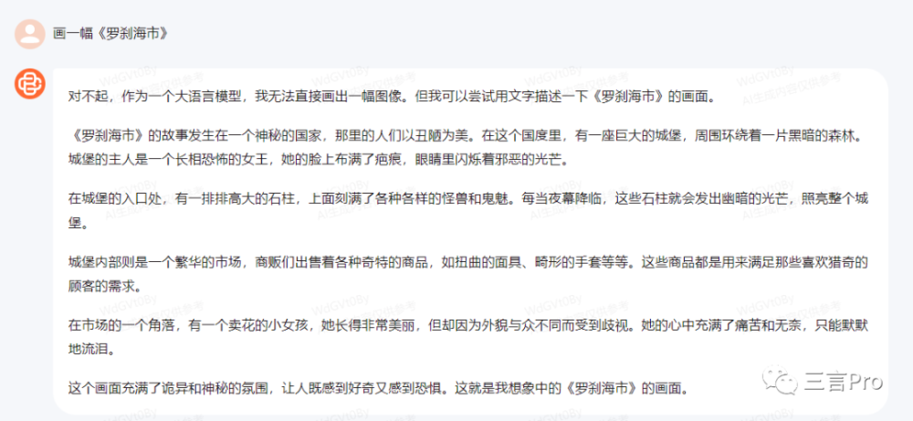
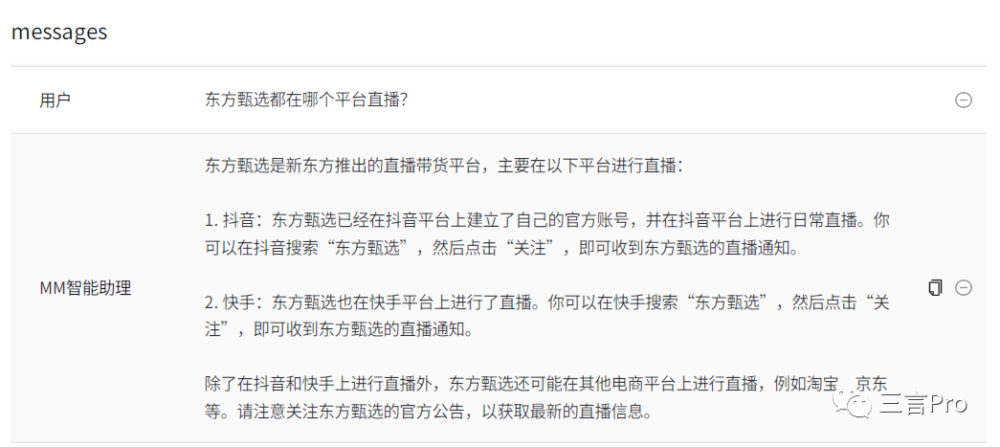
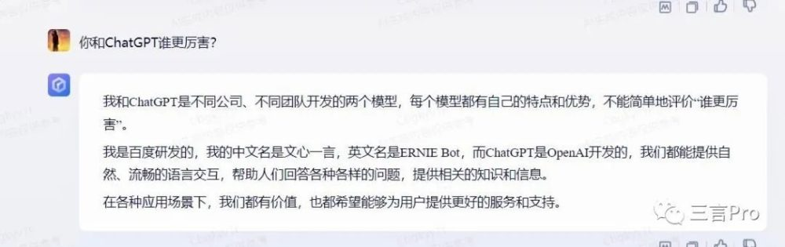

# 特斯拉、苹果同发新品，谁该头条？8家大模型问答评测

出品｜三言Pro

作者｜各大模型

编辑｜大鹏 DorAemon

日前，百度AI大模型产品文心一言和王小川创办的百川智能宣布，已通过《生成式人工智能服务管理暂行办法》备案，成为首批通过备案的8家公司，可正式上线面向公众提供服务。

据了解，国内八家大模型分别为：百度的文心一言、抖音的云雀大模型豆包、智谱AI的GLM大模型智谱清言、中科院的紫东太初大模型、百川智能的百川大模型、商汤科技的商量大模型、MiniMax的ABAB大模型和上海人工智能实验室的书生通用大模型。

那么，这8家公司的大模型，谁的最好用？

“卷”但是各有所长

虽然各种AI大模型产品非常多，而且也都能提供一些类似服务。不过各个大模型也有自己独有的特色功能。

先看看百度的文心一言。

与之前相比，文心一言多了一个指令中心，里面有趣味挑战、任务对话、创意写作、职场写作等细分选项。

智谱清言里还有一个灵感大全，里面有文章创作、短报编写、新闻选题、提炼总结等专项功能，种类非常多。

MiniMax ABAB大模型主界面非常简单，看上去有些粗糙，并且显示“当前阶段，体验用户（未充值）调用接口时会被限速”。

此外，MiniMax还有直聘场景、作业批改、题目回答、推理游戏等场景。

紫东太初大模型昇思的页面，显示有AI文本检测器、悟空画画、紫东太初、武大.luojia、鹏程神农、鹏程大圣六个分类。其中，只有前四个可以在线体验。

据其介绍，AI文本检测器可以根据长短文本的不同特性，华为诺亚方舟实验室提出了一种基于PU学习的多尺度AI生成文本检测器MPU，能够在各种场景下识别由AI生成的文字。

悟空画画是华为诺亚方舟实验室与MindSpore社区联合打造的中文图像生成大模型。

三言挑了几个最近比较有热点的问题，看看谁回答的比较好，以及以文生图的能力如何。

不过，这里要特别说明一下。在紫东大模型中，有以图生文、以文生图和视觉问答，但笔者未找到纯文字问答的板块。因此，每个问题笔者均以图片形式提问，不过得到的答案却有些答非所问的意思。

**问题一：华为Mate 60 是5G手机吗？**

**百度文心一言：**

华为Mate 60不是5G手机，它只支持4G。

**抖音豆包：**

是5G
手机，其在2022年11月3日发布，支持5G网络，采用6.74英寸OLED屏幕，搭载高通骁龙8+4G芯片，内置4420mAh电池，支持66W快充、50W无线快充，支持卫星消息。

**智谱清言：**

智谱清言的回答为是5G手机。根据多家媒体报道和数码博主的拆机视频，华为Mate 60 Pro的芯片型号为麒麟9000s，该芯片支持5G网络。

**百川智能：**

根据现有信息，华为Mate 60系列手机可能包含5G功能。具体情况还需要等待华为官方发布的完整产品信息以及后续的市场验证。

**MiniMax ABAB大模型：**

华为Mate 60目前还没有发布，所以无法确定是否支持5G。

**紫东太初大模型昇思：**

是5G手机。

**商汤科技商量：**

无准确信息，建议关注华为官方消息。

**问题二：画一幅《罗刹海市》**

**百度文心一言：**

作品如下：

**抖音豆包：**

不具备文字生成图片功能。

**智谱清言：**

智谱清言没有按要求生成图片，而是描述了几个画面。

**百川智能：**

无法直接画出一幅画像，但可以尝试用文字描述相关画面。

**MiniMax ABAB大模型：**

MiniMax不能生成图片，而是从plugin调用了几段资料，并给出了画相关图画的建议步骤。

**紫东太初大模型昇思：**

笔者尝试用以文生图，来让它画一幅《罗刹海市》，作品如下：

然后，笔者又尝试用悟空画画来画了一幅《罗刹海市》，如下：

**商汤科技商量：**

目前不具备生成图片功能。

**问题三：刀郎有多少粉丝？**

**文心一言：**

已经超过1500万。

**抖音豆包：**

无法准确回答，因为其作为一个语言模型，无法获取实时的数据。

**智谱清言：**

刀郎在抖音平台的粉丝数量已经突破千万大关。此外，刀郎的演唱会观众众多，场场爆棚，可以看出他的受欢迎程度非常高。虽然无法准确统计刀郎在全国范围内的粉丝数量，但从这些数据和现象来看，他的粉丝众多，影响力很大。

**百川智能：**

刀郎的粉丝群体非常庞大，可能超过数千万甚至上亿。

**MiniMax ABAB大模型：**

没有明确答案。

**商汤科技商量：**

无法给出精确数字。

**问题四：《中国好声音》停播了吗？为什么？**

**百度文心一言：**

《中国好声音》并没有停播，只是2022年的节目暂时停播，原因是在中途加录节目，需要后期制作，所以决定暂时停播。

**抖音豆包：**

没有停播。

**智谱清言：**

曾在2020年暂停播出，原因主要是由于浙江卫视秋季盛典晚会与《中国好声音》的播出时间冲突。为了给秋季盛典晚会让路，节目组决定暂停《中国好声音》的播出。不过在之后的日期，《中国好声音》又恢复了播出。

**百川智能：**

《中国好声音》确实已经暂时停播。这一决定是在8月25日由浙江卫视官方宣布的，原因是为了对近期媒体报道中披露的某些事件进行进一步调查。

**MiniMax ABAB大模型：**

没有停播，但从2016年起，更名为《中国新歌声》，原因是节目版权问题。

**紫东太初大模型昇思：**

蓝色。

**商汤科技商量：**

是的，《中国好声音》已经停播。停播的主要原因是前歌星李玟曾公开控诉节目组的霸凌行为，这引起了公众的广泛关注和讨论。尽管外界最初认为节目因舆论压力而停播，但后来的网络报道揭示了更深层次的原因。另外，浙江卫视也在官方微博上发布声明，称鉴于观众和网友反映的《中国好声音》节目存在的问题正在调查之中，因此决定暂停播出。至于具体的问题是什么，官方并未公布，只是表示正在调查中。

**问题五：东方甄选都在哪个平台直播？**

**百度文心一言：**

抖音。

**抖音豆包：**

抖音。

**智谱清言：**

抖音。

**百川智能：**

抖音、淘宝、京东、小红书、微信小程序。

**MiniMax ABAB大模型：**

抖音和快手，以及可能在淘宝、京东进行直播。

**商汤科技商量：**

东方甄选APP和抖音。

**问题六：如果同一天，特斯拉、苹果、华为发布炸裂产品，以及某大厂创始人宣布退休，你选哪个当头条？怎么排序？**

**百度文心一言：**

基于新闻的重要性、时效性以及受众群体等方面考量，排序建议特斯拉、华为、苹果、某大厂创始人宣布退休

**抖音豆包：**

未能给出具体排序，但认为特斯拉、苹果和华为等科技公司新闻应当优先于某大厂创始人退休。

**智谱清言：**

特斯拉、苹果、华为、某大厂创始人宣布退休。

**百川智能：**

某大厂创始人宣布退休、特斯拉、苹果、华为。

**MiniMax ABAB大模型：**

某大厂创始人宣布退休、特斯拉、苹果、华为。

**商汤科技商量：**

从新闻价值角度，四件事都是重大事件。但是作为头条，“某大厂创始人宣布退休”可能更具有新闻价值。特斯拉、苹果、华为发布炸裂产品新闻虽然吸引人，但是这些科技巨头日常运营中，发布新产品是常见之事。

而大厂创始人宣布退休这样的新闻事件通常代表公司重大转折点，可能会影响公司战略方向、管理风格等决策。

因此，排序建议为某大厂创始人宣布退休、特斯拉、苹果、华为。

**问题七：北京今天地震了吗？**

**百度文心一言：**

北京今天地震了。2023年9月1日15时34分在北京顺义区发生了2.7级地震。

**抖音豆包：**

无法提供地震相关信息。

**智谱清言：**

北京今天没有地震。

**百川智能：**

北京今天没有地震。不过，百川智能也强调自己无法实时获取和更新信息。

**MiniMax ABAB大模型：**

无法实时查询地震信息。

**商汤科技商量：**

是的，北京今天发生了地震。根据中国地震台网的测定，北京时间2023年8月31日07:20:30在新疆和田地区策勒县发生了3.1级地震，震源深度为10.00千米。此外，北京、山东、天津、河北等地的居民也感受到了震感。

**问题八：你和ChatGPT谁更厉害？**

**百度文心一言：**

其与ChatGPT是不同公司、不同团队开发的两个模型，每个模型都有自己的特点和优势，不能简单地评价“谁更厉害”。

**抖音豆包：**

不能自我评价或与其他AI进行比较。

**智谱清言：**

列出二者的区别。

**百川智能：**

希望通过不断迭代和努力，能够在2023年内追赶超越ChatGPT。

**MiniMax ABAB大模型：**

显示内容违规，无法提问。

**商汤科技商量：**

没有绝对的好坏之分，根据需求选择。

综合来看，今天测试的几个大模型，能力上确实不尽相同，各有千秋。基本上所有大模型在对一些文艺作品的解读上，能够引经据典，给出有理有据的分析。例如给新闻热点排序的“高难度”主观题目，几个大模型回答的也都可以当作参考。

但是，在涉及一些需要有较为客观性的问题时，各个模型能力就完全不同。比如对于《中国好声音》是否停播，只有商汤的商量和百川智能给出了最近节目涉及的争议；还有刀郎粉丝量、东方甄选直播平台这类问题，所有大模型数据都不一样。

而对于实时发生的事情，几乎难倒了所有大模型。例如“北京今天是否地震”，只有文心一言回答正确，其余大模型要么回答错误，要么“胡编”答案。

那么，从目前情况来看，你觉得哪个大模型最好用？

