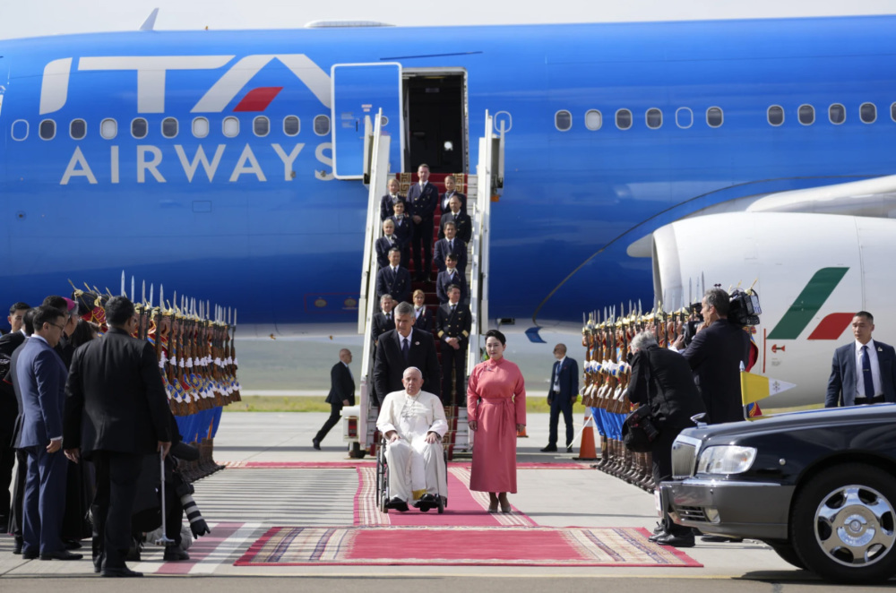

# 罗马教皇首次访问蒙古国，分析人士猜测：寻求扩大梵蒂冈与中俄接触

（观察者网讯）据美联社报道，罗马教皇方济各9月1日上午飞抵蒙古国首都乌兰巴托，开启了对这个亚洲内陆国家的首次访问。由于天主教在蒙古国的影响力极为有限，一些分析人士猜测，方济各或许是想借出访的机会，寻求让蒙古国成为梵蒂冈与中国和俄罗斯沟通的“中间人”。

报道称，方济各在乌兰巴托成吉思汗国际机场接受了蒙古国外交部长和仪仗队的迎接。在为期四天的访问中，方济各将与蒙古国总统和总理举行会晤，对蒙古国政府、文化和商界领袖发表讲话，并会见当地天主教社区的神职人员。

预计方济各还将在9月3日主持一场跨宗教会议，强调蒙古国不同宗教共存的历史传统。蒙古国国内的佛教、犹太教、伊斯兰教、神道教、天主教和东正教等宗教代表受邀出席。

 _9月1日上午，罗马教会方济各飞抵蒙古国首都乌兰巴托
图自美联社_

这是罗马教皇首次造访蒙古国。梵蒂冈称，访问的目的是鼓励蒙古国的天主教信徒。方济各在启程前表示，这是一次“值得期待的访问”，是一次“拥抱人数不多但信仰充满活力、投身慈善事业的蒙古国教会”的机会。

但这次访问也引起了观察人士的疑惑。美国《纽约时报》指出，天主教在蒙古国的影响力极为有限，当地教会的规模仅有不到1500人。去年，方济各将一名在乌兰巴托生活了数十年的意大利传教士提升为枢机主教，此举还一度震动整个梵蒂冈。

因此有分析人士猜测，方济各试图借此次出访在国际舞台上发声，寻求让蒙古国成为梵蒂冈与中国和俄罗斯接触的“中间人”。

半岛电视台称，方济各将与蒙古国政治领导人举行一整天的会议，话题可能涉及中国与俄罗斯。自中国与梵蒂冈在2018年签署关于主教任命的临时性协议以来，方济各一直寻求改善梵中关系，有意与梵蒂冈和中国同时保持友好关系的蒙古国或许可以创造“对话的机会”。

值得一提的是，在专机飞越中国领空时，方济各向中国人民传达了祝福，表达了对团结、和平的希望。对此，中国外交部发言人汪文斌1日回应说，梵方的祝福体现了友好和善意。近年来，中国和梵蒂冈保持沟通，中方愿继续与梵方相向而行，进行建设性对话，增进理解，积累互信，推进双方关系改善进程。

在俄乌冲突的背景下，梵蒂冈与俄罗斯的关系是外界关注的话题之一。本周早些时候，方济各向俄罗斯圣彼得堡的青年天主教徒发表视频讲话时发表了争议言论，他在讲话中赞扬俄国沙皇彼得一世和叶卡捷琳娜二世，称俄罗斯青年为“伟大俄罗斯的继承者”。

这一发言引起乌克兰政府不满，乌官员指责方济各为俄罗斯军事行动“辩护”。对此，梵蒂冈回应说，方济各的发言并不等于支持俄罗斯。

方济各曾试图调解俄乌冲突，维持梵蒂冈在冲突中的外交中立。因此美联社猜测，他或许会利用在蒙古国举行跨宗教会议的机会，向俄罗斯东正教会致以问候。

由于外界普遍关注此次访问与中国和俄罗斯的关联，蒙古国政治学者苏马蒂·卢夫桑登德夫（Sumati
Luvsandendev）直言，“实际上，没有人在谈论教皇的事。”

不过，梵蒂冈方面坚决否认此次出访涉及有关中国或俄罗斯的事务。梵蒂冈发言人马泰奥·布鲁尼（Matteo
Bruni）坚称，访问的重点是蒙古，“方济各教皇将主要与他们交流。”

**本文系观察者网独家稿件，未经授权，不得转载。**

