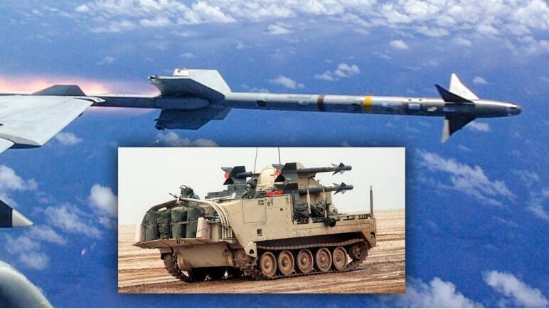
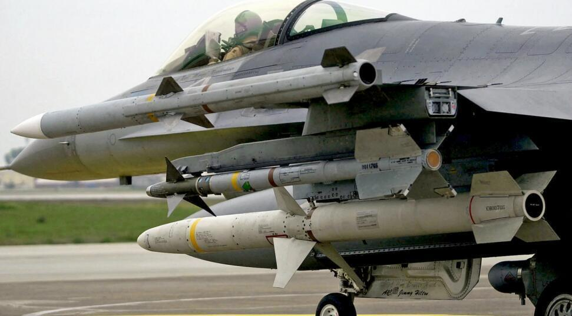
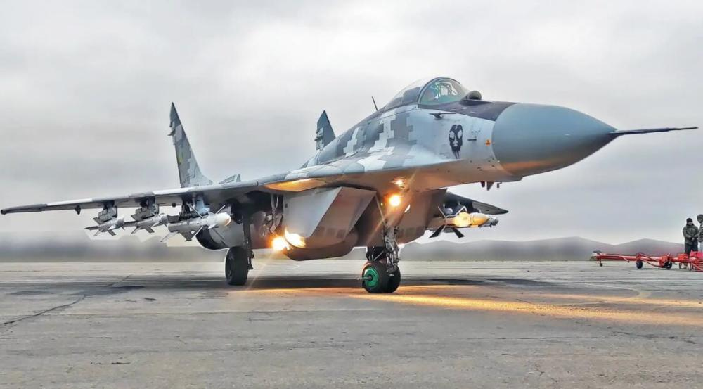
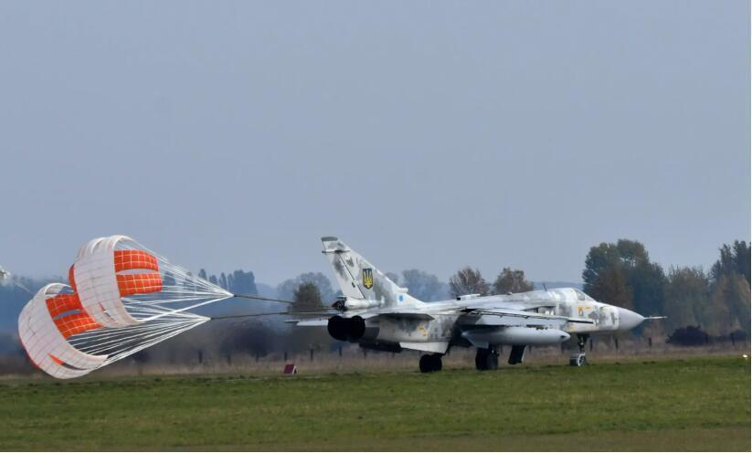
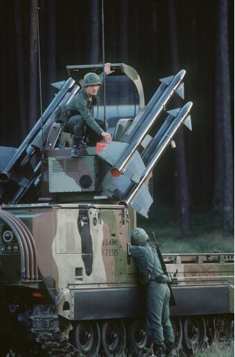

# 美媒：令人惊讶！美最新一轮对乌军援首次提供“响尾蛇”空对空导弹

【环球网报道 见习记者
黄泽佳】据美国“动力”网站当地时间8月31日报道，在当地时间29日宣布的最新一轮价值2.5亿美元的美对乌军事援助清单中，首次出现AIM-9M“响尾蛇”红外制导空空导弹。“动力”网站称，AIM-9M被提供给乌克兰是“令人惊讶”的。报道称，美对乌军事援助总额目前已超过430亿美元。

_AIM-9M“响尾蛇”导弹可从空中或地面发射 资料图 图源：美国“动力”网站_

报道称，尽管美国及西方国家装备的AIM-9M“响尾蛇”导弹目前已被更先进的AIM-9X“响尾蛇”导弹取代，但在某些任务中，AIM-9M相对AIM-9X仍具备一定优势，因此美军战机偶尔会在某些任务中混合挂载这两种导弹。报道称，在美国向乌克兰提供AIM-9M导弹之前，加拿大也曾于去年9月向乌克兰提供43枚AIM-9导弹，但具体子型号不明。

_同时挂载AIM-120C、AIM-9L/M、AGM-88导弹的美空军F-16CJ“野鼬鼠”战机 资料图 图源：美国“动力”网站_

“动力”网站还猜测，乌克兰可能会将AIM-9M导弹集成到乌空军的米格-29及苏-27战机上，作为这些苏制战机使用的苏制R-73红外制导空空导弹的补充。“动力”网站认为，相比射程更远的AIM-120雷达制导空空导弹，在苏制战机上集成AIM-9M红外制导导弹的难度更低。这一集成工作的难度与在苏-27和米格-29上集成美制AGM-88反辐射导弹的难度大体相当。

_挂载R-27雷达制导导弹与R-73红外制导空空导弹的乌空军米格-29战机 资料图 图源：美国“动力”网站_

报道还提到，AIM-9M导弹虽然不是最先进的“响尾蛇”型号，但具备全向攻击能力，拥有较强的抗干扰能力，同时配备了低烟火箭发动机。乌空军战机配备AIM-9M导弹后，在拦截俄军无人机时的效率将会得到提升。此外，“动力”网站还认为，AIM-9M空空导弹可以作为乌军苏-24前线轰炸机及苏-25攻击机的自卫武器，甚至可以由乌军无人机挂载并发射。

 _乌空军苏-24M前线轰炸机 资料图 图源：美国“动力”网站_

“动力”网站还声称，乌克兰武装部队的防空导弹库存已经“非常低”，在俄军大规模巡航导弹和自杀无人机打击下，乌军装备的苏制防空导弹已经消耗殆尽。AIM-9M导弹在经过改进后也可从地面发射，补充乌军防空武器库存。

此前根据当地时间8月29日美国国防部发表的声明，美国向乌克兰提供价值2.5亿美元的新一批军事援助，以满足乌克兰的安全和防务需求。除了AIM-9M空空导弹之外，本轮援助还包括防空导弹、火炮弹药、扫雷设备和反装甲武器等。

_使用“响尾蛇”导弹的美陆军M48“小檞树”防空系统 资料图 图源：美国“动力”网站_

针对北约不断对乌增加军事援助，俄方多次表示，任何包含乌克兰武器的物资都将成为俄罗斯的合法打击目标。俄罗斯外交部表示，北约国家向乌克兰供应武器是在“玩火”。

