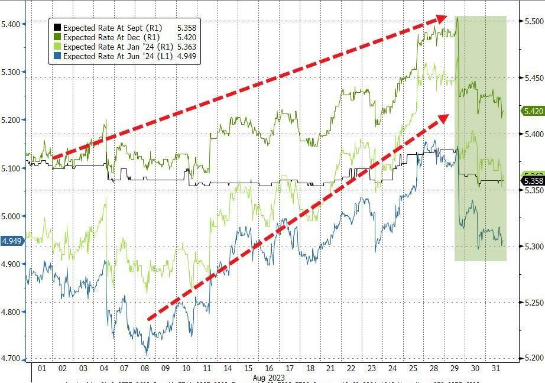
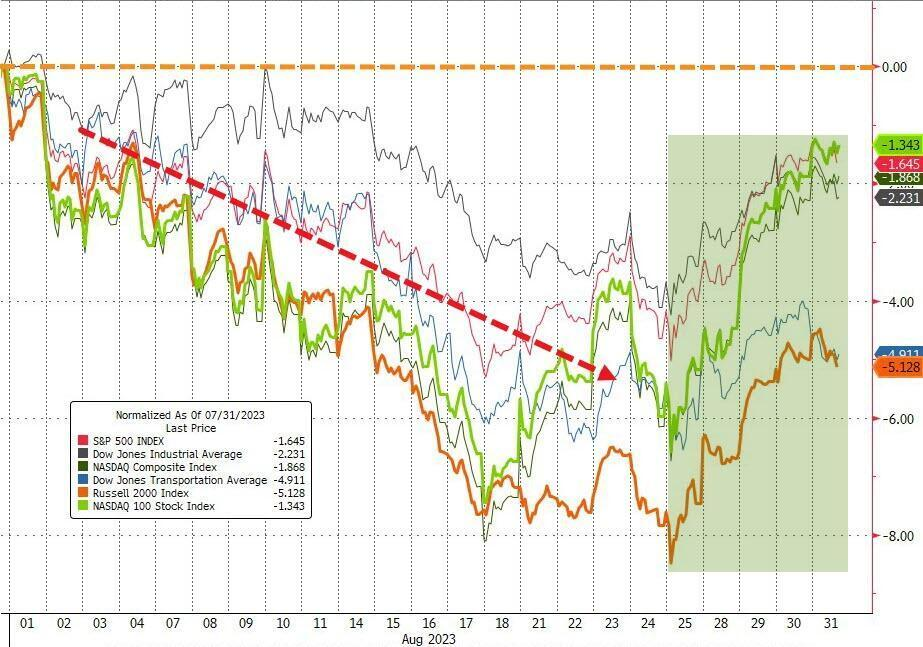
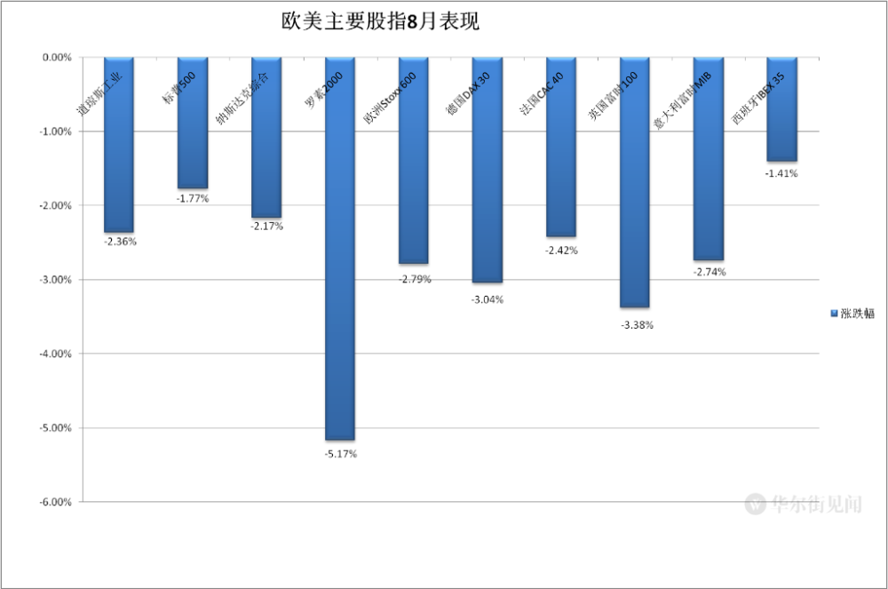
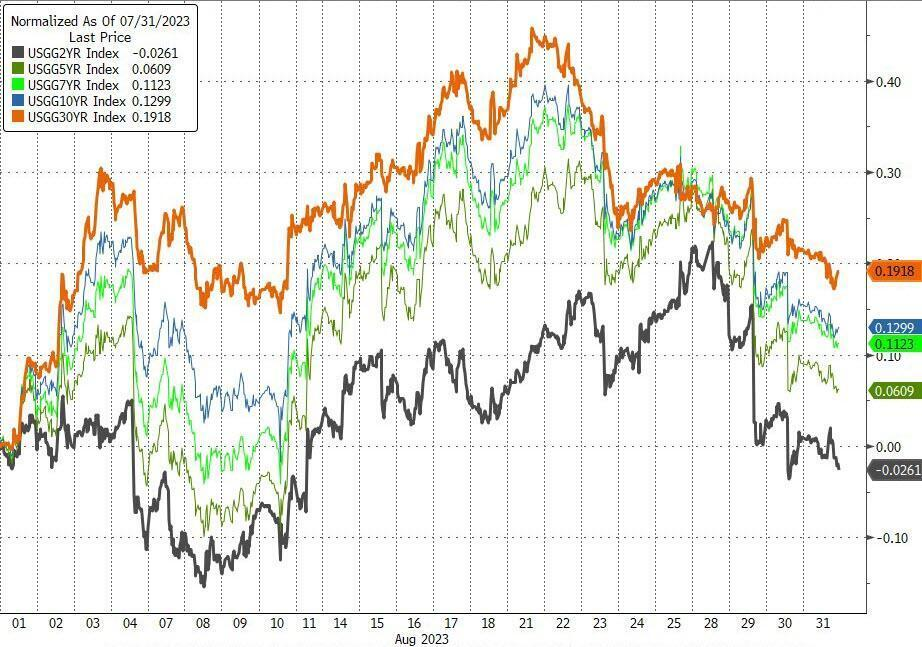
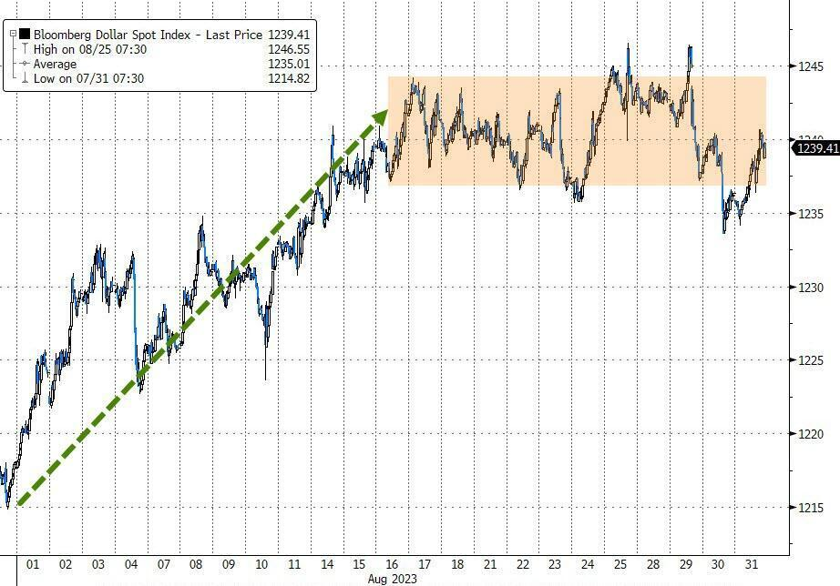
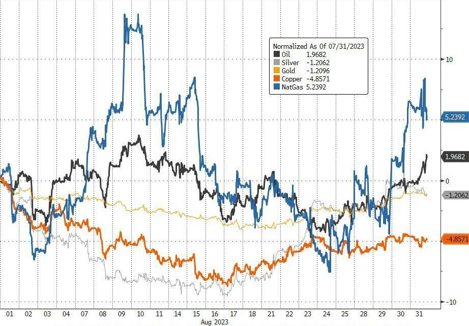

# 美股收盘：三大指数涨跌不一 纳指创今年最差月度表现

美联储青睐的通胀指标如市场所料温和增长，7月核心PCE物价指数连续第二个月环比增长0.2%，创两年多来最低连月增速，同比增长较6月略为加快0.1个百分点至4.2%；但通胀调整后的个人消费支出环比超预期增长0.6%，创半年最高增速。

评论称，新近公布的数据让市场喜忧参半：一方面，通胀指标两个月都环比小幅增长，刺激了消费者支出增长，让美国经济更有可能避免衰退，另一方面，经济的韧性又让人担心，美联储更有理由保持紧缩，以便继续降低通胀。市场焦点转移到周五将公布的重磅就业报告，它也是美联储下次会议前最后一份非农就业数据。

周四的数据公布后，有“全球资产定价之锚”之称的基准十年期美国国债收益率继续，保持下降势头，对利率更敏感的两年期美债收益率先回升，美股早盘转降；美元指数涨幅扩大，脱离周三所创的两周低位，势将本周首度上涨收官；美股继续走高，但盘中涨势消退，主要股指一度齐跌。

美元反弹部分得益于欧元回落。而人民币顶住美元回升的压力反弹，离岸人民币一度涨破7.27至一周来高位，日内涨超300点。周四公布的8月欧元区调和CPI意外未增长放缓，企稳7月水平。数据公布后欧元走低，欧债价格加速回涨，收益率降幅扩大。欧洲央行鹰派官员Isabel
Schnabel称，欧元区经济增长前景比6月预期的疲软，欧央行可能已完成部分工作，又说未必不需要进一步加息，基本通胀仍高企。市场对欧央行9月加息的预期略有下降。

虽然美股本周持续走高，但和欧股的主要股指一样，都未能全月扭转跌势头，体现市场对央行持续紧缩及主要经济体经济前景的担忧。此外，8月股市还曾遭遇惠誉下调美国主权信用评级的“黑天鹅”冲击。

最近市场对美联储加息的预期有所降温，但8月全月，加息预期总体升温

大宗商品中，国际原油继续走高，美油一周来持续上涨，市场预期OPEC+直到今年底都会继续减产，沙特会将自愿增加减产100万桶/日的行动延长到10月，媒体称，俄罗斯与OPEC+达成一致，俄方同意进一步削减石油出口。因主要经济体数据不佳，8月原油虽然继续累涨，但涨幅远不及7月。

其他商品中，美元回涨的打击下，黄金等贵金属齐跌，全月也在美元走强的压制下累跌。经济风向标“铜博士”等轮到基本金属几乎全线累跌，体现市场对主要金属消费国经济和房产等形势的关注。

标普创半年最大月跌 纳指今年内最大月跌 芯片股指五连涨 英伟达连创历史新高

三大美国股指集体高开。道琼斯工业平均指数盘初曾涨约180点、涨0.5%，后涨幅持续收窄。早盘刷新日高时，标普500指数和纳斯达克综合指数分别涨近0.4%和0.7%。午盘道指和标普先后转跌，纳指曾短线转跌。标普午盘不止一次转涨，尾盘又转跌，道指尾盘刷新日低，跌逾170点。

最终，三大指数仅纳指收涨，道指和标普止步四连涨。连续两日创8月15日以来新高的道指收跌168.33点，跌幅0.48%，报34721.91点。周三刷新8月7日以来高位的标普收跌0.16%，报4507.66点。纳指收涨0.11%，报14034.97点。

科技股为重的纳斯达克100指数收涨0.25%，连续三日跑赢大盘，和纳指均连涨五日、连续两日两日刷新8月1日以来高位。价值股为主的小盘股指罗素2000收跌0.19%，跌离周三连涨四日刷新的8月14日以来高位。

主要美股指截至周三连续四日集体收涨，8月仍累计下跌。标普累跌1.77%，创今年2月以来最大月跌幅，纳指累跌2.17%，纳斯达克100累跌1.62%，均创去年12月以来最大月跌幅，都将终结五个月连涨；连涨两个月的道指和罗素2000分别累跌2.36%和5.17%。

主要美股指8月走势

标普500各大板块中，周四只有四个收涨，亚马逊所在的非必需消费品涨0.5%，芯片股所在的IT涨近0.4%，Meta和谷歌所在的通信服务涨0.1%，能源涨近0.2%。8月只有涨超1%的能源一个累涨，累跌的十个板块中，除了通信服务和医疗以外，其他板块至少跌超1%，公用事业跌6.7%领跌，必需消费品、材料和房地产都跌超3%，金融跌近2.9%。

芯片股总体连涨五日，周四跑赢大盘，费城半导体指数和半导体行业ETF
SOXX均收涨约0.7%，刷新8月7日以来高位，8月分别累跌近5%和4.6%。英伟达午盘曾转跌，收涨近0.2%，连续三日刷新收盘最高纪录，8月累涨5.6%。收盘时美光科技涨超2%，英特尔、高通、应用材料涨超1%，而AMD跌0.8%，收涨超3%的博通盘后公布的二季度收入和三季度业绩指引大致符合预期，盘后仍跌超3%。

龙头科技股多数上涨。周三回落的特斯拉收涨近0.5%，刷新周二连涨三日所创的8月3日以来高位，8月累跌3.5%。

FAANMG六大科技股中，亚马逊收涨近2.2%，连涨三日至8月14日以来高位；Facebook母公司Meta收涨近0.3%，开始靠近
周二连涨两日刷新的8月15日以来高位；谷歌母公司Alphabet收涨0.2%，
连涨五日，三日刷新去年4月以来高位；苹果收涨逾0.1%，连涨五日，三日刷新8月3日以来高位；而周三连涨三日、两日刷新8月7日以来高位的微软收跌0.3%，周三连涨四日、两日刷新8月8日以来高位的奈飞收跌0.2%。

这些科技股8月多数累跌，Meta跌超7.1%，苹果跌近4.4%，微软跌2.4%，奈飞跌1.2%，而亚马逊累涨3.2%，Alphabet涨2.6%。

总体连涨四日的AI概念股大多回落。被摩根士丹利将评级从持有下调至低配、认为其缺少AI技术货币化的战略后，Palantir（PLTR）收跌超8%，截至收盘，C3.ai（AI）跌超1%，
SoundHound.ai（SOUN）跌超4%，BigBear.ai（BBAI）跌超5%，而Adobe（ADBE）涨超2%。

银行股指数周四涨跌各异，在被两大评级机构穆迪和标普接连下调多家美国银行信用评级的8月，均大幅累跌。周二刷新8月17日以来高位的整体银行业指标KBW银行指数（BKX）收跌0.1%，连跌两日，8月累跌约8.8%；地区银行指数KBW
Nasdaq Regional Banking Index（KRX）收涨0.4%，地区银行股ETF
SPDR标普地区银行ETF（KRE）收涨近0.5%，开始靠近周二各自刷新的8月18日以来高位，8月分别累跌约9.1%和8.5%。

热门中概股总体连续两日回落。纳斯达克金龙中国指数（HXC）收跌近0.6%，8月累跌10.3%。中概ETF
KWEB和CQQQ均收跌0.9%。个股中，到收盘，小鹏汽车跌超5%，蔚来汽车跌超3%，京东、B站跌超2%，百度、腾讯粉单跌超1%，理想汽车跌近0.8%，阿里巴巴跌0.8%，网易跌0.5%，而周二发布财报后涨超15%创三个月最大涨幅的拼多多收涨近0.9%，连涨七日。

公布财报的个股中，二季度业绩优于预期且三季度及全年指引向好的网络安全公司CrowdStrike（CRWD）收涨9.3%；季度业绩和指引均优于预期的云软件巨头赛富时（CRM）收涨3%；二季度盈利高于预期且全年指引强劲的身份识别与访问管理公司Okta（OKTA）收涨13.5%；而二季度盈利和三季度及全年的指引均逊于预期的折扣零售商Dollar
General（DG）收跌12.2%；三季度指引逊色的另一折扣零售商Five
Below（FIVE）收跌6%；季度业绩优于预期但暗示消费者变得更谨慎、称活跃用户同比下降的宠物食品零售商Chewy（CHWY）收跌12.3%。

波动较大的个股中，截至周一连续三日两位数大幅收涨、且三日连创历史新高的“越南特斯拉”VinFast
Auto（VFS）收跌15.9%，在连涨六日后连续三日每日至少跌超10%，不过，自8月15日美国借壳上市以来，8月累计仍上涨232.15%；周三因拜登政府呼吁将大麻从高危药物分类转移到风险较低分类后大涨的大麻股继续走高，Canopy
Growth（CGC）、Tilray Brands（TLRY）和Cronos Group（CRON）分别收涨25.8%、11.3%和9.6%。

欧股方面，虽然金融股和对利率敏感的房产股走高，但必需消费品和奢侈品类股下跌，拖累泛欧股指盘中转跌，在两连涨后连跌两日。欧洲斯托克600指数继续跌离周二刷新的8月14日上以来收盘高位。主要欧洲国家股指周四多数下跌，法股和西股连跌两日，连涨四日的意股回落，周一休市的英股止步六连涨，而周三结束三连涨的德股反弹。

各板块中，食品跌近1.1%领跌，主要源于警告截至9月末季度在中美销售将下滑后，巴黎上市的酒业巨头保乐力加跌6.7%，银行也跌逾1%，奢侈品类股所在的个人与家庭用品跌约1%；而受益于欧债收益率下行的房产板块涨超1.6%领涨，金融服务涨逾1.5%，创一个月新高，得益于公布削减超过100亿美元成本计划后瑞银大涨6.1%，创2008年来新高。

8月斯托克600指数累跌近3%，在连续两月每月涨超2%后回落，各国股指也均在两月连涨后回落。各板块中，矿业股所在的基础资源跌近7%，连累英股在各国股指中领跌，科技跌5%，银行跌4%，6月跌近2%逆市领跌的公用事业跌3%，6月大涨约10%的房产板块跌不足1%。

两年期德债收益率降10个基点 十年期美债收益率创三周新低 8月仍连升四个月 两年期收益率连降两月

欧洲国债价格齐涨，短债收益率带头下行。欧元区CPI和欧洲央行官员讲话后，货币市场预计，欧央行9月加息幅度可能为7个基点，低于周三预期的幅度13个基点。投资者对英央行的加息预期也降温。

到债市尾盘，英国10年期基准国债收益率收报4.35%，日内降6个基点；2年期英债收益率收报5.12%，日内降9个基点；基准10年期德国国债收益率收报2.46%，日内降8个基点，2年期德债收益率收报2.96%，日内降10个基点，均刷新8月24日以来盘中低位。

8月欧债收益率齐升，体现市场的央行加息预期。10年期英债收益率升约5个基点，在7月回落后最近五个月内第四个月攀升，2年期英债收益率升约18个基点；10年期德债收益率升约3个基点，连升三个月，升幅远不及至少升10个基点的前两月，7月降约16个基点的2年期德债收益率升约6个基点。

美国10年期基准国债收益率在亚市早盘接近4.12%刷新日高，美国PCE通胀数据发布后先曾升破4.10%，后持续下行，美股午盘曾下破4.08%，在连续两日创8月11日以来新低后，又刷新8月10日以来低位，到债市尾盘时约为4.11%，在连降三日后大致持平周三同时段水平，8月仍累计升约15个基点，在连降两个月后连升四个月。

对利率前景更敏感的2年期美债收益率在欧股盘中下破4.85%刷新日低，美国PCE公布后加速上行，美股盘初曾升破4.91%刷新日高，后回落，美股午盘曾回到4.85%下方，逼近周三下破4.84%而连续两日刷新的8月11日以来低位，到债市尾盘时约为4.86%，日内降约2个基点，在周三大致收平后重回降势，本周第三日下降，8月累计降约2个基点，在连升两个月后连降两月。

8月各期限美债收益率总体上行，长债收益率升幅更大，而两年期美债收益率回落

美元指数止住三连跌 脱离两周低位 结束两月连跌 离岸人民币一度涨破7.27

追踪美元兑欧元等六种主要货币一篮子汇价的ICE美元指数（DXY）在亚市早盘曾逼近103.00刷新日低，日内跌超0.1%，欧股盘前转涨后保持涨势，美国PCE公布后涨幅扩大，美股早盘曾涨破103.70刷新日高，日内涨近0.6%，告别周三跌破103.00刷新的8月15日以来盘中低位。

到周四美股收盘时，美元指数处于103.60上方，日内涨近0.5%，8月累涨约1.7%；追踪美元兑其他十种货币汇率的彭博美元现货指数涨0.3%，脱离8月11日以来低位，8月累涨1.8%，和美元指数均结束三日连跌、且8月均在连跌两月后反弹、8月创2月以来最大月涨幅。

彭博美元现货指数创半年来最佳月表现

多种非美货币周四回落，欧元兑美元自亚市早盘起持续下行，欧股盘初跌破1.0900，美股午盘曾跌穿1.0840刷新日低，日内跌约0.8%，跌离周三涨破1.0940刷新的8月15日以来高位；英镑兑美元在美股早盘曾在美股早盘曾跌破1.2660刷新日低，日内跌0.5%，告别周三涨破1.2740刷新的8月23日以来高位；但日元反弹，美元兑日元在美股午盘曾跌破145.50，刷新8月24日以来低位，日内跌超0.5%，远离周二涨破147.30而连续三日刷新的去年11月以来高位。

离岸人民币（CNH）兑美元周四全天基本保持涨势，亚市盘初刷新日低至7.3031，美国PCE公布后盘中跳涨，美股盘前曾涨至7.2686，刷新8月24日上周四以来盘中高位，日内涨345点，北京时间9月1日4点59分，离岸人民币兑美元报7.2755元，较周三纽约尾盘涨276点，抹平周三止步两连涨的跌幅，8月累跌1294点，抹平7月终结五个月连跌的涨幅。

周二因美国上诉法院推翻SEC决定、为Grayscale比特币现货ETF上市扫清障碍而大涨后，比特币（BTC）连续两日回落，周四在欧股盘中曾涨破2.75万美元刷新日高，美股早盘加速回落，午盘曾跌穿2.6万美元关口刷新日低，较日高跌近1600美元、跌近6%，远离周二涨破2.81万美元刷新的8月17日以来盘中高位，美股收盘时处于2.62万美元下方，最近24小时跌超4%。

原油创三周新高 连涨三个月 美油六连阳

国际原油期货在欧股早盘转涨后保持上行，美股午盘刷新日高时，美国WTI原油涨至83.69美元，日内涨2.5%，布伦特原油涨至86.88美元，日内涨逾1.9%。

最终，WTI
10月原油期货收涨2.45%，报83.63美元/桶，刷新8月9日以来收盘高位。布伦特11月原油期货收涨1.87%，报86.83美元/桶，周四到期的布伦特10月合约收涨1.2%，报86.86美元/桶，均创8月9日以来新高。

8月美油即月合约累涨约2.2%，布油累涨1.5%，均连涨三个月，但涨幅远逊7月。7月美油累涨15.8%，创去年1月以来最大月涨幅，7月布油累涨14.2%，创去年5月以来最大月涨幅。

美国汽油和天然气期货齐跌。NYMEX 9月汽油期货收跌1.5%，报2.77美元/加仑，8月跌近5.6%，结束两月连涨；NYMEX
10月天然气期货收跌1.00%，报2.7680美元/百万英热单位，告别周三刷新的8月9日以来高位，在7月回落后8月累涨5.1%。

伦铜跌落三周高位 8月跌超4% 黄金止步三连涨 全月跌超2%

伦敦基本金属期货周四连续两日多数下跌。领跌的伦镍跌1.7%，连跌五日，继续创逾一周新低。伦铜跌落连涨两日所创的三周多来高位。伦锌连跌两日，继续跌离周二所创的将近三周来高位。伦锡几乎回吐周三反弹的所有涨幅，逼近周二所创的逾一周来低位。而伦铝连涨三日，三周多来首次收盘逼近2210美元。伦铅反弹，继周二创1月末以来新高后，又创1月下旬以来新高。

8月基本金属大多累跌，领跌的伦锡跌超11%，伦锌跌逾5%，伦铜跌4.6%，均止步两月连涨；伦镍跌约9%，伦铝跌超3%，抹平7月反弹的涨幅。而伦铅一枝独秀，涨超3%，连涨三个月。

纽约黄金期货周四总体回落，仅在亚市早盘和美股盘前曾转涨，美国PCE公布后持续下行，美股早盘刷新日低至1965.5美元，日内跌约1.6%。

最终，COMEX 12月黄金期货收跌0.36%，报1965.90美元/盎司，跌落周三连涨三日刷新的8月4日以来收盘高位。8月期金主力合约累跌约2.2%。

纽约期银两连阴，COMEX
12月白银期货收跌1.2%，报24.81美元/盎司，继续跌离周三所创的7月31日以来高位，8月累跌2.07%，和期金都在7月扭转两月连跌后回落。

从累计涨跌看，金银铜油和天然气四大商品中，8月金属表现总体逊色，美国天然气表现最佳，原油次之。

金银铜油和美国天然气8月走势

