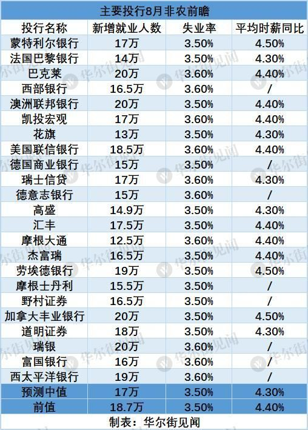
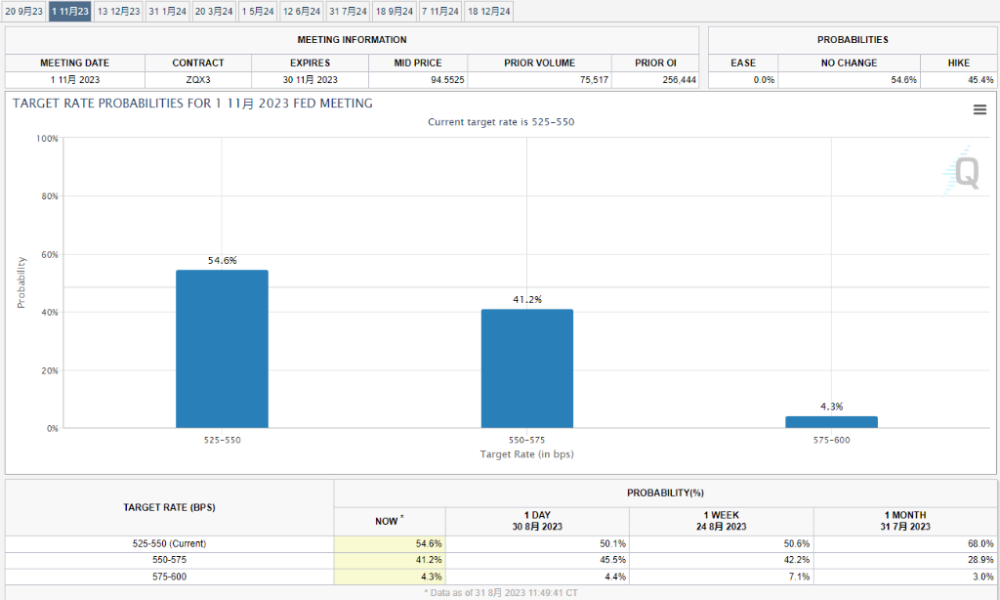

# 重磅非农今夜来袭 美联储9月还会加息吗？

距离美联储9月利率决议还有不到三周的时间，在此之前将公布的关键数据除了8月CPI之外，就是今夜的非农了。

北京时间周五（9月1日）20：30，美国劳工统计局将公布美国8月非农就业人口变动及失业率等数据，揭示美国劳动力市场最新状况。

据彭博社调查中值，经济学家普遍预计：

**8月非农就业人数将增加17万人，较7月份的18.7万人进一步放缓，料将创2020年12月以来最低。**

**平均时薪环比增长0.3%，低于7月份的0.4%** ； **同比增长4.3%，低于7月份的4.4%；**

**失业率保持在3.5%不变；**

劳动力参与率保持在62.6%不变；

平均每周工作时间保持在34.3小时不变。

**若数据最终符合预期，就业市场进一步放缓将再次减弱美联储加息的迫切性。**
此前公布的美国7月核心PCE物价指数符合预期，且环比创两年多来最小连续涨幅，进一步增加美联储可能暂停加息的希望。

上周在杰克逊霍尔全球央行会议上，美联储主席鲍威尔一边强调通胀高位回落但仍然过高，准备适时进一步加息，一边又通过另一句谨慎的措辞来缓和这种鹰派评估，即在未来加息决定时，央行将“谨慎行事”。

**这使得市场对美联储下一步行动的看法摇摆不定。随着美联储采取以数据为中心的立场，非农就业数据将是衡量未来政策决策预期的关键。**

目前市场预计美联储9月维持利率不变的概率达到89%，但11月维持利率不变的概率只有约55%，而有41%的概率会加息25基点。
**如果就业增长令人失望，加息预期可能会进一步下降，但如果就业报告意外非常强劲，加息预期可能会迅速上升。**

主要投行对8月新增非农人数的预测依旧分歧巨大，包括摩根士丹利在内的23家大型投行 **最低预测12.5万，最高预测20万**
。失业率与时薪同比增速的预期值相差不大。具体如下：

导致数据弱于预期的因素

传统上，高盛是卖方机构中最乐观的投行之一，但这次该行的经济学家却是最悲观的。

高盛首席经济学家哈哲思(Jan Hatzius)在一份报告中写道，他预计8月份非农就业人数增加14.9万，远低于市场普遍预期的17万。

原因有以下：

1）大数据。

高盛跟踪的四个大数据指标显示， **8月份就业增长稳健，但总体上有所放缓** ——中位数为增长17.6万，而7月份为增长36.2万。

**2）8月非农就业普遍疲软** ，这可能反映了反复出现的季节性偏差。

高盛统计显示，过去十年中，每年8月份的就业增长都在放缓，其中有七次没有达到共识。就偏差的大小而言，
**过去十年来，8月份的就业人数平均减少了51000人** （相对于3个月的平均水平）。

**3）工人罢工和卡车运输巨头Yellow破产。**
高盛预计，好莱坞工人罢工（18000名工人）和Yellow卡车运输公司裁员（7月底解雇8000名非工会工人） **将造成26000人的就业拖累。**

**4）裁员。** 就业咨询公司Challenger, Gray & Christmas公布的裁员人数从7月的7.6万人，大幅反弹至8月份的9.8万人，
**部分原因是百年老店Yellow宣布破产，导致3万人失业**
，而2022年下半年平均每月裁员人数为4.5万。虽然8月份首申失业救济人数降至每周平均23.5万（7月份为23.8万），但最近的一连串下降可能得益于俄亥俄州欺诈性申请的减少。7月份JOLTS的裁员率维持在1.0%不变。

**5）8月PMI就业分项有所下降。**
美国8月Markit制造业PMI初值中的就业分项降至今年1月份以来新低，服务业PMI中的就业分项降至50.1，创2022年10月以来新低。

**也存在一些支持数据强于预期的因素。**
7月份非农就业人数为增加18.7万，相对于高盛跟踪的四个大数据指标（中位数为增加36.2万人）而言，表现不佳。鉴于此，该行表示，今晚的报告可能会有一个向上的修正，反映其此前捕捉到的夏季强劲招聘。

另外，高盛预计失业率保持在3.5%不变，反映了家庭就业的温和增长和劳动力参与率保持不变。

该行预计平均时薪环比将增长0.20%，这将使平均时薪同比降至4.25%，反映出工资压力的减弱和负面的日历效应（反映与时间段相关联的波动特点）。

如何影响美联储？

最近随着美国经济重新加速，迫使市场重新评估美联储“利率将在更长时间内维持高位”的承诺，交易员们似乎终于同意了政策制定者自6月份以来一直在强调的观点：还会有一次加息。

**目前市场似乎已经放弃了对美联储在9月会议加息的押注，转而预计11月加息的可能性更大。**

本周期货市场曾出现短暂波动，显示美联储到11月召开会议时将政策利率再次上调至5.50-5.75%区间的可能性高达60%，这是自3月初硅谷银行破产和地区银行危机以来的首次。

不过，市场定价仍在不断变化，在周二公布消费者信心下降和职位空缺的报告后，隐含利率迅速回落，凸显了其对数据的依赖性。

因此分析指出，
**今晚的非农就业数据将是衡量未来政策决策预期的关键，如果就业增长令人失望，加息预期可能会进一步下降，但如果就业报告意外非常强劲，加息预期可能会迅速上升。**

鲍威尔已经为9月份加息设定了很高的标准，明确表示美联储在决定进一步收紧政策时将“谨慎行事”。本周发布的一系列数据有助于美联储谨慎行事，
**但分析称，如果非农数据好坏参半，美联储更有可能等到11月才能更清楚地了解到物价和经济的变化。**

值得注意的是，这看似导致美联储9月会议的重要性被低估，但实际上， **9月会议仍然可能是“重大的揭秘时刻”，因为美联储将发布更新的“点阵图”**
，该图可能会显示政策制定者对利率峰值的预期。

市场会怎么反应？

有分析描绘了今晚非农的四种情景：

情景一：就业人数增长10-15万人

**这将是指向软着陆的“金发姑娘”情景，表明不会再有加息，但也不会出现迫在眉睫的衰退。**

情景二：就业人数增长接近20万人

自2022年初以来，就业报告几乎每次都出乎意料地上涨，不排除再次意外飙升的可能性。此外，仅仅增加17万人就能扭转其他数据所描绘的悲观局面。

情景三：就业人数少于10万人

上述两种情况是最可能出现的，但还有另外两种情况需要考虑。

**最悲观的情景是就业人数少于10万人，这**
**将拉响经济衰退警报，促使避险资金流向美元，而股市则会因担心企业利润下降而下跌。金价可能会因美债收益率下降小幅走高。**

情景四：强劲的招聘仍在继续

另一种极端的乐观情况是，就业人数增幅超过20万个，或可能超过25万个。在这种情况下，11月加息将重新回到谈判桌上，美元上涨，股市震荡，黄金“融化”。直到两周前，美国的数据大多超出了预期。

高盛交易部门写道，就股市对非农数据的反应而言，“金发姑娘”情景下，标普500指数将有较大上涨；非农太热是最坏的情况，因为市场不想被迫认真讨论9月加息；而太冷则会加剧增长担忧，目前我们仍处于美债收益率走低、股市上涨的状态，而如果我们看到美债收益率下降，同时股市下跌，这将令人担忧。

以下来自高盛的John Flood：

>22.5万 标普500下跌至少2%；

**位于17.5–22.5万之间 标普500下跌1%–2%；**

**位于15.0–17.5万之间 标普500上涨或者下跌1%；**

**位于10.0–15.0万之间 标普500上涨1%–2%；**

>

