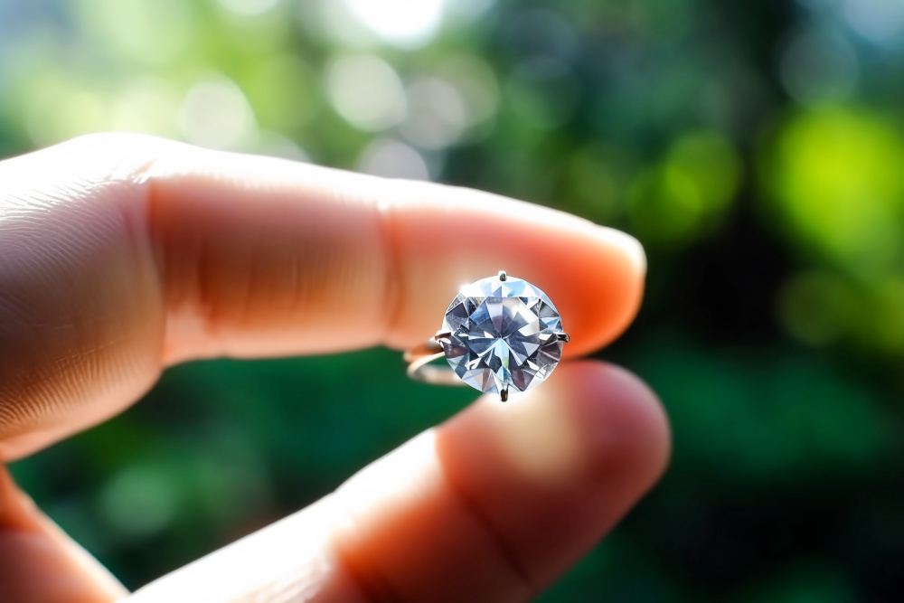

# 钻石无人买，生产和供应商戴比尔斯集团连续四个月毛坯钻销量下滑

界面新闻记者 | 黄姗

界面新闻编辑 | 楼婍沁

根据天然钻石生产商和供应商戴比尔斯集团（De Beers
Group）8月30日发布的最新数据，该公司在2023年第7个销售周期（8月14日至8月29日）售出3.7亿美元（约合26.87亿元人民币）的天然钻石，同比下滑42%。

这也是戴比尔斯2023年以来连续第四个月钻石原石销售额下滑。在2023年第一季度钻石原石销售平稳增长之后，戴比尔斯钻石原石销售额在5月（第4个销售周期）下滑至4.79亿美元，6月（第5个销售周期）至4.56亿美元，而7月（第6个销售周期）至4.11亿美元。至2023年8月，戴比尔斯天然钻石原石销售环比下滑10%。

不仅如此，钻石行业观察机构“钻石观察”在分析中表示，“根据我们的统计，这是近三年来戴比尔斯第一次出现单周期业绩同比降幅超过40%的情况。”

对于8月的销售表现，戴比尔斯集团总裁Al
Cook表示，“由于当前经济环境使得主要消费市场的终端消费者对钻石珠宝的需求愈发疲软，加上传统上夏季的中游交易水平较低，看货商因此在今年第七个销售周期继续保持谨慎的采购态度。”

美国、中国等主要天然钻零售市场对钻石需求的降低，影响了行业中游采购商对市场的信心。为此，戴比尔斯集团近期实际上推出了多项举措来提振市场信心。

钻石行业媒体Rapaport在8月中旬援引消息人士报道称，戴比尔斯进一步放宽了看货商采购政策，允许看货商将不超过一半的毛坯采购计划延迟至2024年。

该报道还指出，一位匿名天然钻开采商给客户写信说，他们可以在他们可以在2023年剩下的9月、10月和12月的采购会上“不采购2克拉以上的毛坯”。该消息未经证实。

若属实，这一举动被视为戴比尔斯集团为应对全球钻石需求下滑、中游天然钻裸钻库存压力增大而采取的措施。本土钻石行业观察机构“钻石观察”在分析中认为，此举相当于戴比尔斯“将毛坯的库存风险转移到了自己身上。”同时也是戴比尔斯集团“针对市场特点进行的从上至下的宏观调控。”

另一提振市场信心的是戴比尔斯集团近期与南非洲地区博茨瓦纳政府签订的全新协议。7月1日，戴比尔斯集团与博茨瓦纳政府签署了新一轮25年钻石开采协议，以及10年钻石毛坯销售协议。

协议签署后，博茨瓦纳的国有钻石公司（Okavango Diamond Company）除了透过正常的拍卖模式以及与HB
Antwerp公司的合作，还将寻求与迪拜多种商品交易中心的合作来销售天然钻石毛坯。

