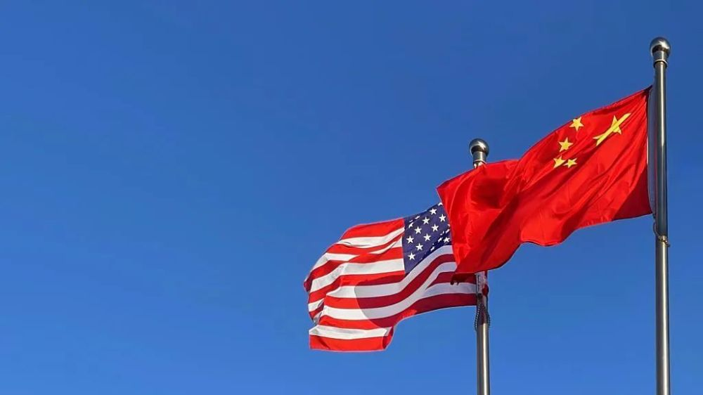
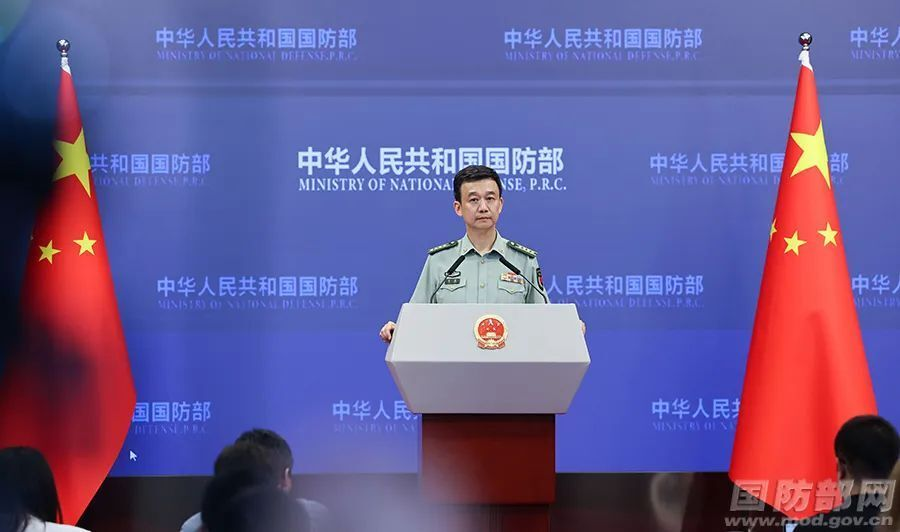

# 中美披露两军高层8月会晤，传递哪些信息

_斐济海岸 资料图_

**直新闻：刘先生，中美两国国防部分别证实，两军高层8月中曾在斐济举行的防长会议上沟通交流。对此，你怎么看？**

**特约评论员 刘和平：**
我想，大家看了这则新闻之后，一定会产生两个疑问，一是为什么中美两国国防部会罕见地如此默契，同时证实中美两军高层曾经在斐济会晤？二是为什么双方不在第一时间内公布，而要等到半个月之后？

从常识和理性上来判断，美方是非常想在第一时间内公布这一信息的。因为美方一直在呼吁中美两军高层恢复交流，并且这对于拜登政府来说，是一个军事外交成果，说明他们有能力恢复中美两国尤其是两军关系。因此未能及时公布的原因，肯定是因为中方不同意。中方不同意的原因，显然又是因为条件不具备，美方未能拿出足够的善意，不仅没有撤销对国防部长李尚福的“制裁”，而且未能放松对中国高科技产业“卡脖子”的行为。

也就是说，在这个信息披露问题上，美方在等中方的同意，中方在等美方的善意。那么中方最终为什么又同意了呢？我认为，显然是美国商务部长雷蒙多访华，起到了关键性的作用。因为雷蒙多这次访华，不仅承诺不会寻求与中国全面“脱钩”，而且在一定程度上部分放松了对中国高科技企业的“制裁”，尤其是部分恢复了被特朗普中断的中美经贸与战略领域的对话机制。很显然，中方同意公布中美两军高层在斐济会晤的消息，意味着中方在一定程度上接受和认可了美方的善意。

从中我们也可以看出，中美双方在处理彼此关系上两种不同的思维模式，美方的思维模式是割裂与单线条的，也就是我在经济上“制裁”了你、但在军事上我们还得交流，而中方的思维模式则是复合与全方位的，是重视整体大环境与大氛围的。

**直新闻：中美两军高层在斐济举行会晤之后，你认为中美两国尤其是两军未来的关系将会走向何方？**

**特约评论员 刘和平：**
我注意到，中美两军高层在斐济举行会晤之后，美国五角大楼发言人莱德说，希望此次会晤能成为与中方定期对话的一部分，以始终保持中美两军沟通渠道的畅通。这背后的言下之意就是，美方并不满足于这次在斐济的会晤，不仅希望中美两军以此为起点实现交流对话的定期化与机制化，而且希望中美两军的对话能够进一步扩展到国防部长层级。

那么对此，中国国防部新闻发言人吴谦的回应是，沟通不能没有原则，对话不能没有底线，中美军事高层接触能否正常化取决于美军是否能与中国相向而行。对此我们可以解读为，中方暂时拒绝了美方提出的将中美两军高层会晤机制化的要求，尤其是拒绝了美方提出的现阶段实现中美两国防长会晤的要求，除非美方能够满足中方最为起码的底线要求。那么中方的底线要求究竟是什么呢？对此吴谦没有明说，但说了一句解铃还须系铃人。答案呼之欲出，那就是美方不仅不能继续在事关中国核心国家利益的问题上，尤其是在台湾问题上，挑战中国的原则和底线，而且当务之急就是，美方自己做错了的事情自己必须要及时改正，也就是撤销对国防部长李尚福的“制裁”。

那么美方会不会在现阶段就改正这个错误呢？我认为，至少在2024年美国总统大选前很难。因为这件事情，涉及的不仅仅是中美两国的面子与里子之争，而且更为关键性的是，还涉及到了拜登与民主党的政治前途。假如在选前拜登政府这样做了，那一定会被特朗普与共和党批评为对华软弱，不利于拜登与民主党的选情。

至于未来的中美关系，我认为，中国国家领导人与拜登去年在巴厘岛的会晤以及今年国务卿布林肯的访华，意味着中美在政治与外交层面的交流已经基本恢复常态，美国财长耶伦与商务部长雷蒙多的访华，意味着中美在经贸层面的交流也已经逐渐恢复了常态，这次中美两军高层在斐济的会晤，则意味着两军的交流正在恢复过程中。也就是说，中美关系的几块拼图政治、外交、经济与军事层面的交往都在恢复过程中。这显然是好事情。但是，恢复交流与接触，并不意味着中美两国关系的正常化，这是两回事。未来双方还有非常漫长的路要走。

**直新闻：国防部新闻发言人吴谦称，中美两军交往并非处于中断状态，双方通过军事外交渠道保持着坦诚有效的沟通。对此，你又怎么看？**

**特约评论员 刘和平：**
其实，此前外界一直以为，自从佩洛西不顾中方警告“窜台”之后，中美两军就一直处于“老死不相往来”的状态，甚至已经没有相关机制处理中美两军之间的一些突发性事件和意外状况了，并因此而对接下来的中美关系与地区局势感到非常的担忧与害怕。那么，吴谦的这一表态，就透露出了一个非常重要的政治和军事信号，即中美两军高层虽然在公开场合没有正常的交往，但是在层级低一些的、尤其是在不公开的渠道，双方的沟通一直未曾中断过。

我认为，吴谦的这一表态，非常及时非常具有针对性。首先，它澄清了近年来外界的一个谣言，反驳了外界的一个偏见。即以美国为首的西方国家，一直把中美两军未能接触与交流的责任归咎给了中方，认为这是中方“不成熟”与“不负责任”的表现，甚至还给中方套上了一个“无理”与“傲慢”的大帽子。吴谦的表态，则不仅告诉了外界，中美两军从未中断交流，中方一直在非常负责任地处理两军的关系。

其次，近年来拜登政府一方面在中国周边肆无忌惮地进行军事布局，另一方面又把自己打造成了一个“和平的使者”，说自己最为担心的就是中美两国从竞争变成对抗甚至是走向冲突，自己所做的一切都是为了防止中美冲突这种最坏的情况出现。而吴谦透露的这一信息则告诉了外界，管控好中美之间的分歧，防止中美由竞争走向对抗尤其是走向冲突，不仅仅是美方口是心非的要求，更是中方一直在踏踏实实地做的事情。也就是说，中方不仅存在着避免中美两军走向冲突的愿望，而且一直在采取实实在在的行动。我认为，明白了这一点，那些仍然在叫嚣着中国大陆将会在2027年前“武统”台湾的人，真的可以洗洗睡了。大陆什么时候采取什么样的行动，取决于“台独”分子的所作所为尤其是他们倚外谋“独”的程度。

作者丨刘和平，深圳卫视《直播港澳台》特约评论员

编辑丨段晓卿，深圳卫视直新闻主编

