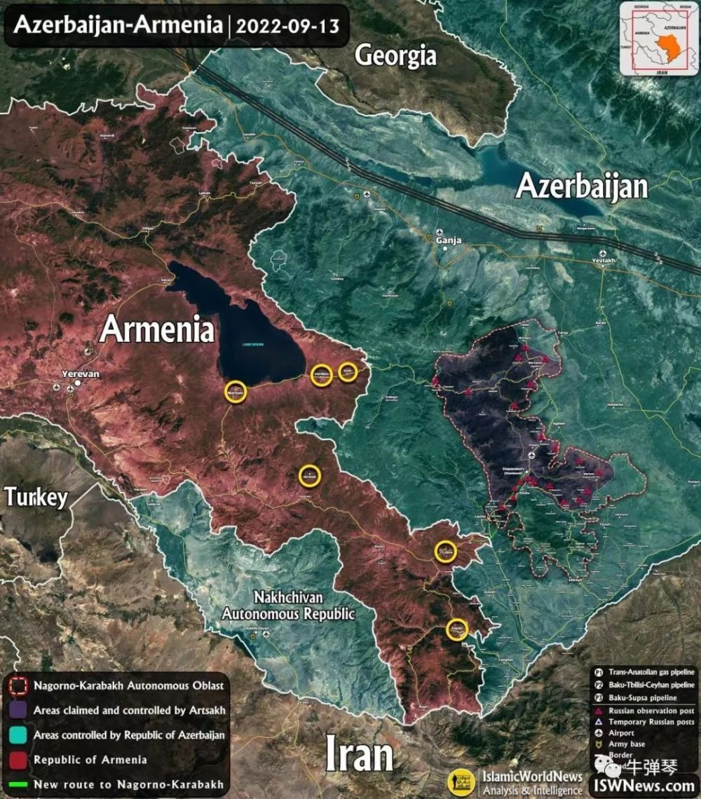
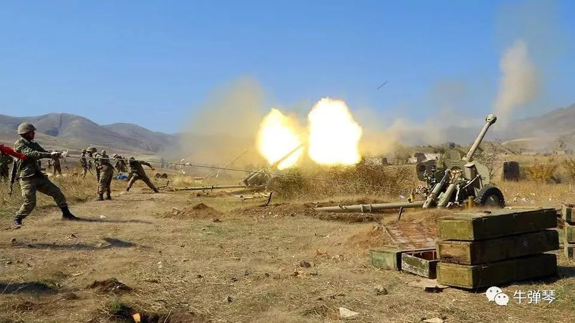
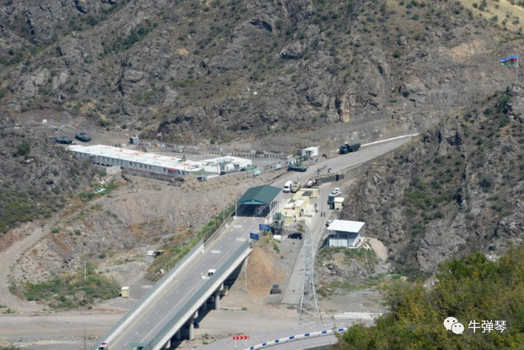

# 亚美尼亚和阿塞拜疆边境交火不断，俄乌冲突后果已外溢到高加索地区

 _资料图_

**（一）**

看得还是很让人忧心，因为 **在这个火药桶，火星又在吱吱作响。**

已经有人倒在了血泊中。

按照亚美尼亚的说法，阿塞拜疆最近在边境集结了大批军队，并使用无人机、迫击炮攻打亚美尼亚阵地，9月1日造成三名亚美尼亚军人身亡。

阿塞拜疆则一概否认，指责是亚美尼亚在挑衅，还出动无人机对阿村庄发动攻击，导致三名阿塞拜疆人受伤。

一切，真是似曾相识。

三年前的2020年，阿塞拜疆和亚美尼亚就爆发了一场战争，造成至少6500人丧生。阿塞拜疆军队当时完全占据了优势，尤其看现场视频，阿塞拜疆军队使用土耳其的无人机，对亚美尼亚坦克一打一个准，这种近乎摧枯拉朽的降维打击，让人印象格外深刻。

亚美尼亚被迫撤退，阿塞拜疆一举收复战略要地纳卡。最后，在俄罗斯介入下，双方实现停火。目前，俄军还在停火线附近部署了约2000人维和部队。

但过去三年，火星一直不断。

记得就在去年，也是9月份，双方又大打出手，炮火接连不断，几乎染红了整个天空，两国都宣布，大约有数十名士兵被对方打死。

至于原因，肯定又是罗生门。

但导火索，则是纳卡这个火药桶无疑。

纳卡不大，全称是纳戈尔诺-卡拉巴赫，4400平方公里，大概17万人口。

当地主要人口，是信奉基督教的亚美尼亚人。但苏联的划分很有意思，纳卡主要是亚美尼亚人不错，但却属于阿塞拜疆。而阿塞拜疆，主体都信奉伊斯兰教。

苏联解体后，各加盟共和国独立，为争夺纳卡，亚美尼亚和阿塞拜疆爆发了激烈的战争，即第一次纳卡战争。3万人丧生，100万人被迫离开家园。

亚美尼亚军队当时很彪悍，拿下了纳卡地区。但这就为2020年第二次纳卡战争埋下了伏笔。

这真是一个让人痛心的结局。

苏联时期，各民族相互杂居，总体还算平和。在纳卡地区，苏联时期五分之四是亚美尼亚族，五分之一是阿塞拜疆族；但2015年纳卡当局统计则显示，当地已没有一个是阿塞拜疆人。

但风水轮流转，2020年阿塞拜疆战胜，收复了纳卡。看到有阿塞拜疆老人，颤颤巍巍回到家园，泪水涟涟。也看到很多亚美尼亚人含泪焚烧自己的住所，转身离去。

一走开，就不知道什么时候再能回来了。

**（二）**

从国际政治看，阿塞拜疆和亚美尼亚都是小国：

**阿塞拜疆面积8.6万平方公里，人口970万；**

**亚美尼亚面积2.9万平方公里，人口310万。**

也就是说，阿塞拜疆的国土面积，大致相当于我们的重庆；亚美尼亚，比我们的海南还小一点。至于人口和经济规模，更无法与我们这两个地区相比。

但阿塞拜疆拥有石油，巴库是高加索地区的石油中心。因此，经过数十年的发展，阿塞拜疆现在的综合国力，尤其是军事实力，大大强于亚美尼亚。

阿塞拜疆背后，还有土耳其撑腰，土耳其为小兄弟提供了大量的先进武器。

亚美尼亚虽小，后面毕竟也有俄罗斯，它本身还是集安组织的成员。

我当年在耶路撒冷工作时，很惊奇地发现，耶路撒冷老城划分为四个部分，其中一个是亚美尼亚人区。在西方，也有不少亚美尼亚人。而亚美尼亚和土耳其又属于世仇。因此，从宗教情感上，西方人普遍站在亚美尼亚人一边。

很有意思的是，对于俄罗斯，亚美尼亚现在似乎更多是愤怒。就在最新冲突爆发的前一天，亚美尼亚还痛批俄罗斯，对盟友领土遭到袭击“绝对漠不关心”。

因为按照集安组织规定，对亚美尼亚的进攻，就是对所有成员国的进攻，但俄罗斯却置之不理。

为什么？

俄罗斯也有难处。帮助亚美尼亚，亚美尼亚似乎胳膊肘往外拐，更喜欢西方；对抗阿塞拜疆，阿塞拜疆后面有土耳其，冲击更重要的俄土关系。

那阿塞拜疆和亚美尼亚你们消停点呢？

也不可能。亚美尼亚愤怒于阿塞拜疆的得寸进尺，欺人太甚；阿塞拜疆愤怒于亚美尼亚战败了还嘴硬，还不承认现实。

在国际上，亚美尼亚还指控阿塞拜疆，封锁纳卡与亚美尼亚的通道，想“饿死”纳卡的亚美尼亚人。

不服，那就打呗。

真理在大炮的射程之内。在这个世界的很多地方，还就是这样残酷无情。

**（三）**

最后，怎么看？

我很感慨，还是粗浅三点吧。

**第一，又一个火药桶正在被点燃。**

亚美尼亚、阿塞拜疆、土耳其、俄罗斯，伊斯兰教、天主教、东正教、亚美尼亚教派，各种矛盾交织在一起，背后更有千年的民族仇恨、宗教冲突、领土争端，真是冤冤相报何时了？民族宗教矛盾处理不好，真是祸害千年啊。

**第二，最倒霉的总是老百姓。**

高加索三国：亚美尼亚、阿塞拜疆、格鲁吉亚，还有争端的纳卡地区、南奥塞梯、阿布哈兹等地，面积都很小，人口都不多，总体上也都不富裕。但最近30年，却总是战乱不断。为什么？这都是苏联解体的后遗症，且没完没了呢。

**第三，俄乌冲突后果正在外溢** 。

必须看到，俄乌冲突的后果在外溢，具体到高加索地区，如果俄罗斯精力没受到牵制，阿塞拜疆和亚美尼亚打得起来吗？如果俄罗斯实力被严重削弱，它还有足够威望，压得住其他火星吗？

类似的问题，仅仅在高加索吗？别忘了，苏东剧变后，一度被掩盖的矛盾突然迸发出来，在苏联，在南斯拉夫，一时间爆发了多少场战争，多少人因此人头落地。

还有， **第一次纳卡战争，亚美尼亚胜；第二次纳卡战争，阿塞拜疆赢。不得不承认，发展还是硬道理啊！**

从俄乌冲突，从纳卡争斗，我们似乎还可以听到，地缘政治裂变的咯咯作响。

当年我在阿富汗和耶路撒冷工作，一个最深刻的感受，就是不到这些地方，你真不明白和平的可贵，人们对和平的渴望。没有和平，一切无从谈起。

但这个世界，和平路茫茫，两目尽血光。唉，我们所习以为常的，真的，却是很多国家最期盼的！

