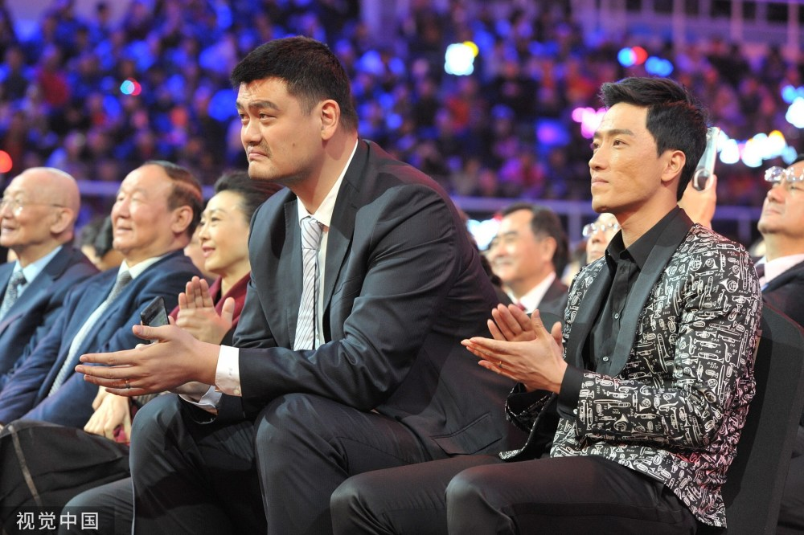
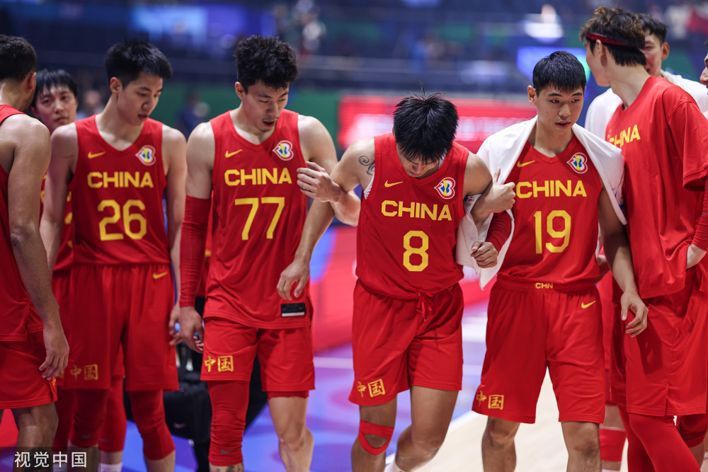

# 体谈丨80后前浪成中国体坛天花板难以超越，后浪们应该焦虑吗？

**撰文丨霍森**

**编辑丨冯小**

当易建联宣布后，中国体坛的80后名将中，仅剩下了苏炳添。

我们都知道，一个时代终将过去，而新的时代终将来临。可有个问题是，接下来的时代，后浪可以赶超前浪吗？如今，90后和00后已经在事实上成为了中国体育的中坚力量。

可是，回顾过去一二十年，你会发现，
**中国体坛的80后名将们，已经开创了前无古人的功绩，堪称史上最强，留给后来人的机会已经不多了。然而我们也必须要承认的是，80后一代运动员成功的背后，是单一维度的唯金牌论或唯成绩论，而90后注定不该对此感到焦虑。属于他们的使命，比这更广阔。**

 _图说：姚明与刘翔是中国体坛80后群星中最被人们耳熟能详的人物。_

01 铸造辉煌的中国体坛80后

首先，过去20年，甚至是新中国有史以来，知名度最高的超级国际巨星，只能说出一个名字的话，你会选谁？

毫无疑问，姚明。

虽然他没能帮助中国男篮在世界大赛上更进一步，但他是第一位在NBA赛场上大放异彩的中国球员，他的谦虚、低调、努力乃至于幽默，都化作了一道中国与世界互相沟通的桥梁，FIBA名人堂里唯一入选的中国球员足以说明他那无与伦比的国际影响力。

还是同样一个问题，排除掉姚明之后，下一个名字会是谁？

当然是刘翔。

他是110米栏世界纪录的创造者，他是奥运会冠军、世锦赛冠军、室内世锦赛冠军三大满贯，他是黄种人的骄傲。

再下来，我们或许还能列举出同样是黄种人骄傲的“苏神”苏炳添；各自在乒乓球和羽毛球项目里大幅断层领先、甚至后人几乎很难超越的马龙和林丹；网球大满贯赛事上首次斩获单打项目冠军的李娜；奥运五金王邹凯（体操）与吴敏霞（跳水）；天下无敌的女乒大魔王张怡宁和同样天下无敌的羽毛球男双组合蔡赟/傅海峰；中国第一个斯诺克冠军丁俊晖；中国第一个拳击奥运冠军邹市明；中国第一个男子击剑奥运冠军仲满……

以上这些伟大的运动员，唯一的共同点就是——他们都是80后。

他们所铸造的辉煌，在中国体坛上留下了如此浓墨重彩的一笔，以至于如果想要评选新中国体坛70年历程里的最佳运动员，几乎很难绕过上面那些星光熠熠的名字。

毫不客气的说，80后很有可能是迄今为止国内体坛分量最重的一个群体，其他世代的运动员虽然也有超脱于时代佼佼者，比如容国团、许海峰、李宁、高敏、朱婷、孙杨、丁宁等等，但无论是数量还是质量，都明显稍逊于80后群体。

_图说：苏炳添是80后体坛名将中仍然现役的存在。_

02 时代浪潮赋予的承前启后重任

那么，到底是什么原因造就了中国体坛80后的辉煌呢？或许是因为，时代的急剧变革。

80年代之后，中国才开始走上了改革开放的康庄大道，往前十年，贫困离乱，往后十年，拥抱世界。可以说，80后是新中国经历最为丰富的一个世代群体，他们出生于改革开发的初期，亲眼见证了中国由一个农业国一步步成长为如今的世界第二极，他们在十数年成长过程中所接触到的新鲜事物，几乎完全跨越了近百年来的人类发展史。

要想在这急剧的时代浪潮当中不被淘汰，就只能不断地去求新求变。

与此同时，举国体制的余晖在80后成长的过程当中也并未完全散去，在50、60和70后的打磨下，成熟完备的举国体制虽然有着缺乏主观能动性、抑制运动员个体创造力、行政手段僵化等缺点，但它强大的纪律性和人员安排调度保证了体育人才品质的下限。

所以，
**80后的运动员，普遍具备老一辈运动员艰苦奋斗、顽强拼搏和刻苦训练的意志品质，同时又因为触摸到了新时代的浪潮，受益于科学系统的训练模式和不断进步的医疗条件，得以在承前启后的同时，兼收并蓄新旧之长，成为了独一无二的特殊群体。**

一个极为典型的例子就是苏炳添。

出生在80年代末的他，初二的时候因为校运会大放异彩而被体校教练所发掘，接下来入选省队和国家队，虽然训练努力刻苦，却始终无法突破10秒大关。

2012年伦敦奥运会与博尔特同场竞技之后，苏炳添燃起了追寻极限的斗志，他在美国训练了几次之后，毅然决定改换起跑姿势和落点步数，把自己过去的技术全部打碎，重头再来。

这个时候，他已经25岁了。

靠着钢铁般的意志，三年后，苏炳添扣开了10秒大关，再后来，苏炳添不断超越自己，直到东京奥运会，“年迈”的他用9秒85书写了100米短跑的全新历史，成为了中国骄傲。

“近乎自虐的刻苦和自律”+“全新的科学训练理念”，既成就了“苏神”，也成就了林丹和马龙。

 _图说：以90后为主力的中国男篮在本届世界杯上表现乏力。_

03 80后的辉煌难以超越

80后运动员们为中国体育所取得的成绩，在短时间之内恐怕已经很难逾越。

除了80后世代取得的成就太过于辉煌，以至于留给后一代人可以开疆拓土的领域越发少且艰难之外，更重要的是——时代的浪潮已过。

**90年代末，中国经济开始进入超高速发展的黄金年代，随之而来的，是各个领域里更为深化和细化的、以市场经济为导向的改革，城市化的浪潮中，旧的社区生态环境完全被瓦解，新的城市社区方兴未艾。**

大家不再鼓励完全服从于集体的宏大叙事，也不再认同极端的自我牺牲，甚至敢于拍着桌子争取属于自己的利益。

李娜、王治郅、宁泽涛……当体制内的“异类”越来越多的时候，过去的体育人才选拔机制，也终于在摸着石头过河的战战兢兢之中抬起头来，后退无路，向前茫茫。

举国体制如今早已步履维艰，也许，市场化和职业化并不是包治百病的灵丹妙药，可体制的转轨一旦开启过之后，就无法再回头。

**持续的扶贫攻坚和低廉的高等教育成本，带来了更多元化的人生选择，对于整体社会福利而言，这毫无疑问是一件好事，可对于举国体制的育才体系来说，则是动摇和挖掘根基的毁灭性破坏。旧的人才选拔机制已经被破坏，但想要建立一个完全基于市场化改革的全新人才选拔体系，仍有待时日。**

所以，我们会看到，在体育职业化改革二十年之后，如足球、篮球这样的许多项目，竟然在90后世代发生了“断档”，隐隐有着原地踏步甚至是退步的迹象。

刚刚结束的男篮世界杯小组赛里，中国男篮三战全败，大家总不免哀叹新时代的姚明和易建联何在；羽毛球世锦赛，中国队最终只收获了一块女双金牌，让大家很是不习惯；一直以来深受国人喜爱的铿锵玫瑰，也在女足世界杯折戟沉沙；而中国男足，更是在多次试错无果之后，朝着深渊坠落，徒留老球迷独自神伤，默默感叹着02年的美好时光。

时代已经变了。

04 新世代运动员无需强行“接班”

但这并不意味着新时代的运动员必须要被束囿于前辈们所建立的辉煌之中。

诚然，姚明、刘翔、林丹、李娜和马龙，本身就是数十年难得一见的天才，他们享受到了时代的红利，也完全兑现了自己的天赋，想要超越他们，本身就是一件极为困难的事情。

可是，既然选择了市场化和职业化的道路，就无需回头，再辉煌的过去也只是过去，人生总要着眼于未来，在学会慢慢放手之后，市场的自我调节总会带来新的出路。

孙杨固然高山仰止，可现在我们的泳池里也有了覃海洋。

李娜当然了不起，可张之臻也刚刚在美网里战胜了TOP5级别的选手，实现了中国网球的新突破。

张博恒（体操）、孙颖莎（乒乓）、全红婵（跳水）、胡明轩（篮球），这些名字都代表着中国体育的未来，在尘埃落定之前，谁又敢说他们之中就一定不会产生“GOAT”呢？

而更为重要的是，全新的现代化体育道路上，自然会有着全新世代的运动员，他们洒脱率性，他们肆意张扬，他们个性斐然。

从洪荒少女傅园慧的意外走红开始，到别着小黄鸭发卡的杨倩，再到活出真我的吴艳妮，观众们也逐渐开始放下对成绩的苛求，转而以更为开放的眼光和更为包容的胸怀来看待这些充满了个性的新时代运动员。

不一定非要冠军和金牌，这样也很好。

