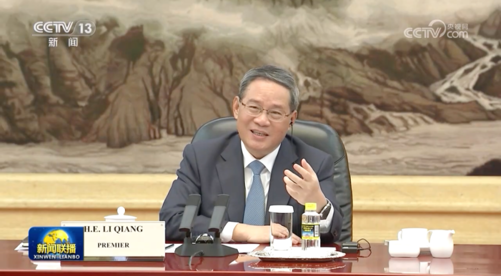
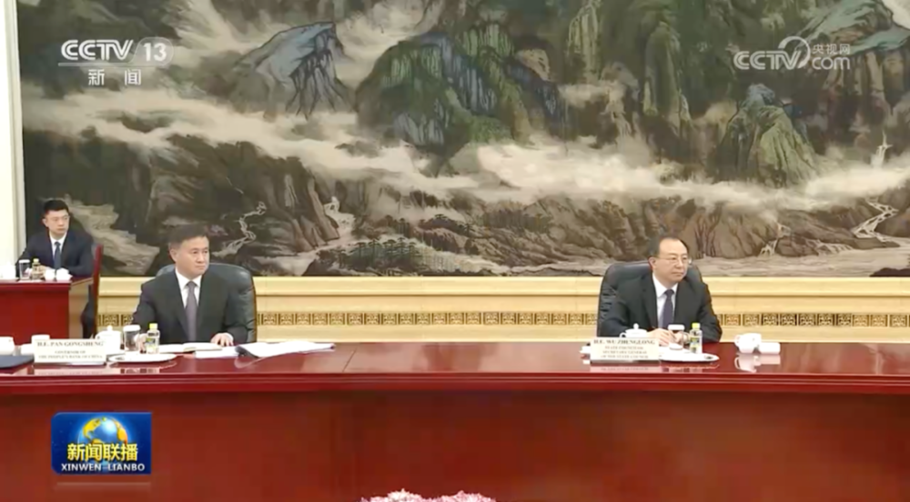
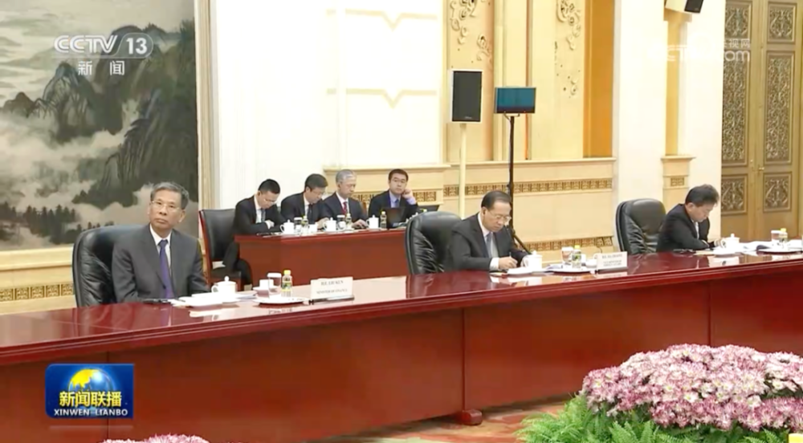
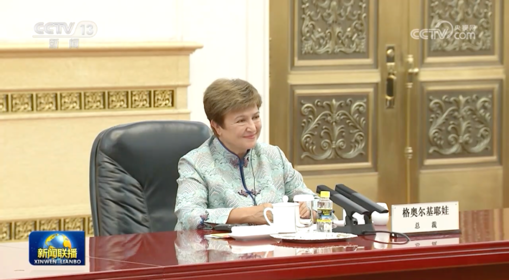
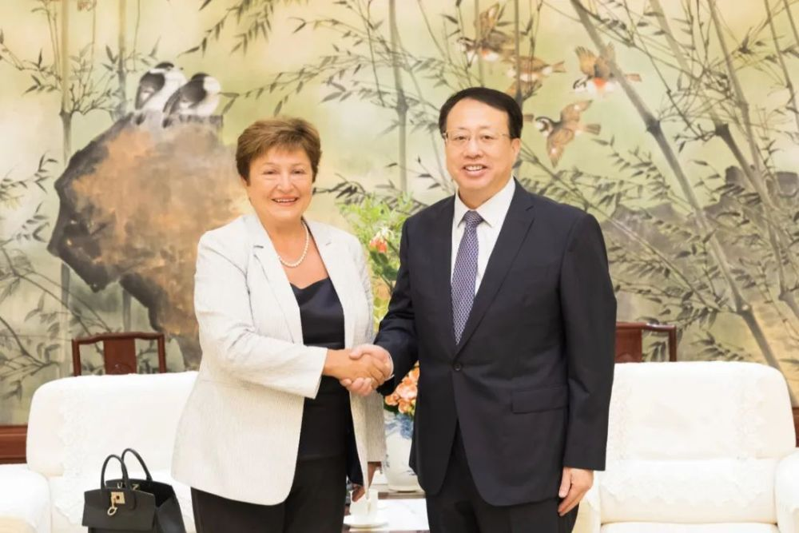

# 总理再度和她见面，释放重要信号

**撰文 | 余晖**

据《新闻联播》消息，9月1日，在人民大会堂，国务院总理李强会见了国际货币基金组织总裁格奥尔基耶娃。

李强表示，希望基金组织推动第十六次份额总检查取得有意义的成果；反对保护主义和各种形式的“脱钩断链”。

现场

央视还报道了现场画面：

画面显示，参加这次会见的还有国务委员兼国务院秘书长吴政隆，财政部部长刘昆，中国人民银行党委书记、行长，国家外汇局党组书记、局长潘功胜等。

国际货币基金组织成立于1945年12月27日，1947年11月成为联合国专门机构。

其宗旨是稳定国际汇兑，消除妨碍世界贸易的外汇管制，在货币问题上促进国际合作，并通过提供短期贷款，解决成员国国际收支不平衡时产生的外汇资金需求。

克里斯塔利娜·格奥尔基耶娃是保加利亚籍，1953年出生，2019年10月1日就任基金组织总裁，任期5年。

另外，中共中央政治局委员、国务院副总理何立峰，财政部部长刘昆，中国人民银行行长、国家外汇管理局局长潘功胜也会见了格奥尔基耶娃。

8月31日，刘昆在钓鱼台国宾馆会见格奥尔基耶娃，双方就 **全球和中国经济形势、中国财政政策、财政部与IMF合作** 等议题交换意见。

9月1日，潘功胜会见格奥尔基耶娃，就 **中国和全球经济形势、中国与国际货币基金组织合作** 等议题交换了意见。

9月1日晚，何立峰在钓鱼台国宾馆会见格奥尔基耶娃，双方就 **当前国际经济金融形势、与国际货币基金组织相关的重大议题** 交换了意见。

反对保护主义和“脱钩断链”

这并非李强今年首次和格奥尔基耶娃见面。

今年3月29日，在海南博鳌，李强会见来华出席博鳌亚洲论坛2023年年会的格奥尔基耶娃。

当时，李强提到，今年世界经济形势总体不容乐观，难预料因素比较多。面对复杂严峻挑战，国际社会需要携手合作、共同应对。

李强还提到，要“ **坚持多边主义，旗帜鲜明反对单边主义、保护主义** ”。

这次和格奥尔基耶娃见面，李强再度提到“反对保护主义”。

他说，中方愿进一步深化与基金组织合作，支持基金组织在全球治理中继续发挥重要作用。

“希望基金组织推动第十六次份额总检查取得有意义的成果；
**反对保护主义和各种形式的‘脱钩断链’，维护经济全球化和自由贸易，维护全球产业链供应链稳定畅通，提升新兴市场国家和发展中国家在国际事务中的代表性、发言权和影响力**
。”

值得一提的是，当前，有的国家不甘心霸权日渐衰落，将国际经贸合作政治化、武器化和意识形态化，大搞“脱钩断链”和经济胁迫，严重拖累世界经济发展。

8月31日，《光明日报》刊发了《反“脱钩断链”是维护全球发展的正义斗争》一文。

文中提到，当前，世界之变、时代之变、历史之变正以前所未有的方式展开，国际社会正经历罕见的多重风险挑战。

一些国家鼓吹“脱钩断链”，构筑“小院高墙”，企图通过科技垄断、技术封锁、贸易壁垒干扰别国创新发展，维护自身霸权地位，破坏全球经济稳定，损害世界各国利益。

站在历史的十字路口，反对“脱钩断链”，摒弃“小圈子”和零和博弈，不仅是捍卫国家主权、安全、发展利益的正当之举，更是维护全球发展的正义斗争。

8月29日，中国驻美国大使谢锋应邀在以“新前进道路”为主题的福布斯第五届美中商业论坛发表主旨演讲。

他提到，中美作为世界前两大经济体、联合国安理会常任理事国，搞阵营对抗带不来和平安全， **脱钩断链只会作茧自缚**
，中美冲突对抗没有赢家、世界不可承受，合作应对全球性挑战，为世界提供更多和平红利、发展红利才是唯一正确选择。

各方应保持全球供应链稳定畅通

一个事实是，在世界经济波动下行，外部环境更趋复杂严峻的背景下，中国经济长期向好的基本面依然稳固。

在这次会见中，李强表示， **今年以来，中国经济持续恢复，总体回升向好。**

他说，我们将进一步强化政策协同，促进经济增长，同时 **坚持改革开放不动摇，优化民营企业发展环境，推动外贸稳规模优结构，更大力度吸引和利用外资**
。我们有信心有能力推动经济持续健康发展。

今年7月，国际货币基金组织发布了《世界经济展望报告》，预计中国经济增速在主要经济体中排名前列。

9月1日，格奥尔基耶娃表示，中国经济对世界经济增长的贡献率达三分之一。

她说，基金组织赞赏中方为促进经济增长采取的有力举措，高度评价中方为帮助脆弱和中低收入国家发展、实现全球经济增长发挥的强有力引领作用，愿同中方进一步加强合作。

“ **各方应保持全球供应链稳定畅通，防止碎片化风险** 。基金组织愿努力推动份额总检查取得积极成果。”

离开北京后，格奥尔基耶娃前往上海。

9月2日，上海市市长龚正会见了格奥尔基耶娃一行。

龚正提到，期待国际货币基金组织助推上海金融市场开放，助力上海金融基础设施与世界各地互联互通，促进更多国际性经济组织在沪设立办事机构，支持更多金融机构落户上海。

格奥尔基耶娃说，“此次访问距离我首次到访上海已有25年，上海发生了翻天覆地的变化，对中国及全球经济发展作出了巨大贡献。”

她说，当前全球经济增长疲软，越是充满不确定性，越是要求我们以更大决心推动经济转型，特别是绿色和数字化转型，从而提高生产率，增强景气度。

“国际货币基金组织将发挥专业知识，与上海深化合作，推动全球经济繁荣发展。”

**资料 ｜ 新华社 人民网 央视等**

**【版权声明】本文著作权归政知新媒体独家所有，未经授权，不得转载。**

