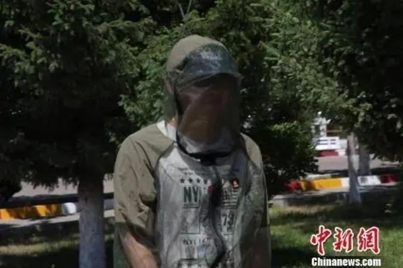

# 比断骨还痛，已致多人死亡！传染病登革热近期高发

立秋已过天气依然炎热，不少蚊虫继续四处出击，作为蚊媒传染病“一哥”的登革热近期也被频频提及。

**全球多地暴发登革热疫情**

据央视网消息，中国台湾台南登革热破3000例，恐重演2015年大流行。

据厦门日报消息，记者8月28日从厦门海关获悉，厦门海关所属机场海关近日在入境航班中检出厦门口岸今年首例登革热病例。

当地时间8月30日，危地马拉卫生部指出，今年以来该国上报的感染病例为10914例，同比增长135%，其中死亡22人，全国进入为期三个月的卫生紧急状态。

据越南卫生部8月29日通报，截至8月23日，越南全国今年累计确诊登革热病例6万1799例，其中死亡病例14例。

据哥伦比亚媒体当地时间8月27日报道，哥国家卫生研究院发布的流行病学公报显示，今年初至8月中旬，该国报告67944例登革热病例，累计死亡病例44例。

当地时间8月27日，洪都拉斯卫生部登革热流行病学监测员对当地媒体表示，2023年以来，该国共报告11540例登革热病例。

**夫妻双双确诊**

据福建卫生报9月1日报道，福建医科大学附属第一医院感染科詹医生介绍，上周，门诊接诊了一对60多岁的夫妻。妻子已发热5天，持续高热，伴肌肉酸痛，腹泻、呕吐等消化道症状明显，就医当天四肢有红色1-2mm出血性丘疹，登革热抗原检测为阳性；丈夫当天也感觉有点低烧，顺便也抽血检查，结果也为阳性。夫妻俩近期无外出旅居史。

**什么是登革热？**

登革热是一种由登革病毒引起的急性虫媒传染病，由于会剧烈疼痛，又被称为“断骨热”。

**登革热如何传播？**

登革热是经媒介伊蚊叮咬传播的急性传染病，主要由“病人→伊蚊→其他人”的途径传播，人与人之间一般不会直接传播疾病。

登革热病人或隐性感染者被伊蚊叮咬后，病毒在伊蚊体内一般需经大约8-10天的增殖后，才可以通过叮咬将病毒传播给人。我国人群普遍易感，感染后，潜伏期一般为1-14天，但也有部分人不发病(称为隐性感染者)。能传播登革病毒的媒介伊蚊在我国分布广泛，病毒输入后可以快速传播扩散。

**登革热有什么症状？**

登革热的典型症状是高热、三痛、三红和皮疹。

高热：突发高烧(40°C以上)；

三痛：剧烈头痛、全身关节痛、肌肉酸痛；

三红：面红、颈红、胸红；

皮疹：四肢躯干或头面部，出现充血性皮疹或点状出血疹。

**登革热流行区和流行季节**

该病广泛流行于东南亚、西太平洋地区和非洲南部等热带、亚热带国家和地区。近年来，我国登革热疫情主要为境外输入病例引起的本地传播疫情，主要来源国为缅甸、柬埔寨、印度尼西亚、泰国、老挝和马来西亚等东南亚和南亚国家；多分布在广东、云南等沿海或沿边地区。

登革热高发季节为夏秋季，一般自5月份开始逐渐增多，8～10月份为发病高峰期。

_资料图：当地时间2019年7月30日，孟加拉达卡，一名登革热病人躺在病床上。当时，孟加拉国正在遭遇史上最严重的登革热疫情。_

**何时怀疑自己得了登革热？**

如果过去2周曾在登革热流行的国家或地区逗留，或自己生活与活动的社区、街道、甚至城市范围内有登革热发生，当出现突起发热(有时可达39°C)，同时伴有以下症状之一——明显疲乏、厌食、恶心等，常伴较剧烈的头痛、眼眶痛、全身肌肉痛、骨关节痛，可伴面部、颈部、胸部潮红时，应考虑自己有感染登革热的可能。此时应尽快到正规医院就医，并主动向大夫说明自己可能得了登革热，以尽快得到诊治，并采取防蚊隔离，防止进一步扩散。

**如何预防登革热？**

目前，登革热尚无经审批注册的疫苗上市，也无特效的抗病毒治疗药物，早发现、早诊断、早治疗、早防蚊隔离是应对登革热的主要措施。

因此，如确需前往登革热流行地区，行前可做好防蚊虫叮咬准备。如准备防蚊液、花露水、蚊香、电蚊拍、灭蚊灯、蚊帐、高效低毒灭蚊药等。

_资料图：防蚊虫服装。_

在登革热流行地区活动时，应穿长袖衣裤，尽量选择浅色；外出使用蚊虫驱避剂等驱蚊产品，避免前往阴暗潮湿处，尽量避免被蚊虫叮咬。

选择清洁、干燥的住所，并在住所安装纱门、纱窗。出门前可以在房间使用蚊香、灭蚊气雾剂等。即使是酒店，也要注意室内灭蚊。

