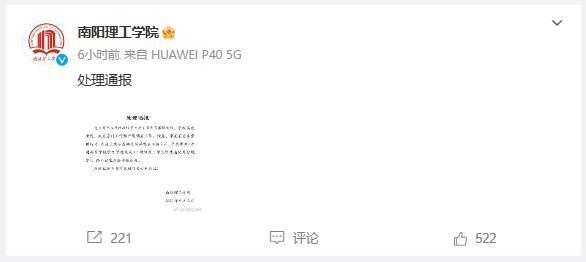

# 河南南阳理工学院学生因发布虐猫视频被开除学籍，曾详细描述虐猫经过

9月2日，@南阳理工学院
发布情况通报称，近日有网友反映我校学生李某某发布虐猫视频，学校高度重视，成立专门工作组开展调查工作。经查，李某某存在虐猫行为，在网上发布虐猫视频并发表不当言论。学校依据《普通高等学校学生管理规定》《南阳理工学院学生违纪处分规定》，给予该生开除学籍处分。感谢社会各界对我校的关心和关注！

另据此前报道，8月27日，有网友反映，南阳理工学院有一名学生发布虐猫视频。该网友发布的信息显示，该学生还以文字形式详细描述了虐猫经过。

8月28日，南阳理工学院曾就此事发布通报表示，学校高度重视，立即成立专门工作组开展调查处置工作。经初步核查，虐猫视频确系该校2020级学生李某某所发。

