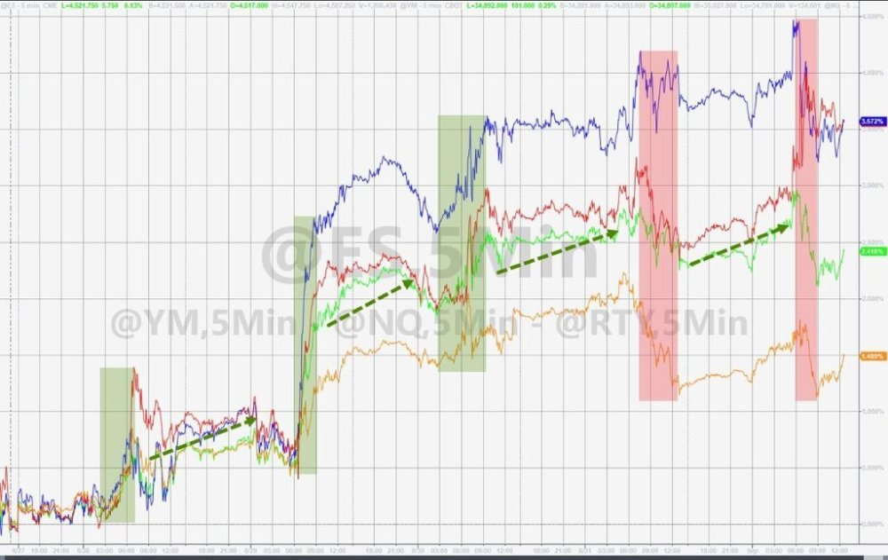
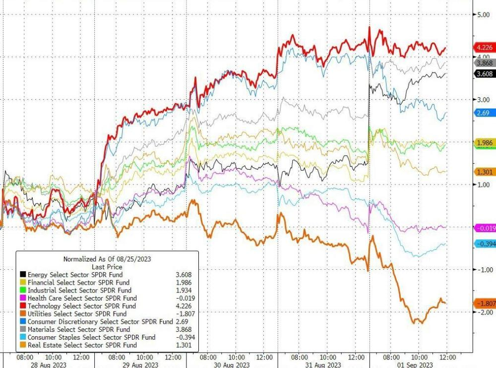
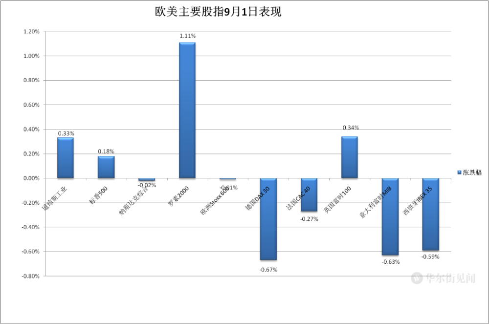
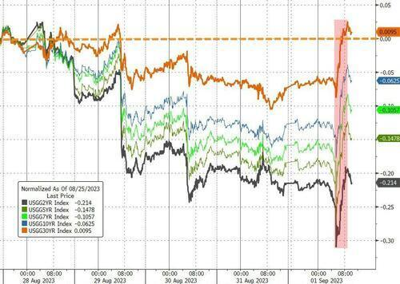
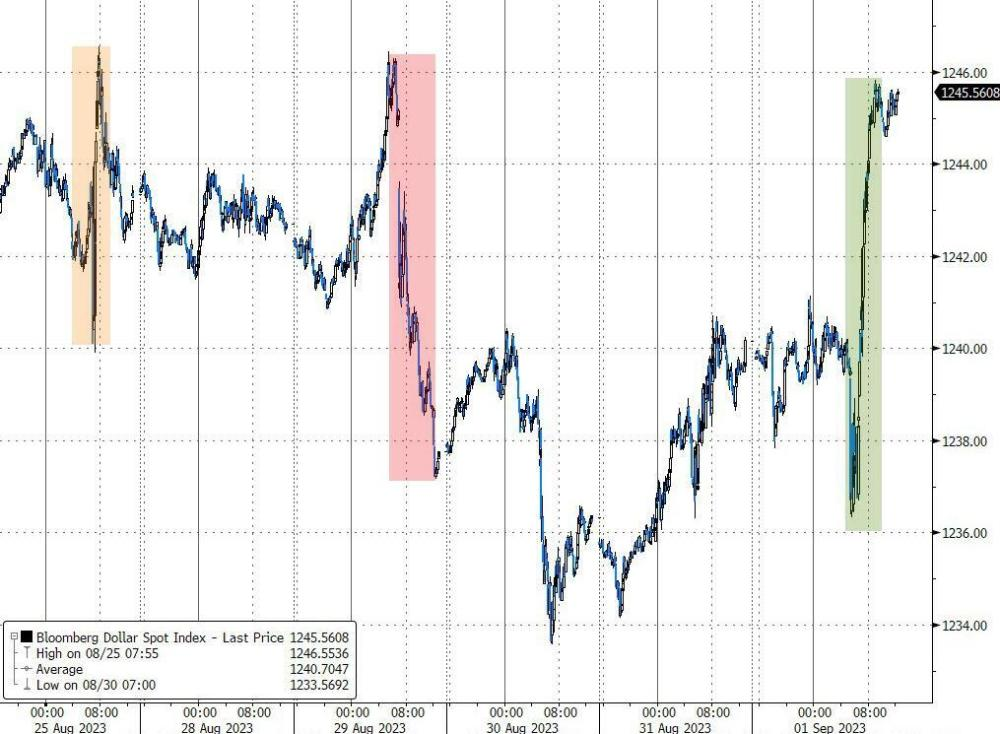
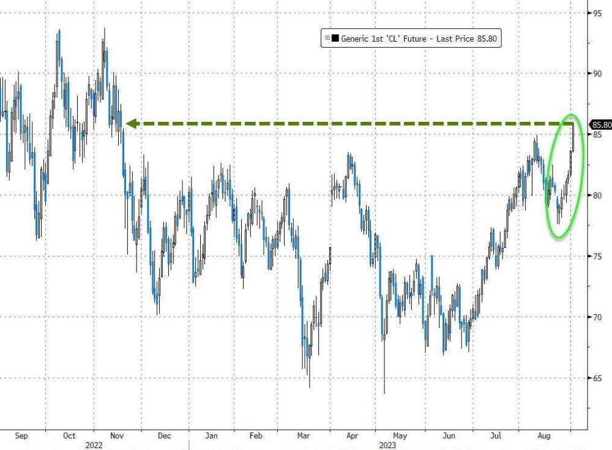
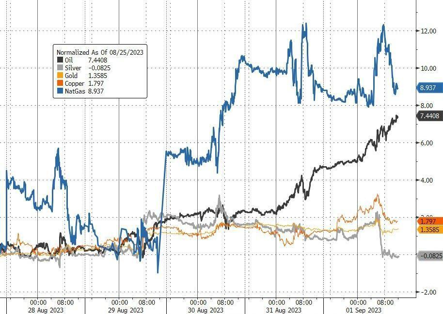
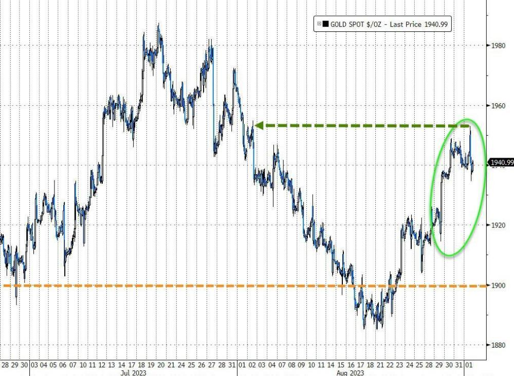

# 美股盘中涨势熄火，标普纳指连涨两周，中概强劲反弹9月开门红

虽然重磅就业报告带来经济符合软着陆走势的好消息，但美联储官员又给更为乐观的风险偏好泼冷水，暗示继续紧缩，美股和美债涨势迅速熄火。

周五公布的美国8月非农就业报告数据喜忧参半：8月非农就业人口较预期多增1.7万，但前两月就业人口合计下修11万；8月失业率超预期回升至3.8%，创一年半新高，体现劳动力参与率回升；8月平均时薪同比增长略有放缓至4.3%，符合预期，而环比增长超预期放慢至0.2%，创一年半来最低增速。

评论称，本次重磅就业报告展示了美国劳动力市场既有韧性又有降温。美联储官员此前强调，劳动力市场强劲是降通胀的一个关键挑战，该市场继续呈降温之势正是联储寻求的结果。报告数据可能让联储9月会议保持利率不变、暂停加息的几率增加。

还有评论称，本次报告是对金融市场和美联储都友好的结果，劳动力市场继续降温仍是好消息，令人对加息周期可能接近结束更为乐观，也让人乐观预期，若通胀继续下降，未来一年内还可能降息。

报告公布后，互换合约显示，交易者预计今年内美联储再加息一次的概率低于50%，明年降息的预期时间从6月提前到5月；美国国债价格加速上涨、收益率集体进一步下行，基准十年期美债和对利率敏感的两年期美债收益率均刷新三周来低位；美股高开，标普和道指反弹。

报告发布后，克利夫兰联储主席梅斯特称，劳动力市场在取得一些改善供需平衡的进展，可是通胀还太高，劳动力市场仍强劲，美联储将根据未来数据做加息决策。她讲话后，美债收益率持续拉升，不但抹平日内降幅，而且一度较日低回升超过10个基点，美股涨势很快消退，三大股指盘中均曾转跌。

有评论称，认为美联储已摆脱加息困境的想法是不负责任的，经济增长的强劲是不可持续的。还有评论称，市场普遍预计9月暂不加息，但此后会怎样还不确定。包括美联储主席鲍威尔在内，联储官员之前就暗示，会考虑今年内进一步加息，尤其在通胀未持续下降时。

_8月全月，市场对美联储今年内加息的预期总体升温，而9月1日周五的预期有所降温，有偏鸽转向_

主要股指本周后两日涨势消减，全周集体累涨的势头却不改，主要受益于周二公布的职位空缺远低于预期，市场对美联储紧缩将告终的预期强化，当天股市大涨。行业股中，原油等商品走高影响的能源表现最佳。中概股周五表现更为亮眼，在财新中国制造业PMI重回扩张、国内多重利好政策齐发之际强势反弹，势将以9月开门红给本周的大涨画上圆满句号。

中概股走强之际，人民币虽也上涨，但相对震荡较大。亚市早盘中国央行宣布9月15日起下调外汇存款准备金率2个百分点后，人民币盘中拉升300多点，离岸人民币兑美元三周来首次盘中涨破7.24，美国就业报告公布后涨幅曾再度有所扩大、收复7.25，后随着美元反弹，一度几乎回吐所有涨幅。

大宗商品中，中国PMI向好，美国经济数据增加软着陆希望，共同支持国际原油保持连日涨势，均冲上去年11月以来高位。本周原油高涨，美油七日连涨，创五个月前沙特等OPEC+国家宣布自愿减产以来最佳周表现，除了中美数据，投资者预计沙特将延长减产、美国能源部公布的上周美国EIA原油降幅远超预期也是利好。

金属周五表现不一，中国利好的推动下，经济风向标“铜博士”等工业金属全线上涨；而贵金属黄金随着美元盘中反弹一度转跌，勉强保住反弹势头，但全周都累涨，工业金属涨幅普遍超过上周，体现中国政策密集出台等形势。

标普创逾两月最大周涨幅 能源板块全周涨超10% 芯片股指六连涨 英伟达回落 中概指数全周跑赢大盘

三大美国股指集体高开，盘初刷新日高时，纳斯达克综合指数涨超0.8%，道琼斯工业平均指数涨近260点，和标普500指数都涨超0.7%。但纳指开盘不到半小时短线转跌，开盘一个多小时后再度转跌，午盘刷新日低时跌近0.4%。道指早盘尾声时短线转跌，标普在早盘尾声和午盘几度转跌，刷新日低时跌逾0.1%。

尾盘道指和标普涨幅有所扩大，纳指收窄多数跌幅。最终，三大指数仅纳指未收涨，周四回落的道指和标普反弹，均本周第四日收涨。道指收涨115.8点，涨幅0.33%，报34837.71点，靠近周三所创的8月15日以来高位。标普收涨0.18%，报4515.77点，刷新周三所创的8月7日以来高位。纳指收跌0.02%，报14031.81点。

科技股为重的纳斯达克100指数收跌0.07%，和纳指均终结五日连涨、还接近周四各自刷新的8月1日以来高位。价值股为主的小盘股指罗素2000收涨1.11%。

 _周五主要股指表现各异，道指几乎全天保持涨势，纳指早盘转跌后保持跌势_

尽管本周四和周五未能继续齐涨，三大股指全周仍将累计上涨，周二贡献最大。周二收涨1.45%创6月2日以来最大涨幅的标普累涨2.5%，周二收涨1.74%的纳指累涨3.25%，周二涨超2%、和纳指均创7月28日以来最大涨幅的纳斯达克100累涨3.67%，都在连跌三周后连涨两周。道指累涨1.43%，罗素2000累涨3.63%，在分别连跌两周和四周后反弹。标普创6月16日以来以来最大周涨幅，纳指和道指均创7月14日以来最大周涨幅。

 _主要美股指周四和周五未能集体收涨，本周仍大幅累涨_

周五有六个标普500板块收涨，其中涨超2%的能源领涨，凸显原油走高推动，材料涨约1%，金融涨0.8%，工业涨0.5%，医疗和IT涨逾0.2%。五个收跌的板块中，必需消费品跌逾0.8%，公用事业、特斯拉所在的非必需消费品、谷歌所在的通信服务都跌逾0.5%，对利率敏感的房产跌不足0.1%。

本周只有跌1.7%的公用事业和跌0.3%的必需消费品两个板块累跌。累涨的九个板块中，除涨不足0.1%的医疗外，其他至少涨超1%，能源涨逾13.7%，遥遥领先其他板块，苹果和芯片股所在的IT涨超4%，通信服务和材料涨超3%，金融涨2%。

_各板块ETF本周走势_

芯片股总体有惊无险连涨六日，早盘曾转跌。费城半导体指数和半导体行业ETF
SOXX午盘转涨，均收涨约0.3%，两日刷新8月7日以来高位，本周累涨约5.5%。个股中，截至收盘英特尔涨超4%，AMD涨超3%，德州仪器涨超1%，而周四盘后公布第四季度指引略低于预期的博通收跌超5%；英伟达盘初涨0.9%后迅速转跌，早盘曾跌超2%，收跌1.7%，结束连续三日创收盘历史新高之势，本周累涨5.4%，连涨三周，前两周每周至少涨约6%。

 _英伟达在连涨四日、三日连创收盘新高后回落，未能突破500美元的看涨期权墙水平_

龙头科技股多数反弹，在中美下调Model S和Model X车型售价的特斯拉表现最差，低开低走，收跌近5.1%，本周累涨2.7%，涨幅远不及上周的近11%。

FAANMG六大科技股中，周四止步四连涨的奈飞收涨1.4%，反弹至8月7日以来高位；苹果收涨近0.9%，连涨六日，四日刷新8月3日以来高位；周四止步三连涨的微软收涨近0.3%，逼近周三刷新的8月7日以来高位；Facebook母公司Meta收涨近0.2%，连涨两日，逼近周二刷新的8月15日以来高位；亚马逊收涨不足0.1%，连涨四日，两日刷新8月14日以来高位；而连涨五日、三日刷新去年4月以来高位的谷歌母公司Alphabet收跌近0.4%。

这些科技股本周都累涨，苹果涨近6.1%，奈飞涨5.7%，Alphabet涨超4.4%，Meta和亚马逊分别涨3.8%和近3.7%，微软涨近1.8%。

周四总体回落的AI概念股基本反弹。到收盘，BigBear.ai（BBAI）涨4.9%，周四被摩根士丹利降评级、质疑AI货币化前景后跌超8%的Palantir（PLTR）涨超1.3%，Adobe（ADBE）涨0.7%，C3.ai（AI）涨超0.6%，SoundHound.ai（SOUN）收平。

总体连续两日回落的热门中概股强劲反弹。纳斯达克金龙中国指数（HXC）早盘曾涨约4.9%，收涨约3.2%，本周累涨8.6%。个股中，截至收盘，蔚来汽车涨超7%；老虎证券涨超6%；小鹏汽车涨超5%；周二发布财报后涨超15%创三个月最大涨幅的拼多多涨超4%，连续八日收涨，本周累涨约29.3%；B站涨近3%，阿里巴巴、京东和百度涨超2%；
理想汽车、金山云涨超1%；网易涨近1%。

银行股指数全线上涨，也跑赢大盘。连跌两日的整体银行业指标KBW银行指数（BKX）收涨近1.1%，反弹至8月15日以来高位，本周累涨2.9%；地区银行指数KBW
Nasdaq Regional Banking Index（KRX）收涨约2.7%，地区银行股ETF
SPDR标普地区银行ETF（KRE）收涨约2.4%，均连涨两日至8月14日以来高位，本周分别累涨4.7%和近4.6%。

公布财报的个股中，二季度盈利和收入高于预期、被摩根士丹利列入IT硬件类股中首选的戴尔（DELL）收涨近21.3%；第二财季业绩优于预期且上调全年指引的运动服零售商Lululemon（LULU）收涨6%；季度业绩优于预期的数据库硬件生产商MongoDB（MDB）收涨3%；第三财季盈利指引低于预期的数字运营管理平台PagerDuty（PD）收跌7.7%。

波动较大的个股中，截至周一连续三日两位数大幅收涨、且三日连创历史新高的“越南特斯拉”VinFast
Auto（VFS）收跌15%，在连涨六日后连续四日每日至少跌超10%，本周累跌57%，不过，在截至周四的8月全月，自8月15日借壳上市以来累计涨逾232%。

欧股方面，连跌两日的泛欧股指微幅收跌，中国财新PMI显示制造业活动重回扩张、叠加国内稳地产等政策密集出台，大宗商品相关板块走高，抵消了奢侈品类股下跌的影响。欧洲斯托克600指数几乎收平。主要欧洲国家股指继续多数下跌，而周一休市的英股在止步六连涨后反弹。

各板块中，汽车板块跌2.6%领跌，源于被瑞银下调股票评级和目标价的大众和雷诺分别跌5%和6.3%；而受益于原油走高的油气涨约1.9%领涨，中国利好推升矿业股所在的基础资源涨约1.5%。个股中，得益于旗下治疗糖尿病药物和减肥药的需求增长，丹麦药企诺和诺德收涨2.1%，超越LV母公司LVMH，成为欧洲市值最高的上市公司，LVMH周五跌0.8%。

本周斯托克600指数涨超1%，创1月14日以来最大周涨幅，和各国股指均连续两周累涨，除法股外，其他国家股指都涨超1%。各板块中，上周涨幅居前的基础资源涨超4%领涨，继续体现中国利好带动矿业股走高的影响，油气涨超3%，上周逆市领跌的零售也涨超3%，房产涨近3%，汽车板块因周五下跌而累跌超1%。

美债收益率盘中反弹 两年和十年期收益率创三周新低 后拉升超10个基点

欧洲国债价格周五回落，收益率盘中追随美债回升。到债市尾盘，英国10年期基准国债收益率收报4.42%，日内升7个基点；2年期英债收益率收报5.15%，日内升2个基点；基准10年期德国国债收益率收报2.54%，日内升9个基点；2年期德债收益率收报2.98%，日内升2个基点。

本周欧债收益率继续下行。10年期英债和德债的收益率均累计降约2个基点，均连降两周，但降幅不及上周；2年期英债收益率降约12个基点，同期德债收益率降约4个基点，凸显市场对英央行加息的预期继续降温。

非农就业报告公布后，美国10年期基准国债收益率的日内降幅迅速扩大，美股盘前曾下破4.06%，连续两日刷新8月10日以来低位，美联储官员梅斯特讲话后持续回升，美股早盘抹平降幅转升，早盘尾声时逼近4.20%刷新日高，日内升约9个基点、较日低回升超14个基点，到债市尾盘时约为4.18%，日内升近7个基点，本周累计降约6个基点，在连升四周后连降两周。

就业报告公布后，对利率前景更敏感的2年期美债收益率盘中迎来一波下拉，美股盘前曾下破4.76%，也刷新8月10日以来低位，日内降约11个基点，梅斯特讲话后加速回升，也在美股早盘转升，早盘尾声时上测4.89%，日内升超2个基点，较日低回升逾13个基点，到债市尾盘时约为4.88%，日内升约2个基点，本周累计降约20个基点，在连升三周后回落。

_各期限美债收益率本周总体下行，仅30年期长债收益率略有攀升，两年期美债收益率降幅居首_

就业报告后美元指数刷新日低 后转涨并逼近逾两月高位 离岸人民币盘中涨破7.24创三周新高

追踪美元兑欧元等六种主要货币一篮子汇价的ICE美元指数（DXY）跌破103.30刷新日低至103.272，日内跌超0.3%，梅斯特讲话后转涨并保持上行，美股早盘重上104.00，午盘曾接近104.30，日内涨逾0.6%，逼近上周五涨破104.40刷新的6月1日以来盘中高位。

到周五美股收盘时，美元指数处于104.20上方，日内涨约0.6%，本周累涨近0.2%；追踪美元兑其他十种货币汇率的彭博美元现货指数涨超0.4%，处于5月31日以来同时段高位，本周累涨近0.2%，和美元指数均在三连跌后连涨两日、连涨七周。

_彭博美元现货指数周五盘中拉升、接近周三公布美国PCE通胀放缓前的盘中高位_

离岸人民币（CNH）兑美元在亚市盘初曾跌至7.2781，后很快转涨，中国央行宣布将下调外汇存款准备金率后，在亚市早盘拉升，迅速收复7.27、7.26、7.25三道关口，并一度涨破7.24至7.2392，刷新8月11日以来盘中高位，8月11日以来首次突破7.24，日内涨363点，后很快回落，亚市盘中失守7.27，美国就业报告公布后涨幅迅速有所扩大，曾收复7.25，后又回落，美股早盘尾声时曾几乎回吐所有涨幅。

北京时间9月2日4点59分，离岸人民币兑美元报7.2703元，较周四纽约尾盘涨52点，连涨两日，本周仅周三一日下跌，全周累涨245点，在连跌三周后连涨两周。

其他非美货币也在美国就业报告公布后大幅波动：欧元兑美元在报告后曾涨破1.0880刷新日高，后迅速转跌，美股早盘跌破1.0800，午盘跌破1.0780，刷新8月25日以来一周低位；英镑兑美元在报告后曾涨破1.2710刷新日高，美股午盘跌破曾1.2580刷新日低，日内跌超0.7%，继续跌离周三涨破1.2740刷新的8月23日以来高位；日元盘中转跌，美元兑日元美国报告公布先跌破144.50，刷新8月11日以来低位，后拉升，美股盘中曾上测146.30、日内涨超0.5%。

高风险的加密货币盘中追随美股回落。比特币（BTC）在美股午盘曾跌破2.54万美元，刷新8月17日以来低位，较亚市早盘2.62万美元上方日内高位跌超800美元、跌超3%，美股收盘时处于2.58万美元下方，最近24小时跌近2%，最近七日跌超1%。

原油创九个月新高 美油七连阳 本周涨超7%创五个月最大涨幅

国际原油期货在亚市早盘转涨后保持上行，美股盘中涨幅扩大到2%以上。最终，美国WTI
10月原油期货收涨2.29%，报85.55美元/桶，刷新去年11月16以来高位，连续七个交易日收涨，七日累涨约8.3%；布伦特11月原油期货收涨1.98%，报88.55美元/桶，刷新去年11月17日以来高位，连涨四日。

本周美油累涨7.16%，创3月31日一周以来最大涨幅，布油累涨5.48%，创4月6日一周以来最大涨幅，均止住两周连跌。

_美油创去年11月以来新高，本周创3月末以来最佳单周表现_

美国汽油和天然气期货继续齐跌。NYMEX 10月汽油期货收涨1%，报2.59美元/加仑，本周累跌2%，抹平上周反弹的涨幅；NYMEX
10月天然气期货收跌0.1%，报2.7650美元/百万英热单位，在连跌两周后本周累涨约8.86%。

_金银铜油和美国天然气中，本周天然气涨幅居首，白银表现垫底_

伦镍涨近4% 伦铜反弹至四周高位 黄金一度转跌惊险收涨 连涨两周

伦敦基本金属期货周五自8月23日以来首次全线收涨。领涨的伦镍涨逾3.9%，不但扭转五日连跌，而且将近四周来首次收盘涨破2.1万美元。伦铜抹平周四止步两连阳的跌幅，四周来首次收盘触及8500美元关口。伦铝连涨四日，创8月1日以来新高。伦铅两连涨，两日连创七个多月来新高。连跌两日的伦锌和周四回落的伦锡分别反弹至将近四周来和一周来高位。

本周基本金属继续集体累涨。领涨的伦锌涨约4.4%，和涨约4%的伦铝、涨超1%的伦铜、伦镍、伦锡都连涨两周，涨约4%的伦铅连涨三周。

纽约黄金期货在美国就业报告公布后先短线拉升、刷新日高至1980.2美元，日内涨超0.7%，后随着美元反弹持续回落，美股早盘和午盘都曾转跌。

最终，COMEX
12月黄金期货收涨0.06%，报1967.10美元/盎司，在周四止步三连阳后勉强成功反弹，还未逼近周三报1973美元刷新的8月4日以来收盘高位。本周期金累涨1.40%，在连跌四周连续两周累涨，且每周都涨超1%。

_现货黄金连涨两周，周五盘中曾涨破1950美元创一个月新高_

