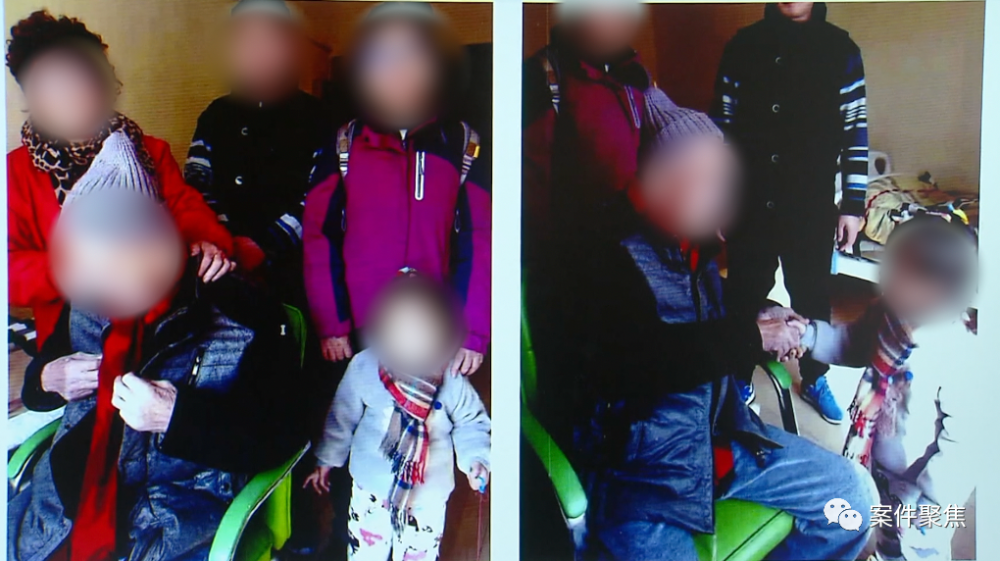
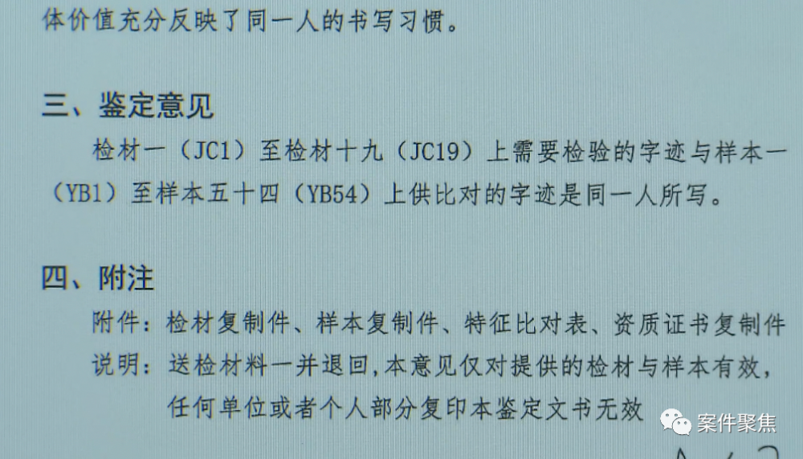
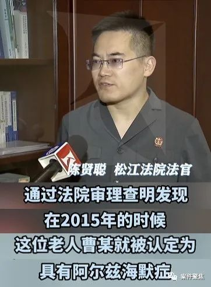
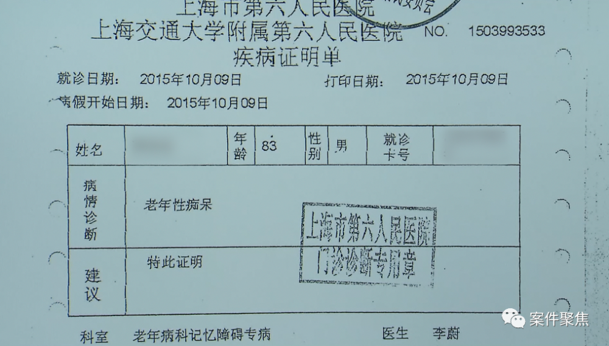

# 老人去世后留下19份不同的遗嘱，法官：因老人意识模糊，所有遗嘱无效

订立遗嘱，本应减少子女之间的纠纷。但是上海一位老人，却在生前留下了 **19份内容不同的遗嘱！**

今天说把房子留给大女儿，明天说留给二女儿，后天说留给孙女。那么， **究竟该以哪份遗嘱为准呢？**

法官在案件审理过程中，发现了新的情况。

**2013年至2017年，八旬老人曹某共写下19份内容互相矛盾的遗嘱** ，分别向两个女儿和一个孙女承诺，要将 **同一套房产** 单独留给她们。

2021年，老人去世后，第一份遗嘱的受益人（老人的二女儿）便将另外两名亲属（老人的大女儿和老人的孙女）告上法庭，主张 **立给自己的遗嘱才是有效的。**

针对几位当事人对于遗嘱真实性的怀疑，法院方面首先进行了专业字迹鉴定，确认 **19份遗嘱均为曹某亲笔所立。**

同时，法官发现老人立遗嘱期间存在 **民事行为能力受限制** 的情况且曾被指定过监护人。

法官走访了老人居住过的两家 **养老院** 和 **居委会**

工作人员均确认老人在此期间 **意识有些模糊**

**陈贤聪 松江法院法官：**

**“** 我们也认为这个病（阿尔兹海默症）是个持续性的病，所以很难去断定他在立每一份遗嘱的时候具有民事行为能力，所以
**我们倾向于所有的遗嘱效力都不认可。”**

法官表示， **遗嘱无效** ，房产归属就会以 **法定继承** 来确定。

最终，经过两年的拉锯，三方在法官的不断释法明理下，在今年 **达成和解一致** 。

由无房的二女儿继承 **50%** 的房产份额，并承担遗产税，大女儿和孙女分别继承 **25%** 份额。

**对于一些晚年罹患疾病的老人一旦属于限制民事行为能力再想立遗嘱该怎么办呢？**

**法官表示：**

最好是通过法院或者公证机关去确认老人的民事行为能力在某一个点、某一个时期是正常的。在这种情况下，再有第三方机构的共同见证下去订立遗嘱，会比较好一点。

来源：案件聚焦（记者丨曾瑶婷）

编辑：许露露

