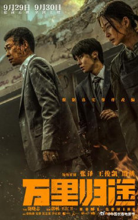

# 长春电影节金鹿奖公布：易烊千玺、倪妮分别获得最佳男、女演员奖

每经编辑：张锦河

据中国长春电影节官微，9月2日，第十八届中国长春电影节“金鹿奖”获奖名单在吉林长春揭晓。
**演员易烊千玺、倪妮分别凭借《满江红》、《消失的她》获第十八届中国长春电影节金鹿奖最佳男演员奖、最佳女演员奖。**

此外，“金鹿奖”最佳影片奖为《流浪地球2》。

“金鹿奖”最佳处女作奖为《茶啊二中》为夏铭泽、阎凯；

“金鹿奖”最佳音乐奖为《万里归途》李衡（中国台湾）；

“金鹿奖”最佳剪辑奖为《封神第一部：朝歌风云》黄烁、张嘉辉（中国香港）、杜媛；

“金鹿奖”最佳摄影奖为《流浪地球2》刘寅；

“金鹿奖”-最佳编剧奖为《八角笼中》七七，王宝强；

“金鹿奖”最佳导演奖为《万里归途》饶晓志。

第十八届中国长春电影节 “金鹿奖”评委会委员如下：

郑大圣，著名导演。代表作品：《1921》《村戏》《了不起的她》。

赵非，北京电影学院摄影系教授，著名电影摄影师。2010年，担任长春电影节评委，2019年，担任中国电影金鸡奖评委，2020年，担任澳门电影节评委，2016年，受邀加入美国电影艺术学院新一届奥斯卡奖评委。

余男，著名演员，代表作品有《敢死队2》《战狼》《无人区》《杀生》等。

朱亚文，著名演员。参演电影《建军大业》《中国机长》《悬崖之上》《中国医生》《长津湖》《陆垚知马俐》等；参演电视剧《闯关东》《远去的飞鹰》《我们的法兰西岁月》《红高粱》等。

郭俊立，1971年出生，1997年毕业于中央戏剧学院戏剧文学系，著名编剧、导演。主要作品：《投名状》获香港电影金像奖最佳影片，最佳编剧提名；《十月围城》获香港电影金像奖最佳影片，最佳编剧提名，中国影协杯优秀电影剧本奖等。

舒楠，音乐家，国家一级作曲，北京电影学院教授，中国音乐家协会理事，安徽音乐家协会副主席，六次获得中宣部“五个一工程”奖，中国电影金鸡奖最佳音乐、中国电影华表奖最佳电影音乐获得者。

公开资料显示，中国长春电影节创办于1992年,是经中宣部批准的,新中国第一个以城市命名的国家级电影节。中国长春电影节办节周期从第16届起，由两年一届调整为一年一届
。最高奖名称为金鹿奖，下设10个奖项，与中国金鸡百花电影节、上海国际电影节、中国珠海电影节并称“中国四大电影节”。

每日经济新闻综合自中国长春电影节官微、官网

每日经济新闻

