# 78年前的今天，我们胜利了！

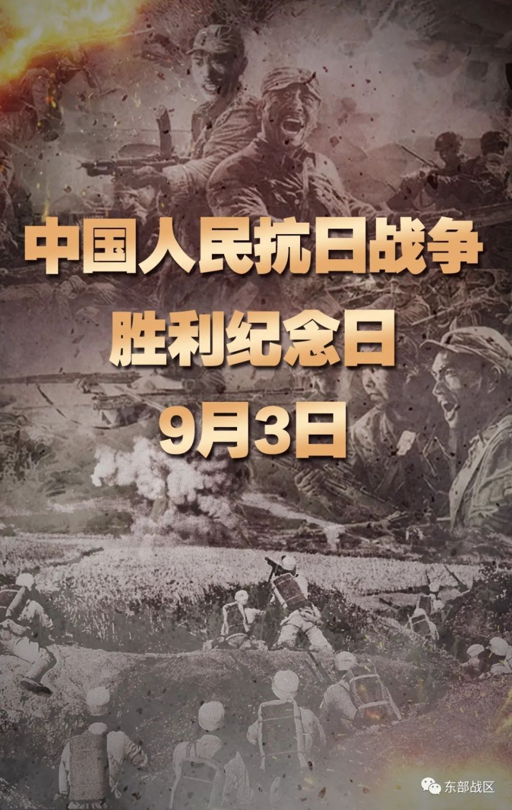

**今天，9月3日是中国抗日战争胜利纪念日，也是世界反法西斯战争胜利纪念日，是所有中国人必须铭记的日子！在今天这个特殊的日子，告诉后辈，这些历史不能忘、不敢忘。**

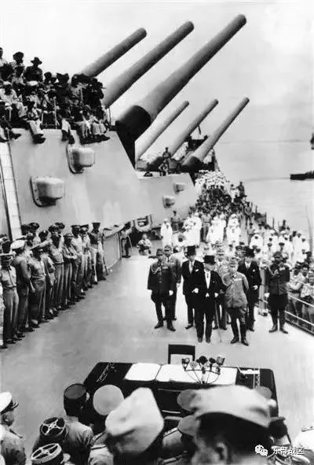

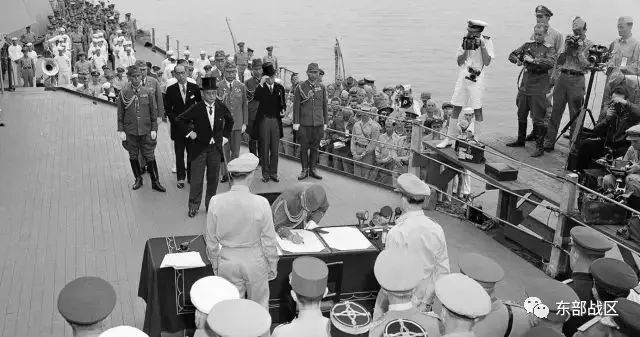

_▲1945年9月2日，日本代表签署无条件投降书。_

透过历史尘烟，胜利的场面历久弥新。

**1945年9月2日，** 泊于东京湾的密苏里号战列舰，在包括中国在内的9个受降国代表注视下，日本正式签署无条件投降书。

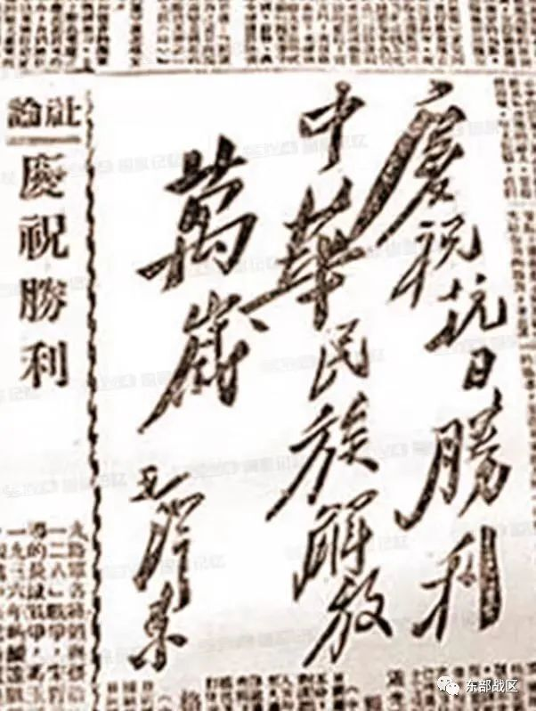

_▲1945年9月3日，《新华日报》刊载毛泽东题词“庆祝抗日胜利 中华民族解放万岁”_

1945年9月3日，被全世界公认为 **世界反法西斯战争胜利日。**

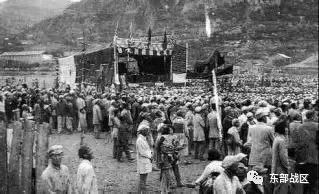

_▲延安两万多人举行庆祝大会。_

这一天，四万万中国人民举国同庆，庆祝抗战胜利。这晚的延安，全城轰动，万众欢腾，无数的火炬照亮了山巅河畔，群众乐队、秧歌队纷纷出发游行全国各地，人们奔走相告、欢欣鼓舞。

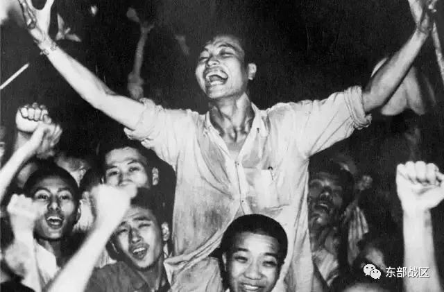

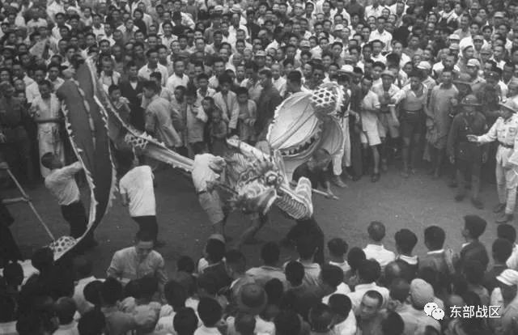

_▲人民群众欢庆抗战胜利。_

这一天，是属于世界反法西斯人民的胜利，更是属于中国人民的胜利。

_▲百团大战中，八路军攻克涞源县日军据点东团堡。_

这份欢乐，这份激动，如此来之不易。中国人民以铮铮铁骨战强敌，以血肉之躯筑长城，前赴后继赴国难，谱写惊天地泣鬼神的雄壮史诗。

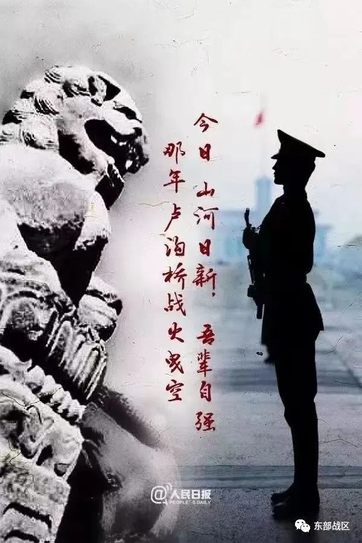

这一刻，结束了日本侵略者的罪恶，也埋葬了其罪恶的野心，永远值得中华民族铭记和纪念。

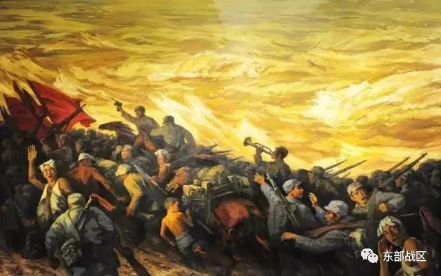

这一刻，所有中国人都刻骨铭心，历经百年屈辱，付出无数惨痛代价的国家，打败了穷凶极恶的日本军国主义侵略者，赢得了近代以来中国反抗外敌入侵的第一次完全胜利。

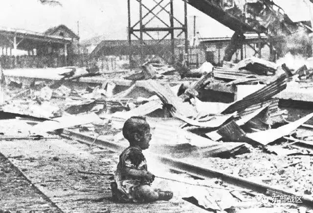

为了这一天，中华民族浴血奋战 **14年，3500多万** 同胞伤亡， **930余座** 城市先后被占， **4200万** 难民无家可归，
**800余万** 劳工被俘虏。

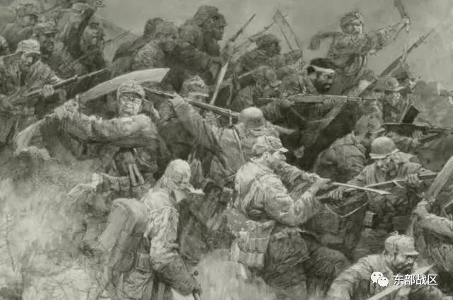

为了这一天，无数先辈为了国家之存、民族之续、人民之安，前赴后继。在侵华日军的暴行面前，中华儿女没有退缩，愤怒拿起武器奋起反抗。

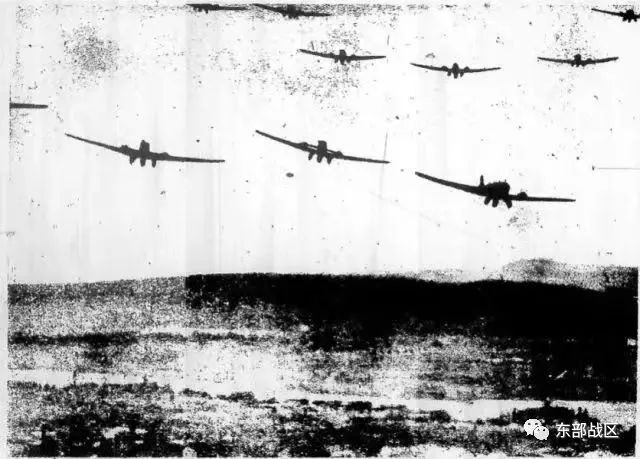

从“战斗到最后一刻”的南京保卫战，到“不惜用生命填进火海”的台儿庄血战。

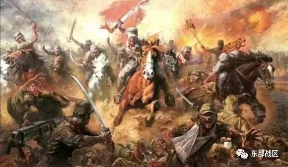

从“打完子弹就上刺刀冲锋”的平型关大捷，到“以血肉之躯战胜精良装备”的百团大战。

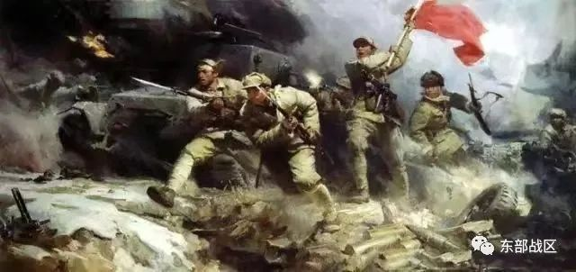

千千万万中华儿女同仇敌忾、浴血奋战，以血肉之躯筑起钢铁长城，让祖国不再被践踏。

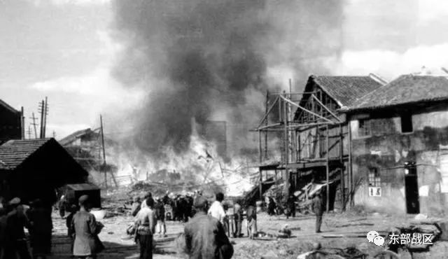

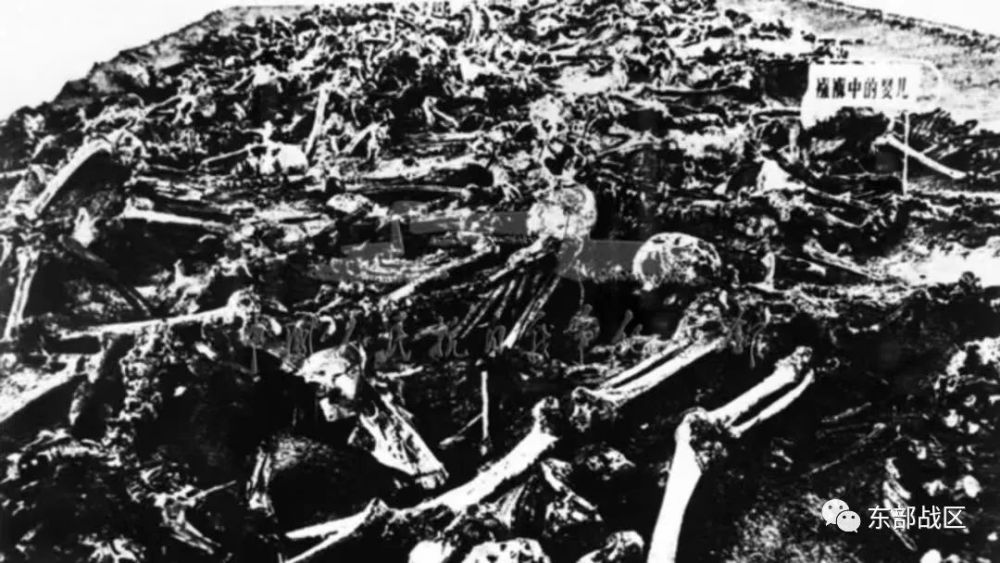

我们永远不会忘记这场浩劫！

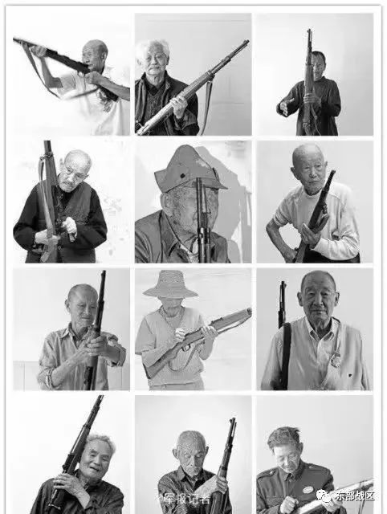

更不会忘记，每一个不顾生死的抗战英烈，为保卫山河抛头颅洒热血。

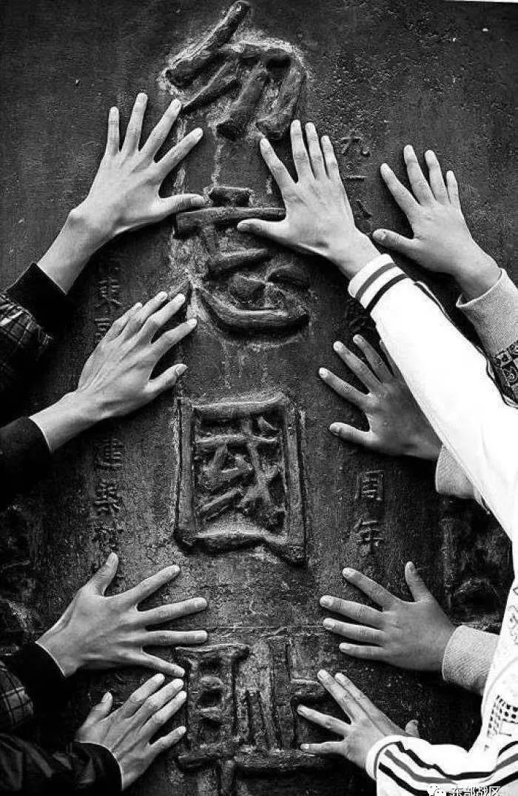

今天，战争的硝烟虽然散去，但战争的阴影并未消除，日本右翼分子一再否认甚至美化侵略历史，公然参拜靖国神社，试图彻底修改现行宪法，并到处煽风点火，破坏国际互信，制造地区紧张。

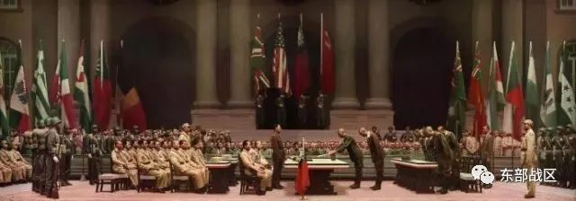

这些倒行逆施不仅是对，历史的公然藐视、国际秩序的公然破坏，更是对和平潮流的公然挑衅。忘记历史就意味着背叛，否认罪责就可能重蹈覆辙。

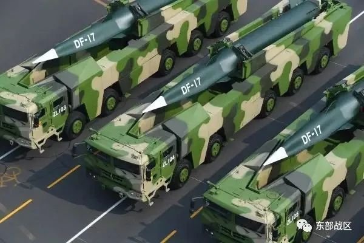

如今，国际社会处于多事之秋，天下仍不太平，我们一刻也不能放松对战争的警惕。

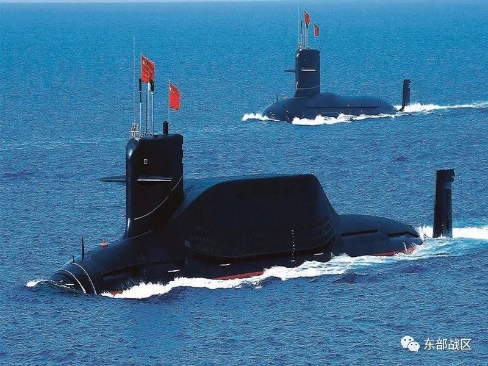

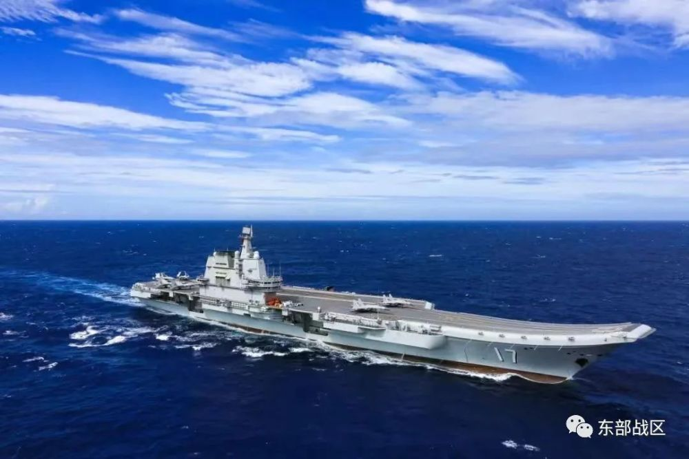

如今，当年的贫弱已一去不返，一个充满生机的中国，一个充满希望的中国，已经巍然屹立在世界的东方。

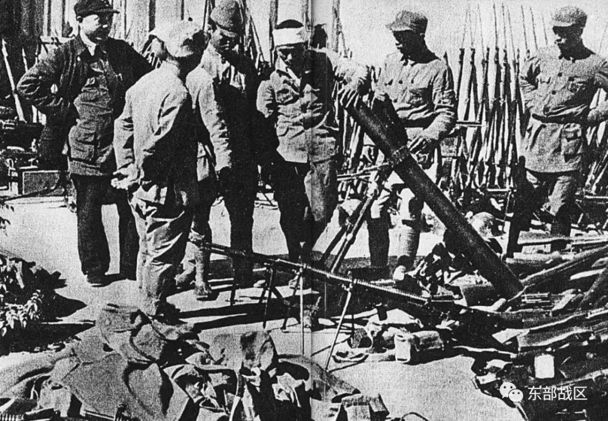

_▲1945年，日本侵略军向中国军队缴械投降。_

今天的人民军队，有信心有能力打败一切来犯之敌。

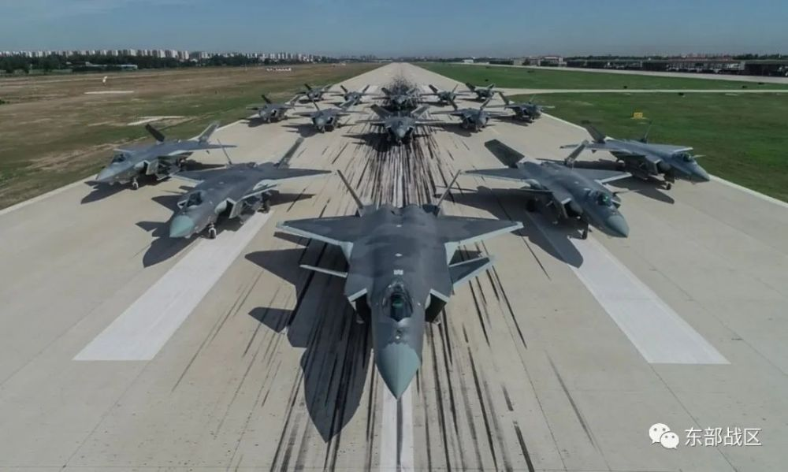

中国人民绝不允许任何外来势力欺负、压迫、奴役我们！谁妄想这样干，必将在14亿多中国人民用血肉筑成的钢铁长城面前碰得头破血流。

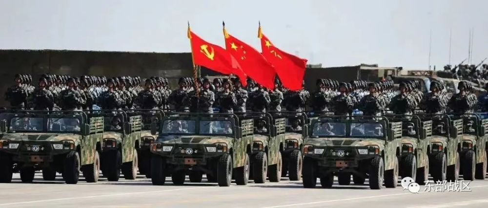

**今天，我们缅怀死难同胞，致敬英勇捐躯的先烈，致敬那场永不妥协的抗争，更提醒你我勿忘历史，珍爱和平，振兴中华，吾辈自强！**

图片素材来源于网络

