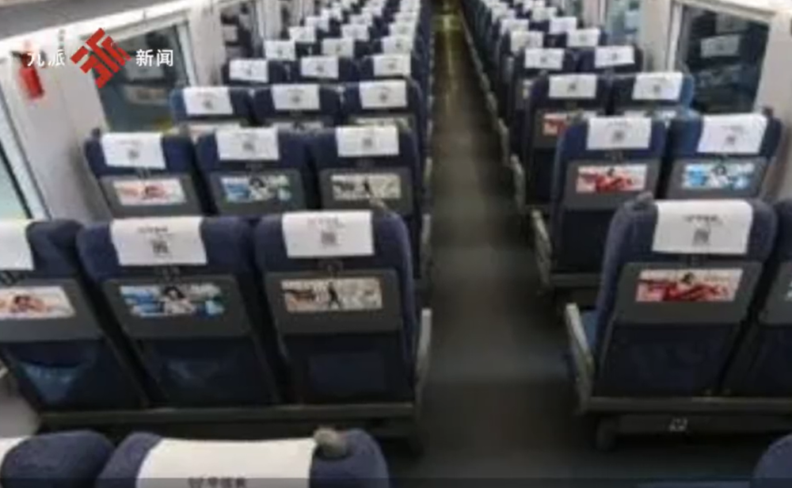
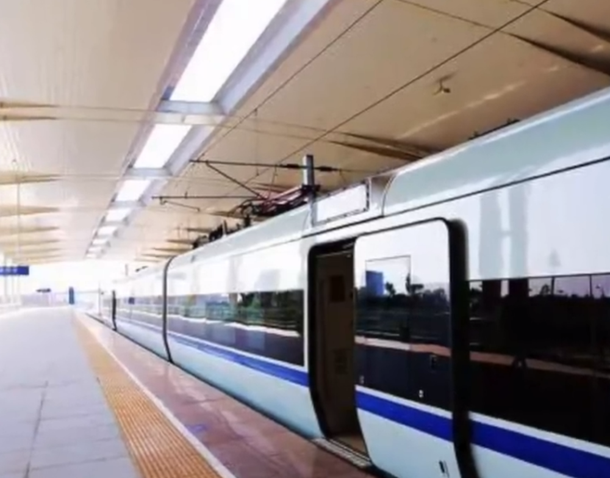

# “为什么无座和二等座票价一样”引全网热议 12306：会记录建议

据九派新闻视频报道，9月3日，话题“为什么无座和二等座是同价 ”登顶热榜，引发关注。

有网友表示不解，“花一样的钱，却一个舒服坐着，一个只能被挤到厕所门口去！”有网友认为，“无座”是指“无固定座位”，“有空座就可以去坐！”

也有网友表示，“如果价格不一样，那别人都买无座，然后都去坐二等座！”

对此，12306客服回应称，目前无座售价与二等座相同。目前的定价是根据国家发改委文件精神，由铁路运输企业自行定价。按照价格法，铁路法等法规规定，同时会根据市场情况，实行多档次浮动票价体系。

另据媒体报道，12306客服回应称，无座站票可以坐在空闲座位上，但若是该座位的乘客上车，须给该座位乘客让座。“针对这个问题会进行记录建议，看今后铁路部门在相关票价进行修改时是否能采纳。”

**【来源：综合九派新闻视频、网友评论等】**

