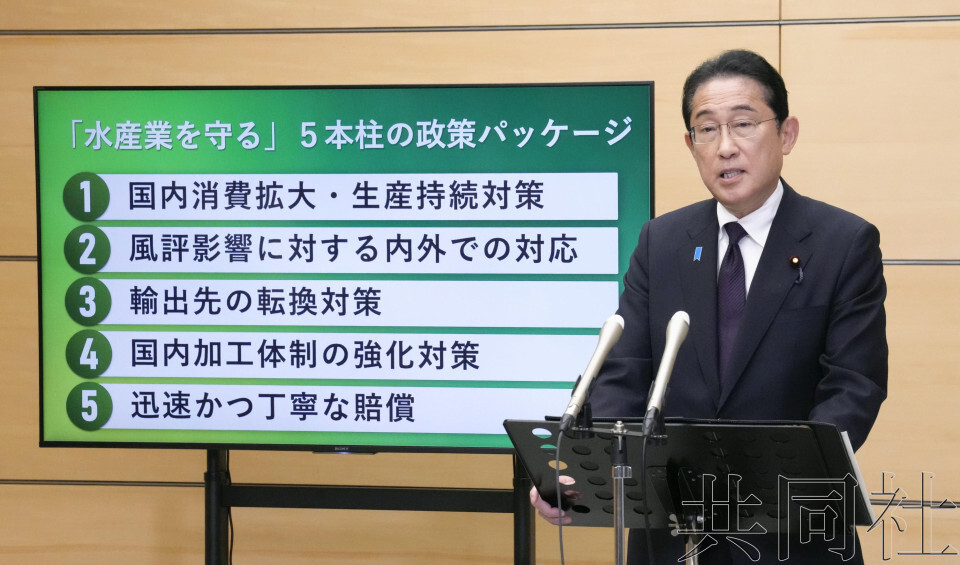

# 中国全面暂停进口日方水产品后 日本政府拟追加200亿日元支持渔业企业

【文/观察者网 张菁娟】中方宣布全面暂停进口日本水产品后，日本首相岸田文雄于一周后公布了对水产从业者的支援措施。

综合日本共同社、日本广播协会（NHK）报道，日本政府计划在已有援助基金的基础上，追加约200亿日元（折合人民币约9.93亿元）的拨款。

目前，日本政府已经设立了800亿日元的基金，其中300亿日元用于形象受损对策，500亿日元用于渔业持续支援。

_当地时间2023年9月1日，日本福岛，在日本开始排放东京电力公司福岛第一核电站核污染水大约一周后，相马市松川港内，渔业工人正在卸载在近海拖网捕鱼中捕获的海鲜。_

报道称，追加的拨款将用于援助暂时收购并保管扇贝等对华出口依赖度较高的水产品的业者；通过日本贸易振兴机构（JETRO），以加强贸易对接和网购等方式开辟新的出口销路；为国内加工设施引入新设备等。

目前，新的援助措施正在进行最终调整，日本政府计划最早于下周初汇总并公布上述措施。

8月24日，日本不顾多方强烈反对，执意启动福岛核污染水排海工作后，中国海关总署为保护中国消费者健康，确保进口食品安全，宣布即日起全面暂停进口原产地为日本的水产品（含食用水生动物）。

为摆脱对中国市场的依赖，日本决定设立紧急支援项目。31日，岸田文雄指示相关阁僚汇总一揽子支援政策，其中包括5项内容：扩大国内消费和维持生产措施；在国内外应对形象受损的影响；改变出口目的地的措施；强化国内加工体制的措施；进行迅速而细致的赔偿。

据报道，日本2022年的水产品出口（3873亿日元）中，对华出口最多，达871亿日元。主要品种是扇贝和海参。支援措施以中小企业为主，设想引进机器等强化加工设备、把秋刀鱼和鱿鱼等鱼荒品种的加工设施转用于扇贝等。将积极支援开拓美国和东南亚等替代中国的出口目的地，并扩大国内消费。

_8月31日，日本首相岸田文雄接受采访。_

共同社称，中国和日本在核污水排放的安全问题上一直存在分歧，此次排海进一步加剧两国本就不稳定的双边关系更加紧张。

针对中方对日本水产品采取紧急措施一事，我外交部发言人汪文斌8月30日表示，中方已多次就日本核污染水排海问题表明严正立场。对于日本政府强行启动向海洋排放核污染水这种自私自利、极不负责任的行径，国际社会普遍给予批评并采取相关防范措施。中方主管部门依据中国法律法规以及世贸组织《实施卫生与植物卫生措施协定》相关规定，对原产地为日本的水产品采取紧急措施，完全正当、合理、必要。

**本文系观察者网独家稿件，未经授权，不得转载。**

