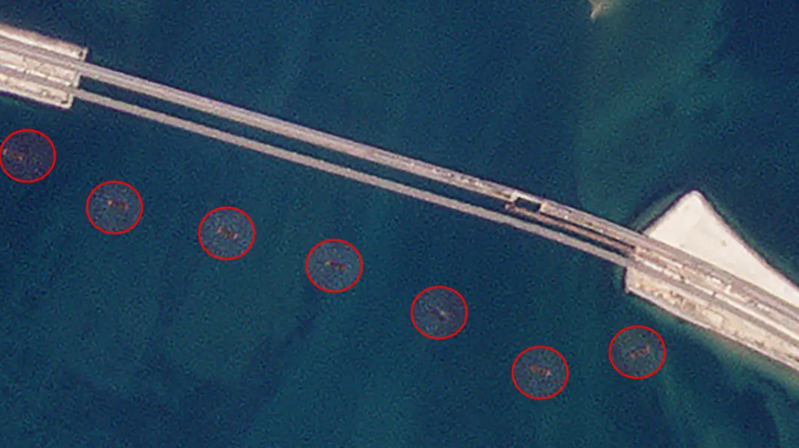

# 为保护克里米亚大桥，俄罗斯拼了：在桥周围自沉了至少7艘船只

作为连接克里米亚半岛与俄本土之间的交通命脉，克里米亚大桥自修建之初就一直是乌克兰方面的眼中钉，并在俄乌冲突爆发后数次因攻击而受损。而俄军对该桥的保护也不断升级，不但在大桥周围部署了包括S-400远程防空系统在内的多种先进武器，最新卫星照片还显示，俄军憋出了大招——在大桥周围自沉了多达7艘船只，以防备最近活动越来越频繁的乌军自杀无人艇。

美国“动力”网站8月29日称，卫星照片显示，俄军沿着克里米亚大桥以南的附近水域自沉了至少7艘船只，它们将组成一道屏障，以阻挡乌军无人艇的袭击。众所周知，克里米亚大桥多次遭到乌克兰方面组织的袭击，并因爆炸卡车和自杀无人艇而两次严重受损，造成交通中断。乌克兰官员表示，如今它仍然是乌军袭击的首要目标，这不仅是因为其重要的后勤价值，还因为它具备的象征主义。

报道称，卫星照片显示，由沉船组成的封锁线位于刻赤海峡与黑海交汇处以北，“几乎可以肯定，之前发动袭击的乌克兰无人艇就是通过这条路线到达大桥”。

由沉船组成的海上封锁线由来已久。例如二战期间，英国海军就用沉船和水雷在英国海军最重要的基地斯卡帕湾组成了复杂的防御体系，以阻挡德国潜艇的水下渗透——结果德国海军U-47潜艇成功突破这些防御，并击沉了“皇家橡树”号战列舰。

在接连遭到乌军无人艇袭击后，俄军也在黑海舰队基地塞瓦斯托波尔港修建了复杂的海空防御体系，其中同样包括水面拦阻网等障碍物。但它们并非绝对可靠，“动力”网站分析称，5
月23日，塞瓦斯托波尔再次遭到乌军无人艇袭击，现场视频似乎显示，其中一艘乌军被成功拦下，但另两艘无人艇成功越过障碍物。

西方海军情报分析家萨顿认为，这些由沉船组成的屏障“可能对无人艇具有一定的效果”，例如俄军可能会在这些沉船露出或接近水面的部分之间悬挂链条和网组成的栅栏，以防止无人艇行驶。“无人艇在夜间可能很难成功越过这些屏障，特别是在受到攻击的情况下。”

不过俄军对大桥的这种防御恐怕也不是万能的。报道提到，随着乌克兰获得的远程打击武器数量越来越多、性能越来越先进，对克里米亚大桥的攻击方式也在发生变化。此前有报道称，最近乌克兰已经将国产“海王星”反舰导弹改装后用于对地攻击，其射程为250英里，弹头重约770磅，具备相当可观的破坏能力。该导弹可以从空中、海上或陆地平台发射，因此防御的难度也要大得多。

