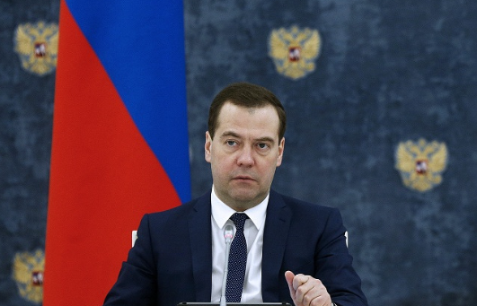
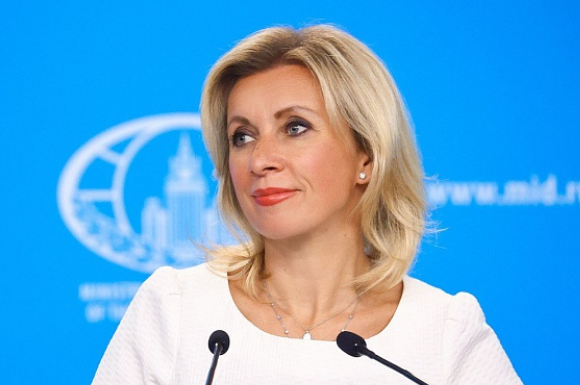

# 俄庆祝首个“对日战争胜利纪念日”，梅德韦杰夫：日本别点燃三战之火

（观察者网讯）9月3日俄罗斯迎来首个“对日本军国主义战争胜利纪念日”，俄远东地区的南萨哈林斯克举行了庆祝活动。在出席活动时，俄联邦安全会议副主席梅德韦杰夫抨击日本政府忘记二战悲剧，正在推行新的国家军事化方针，不断有人试图篡改历史并为战争罪行辩护。他警告日本“应从历史中吸取教训，尽一切努力避免点燃第三次世界大战之火”。

_俄联邦安全会议副主席梅德韦杰夫/塔斯社_

据俄罗斯卫星通讯社和塔斯社报道，梅德韦杰夫在南萨哈林斯克举行的庆祝活动中说，在美国的策动下，日本正在积极扩大军事基础设施，购买外国武器，包括进攻性武器；日本正在取消对自卫队海外军事行动的限制，并在南千岛群岛（日本称“北方四岛”）附近举行军事演习，日本的“军事化”政策正在导致亚太地区局势严重复杂化。

他表示，俄罗斯注意到，日本方面“不断有人试图篡改历史，为战争罪行辩护，粉饰罪魁祸首”。

“令人遗憾的是，日本当局正在走上新的国家军事化道路，他们成为了那个拥有不光彩结局的日本的继承人。在他们对美国屈膝时，他们早已忘记数十万同胞在核火焰中被活活烧死、子孙后代遭受辐射毒害的悲剧。”

梅德韦杰夫警告：“日本必须从历史和当下人们庆祝的纪念日中吸取教训，充分认识第二次世界大战的后果，尽一切努力避免点燃第三次世界大战之火。（日本应该）放弃军国主义计划，以造福本国民众。”

_1945年8月，苏联红军出师我国东北，图为向苏联红军集体缴械投降的日本汽车部队。新华社发_

讲话中，梅德韦杰夫还指责日本加大了对乌克兰的支援力度，卷入军事对抗。他表示，俄罗斯继续与纳粹主义作斗争，现在纳粹主义又在乌克兰抬头了，而且是在西方赞助人的支持下进行的。

“在伟大的卫国战争年代，这些西方赞助人曾是我们的盟友。邻近的日本越来越积极地支持基辅政权，正在卷入军事对抗，这很糟糕。”他说。

据日本共同社此前报道，日本首相岸田文雄8月29日与乌克兰总统泽连斯基举行电话会谈。岸田在会谈中谴责俄罗斯继续进攻乌克兰，并表示日本将使用拨付给北约基金的3000万美元，向乌克兰提供反无人机探测系统等非致命性装备。

自去年2月俄乌冲突以来，日本便立场明确，与美西方国家一道坚定反俄挺乌，引发俄罗斯方面的强烈不满，俄罗斯中断了与日本之间关于缔结和平条约的谈判和“免签交流”。

为反制日本，俄罗斯总统普京6月24日签署了《俄罗斯军事荣誉日和纪念日联邦法》修正案，将9月3日庆祝的“第二次世界大战结束日”，更名为“对日本军国主义战争胜利日和第二次世界大战结束日”。俄方在法律解释性文件中指出，俄罗斯开展特别军事行动后，日本方面与西方联合发起俄日历史上史无前例的不友好行动。9月3日纪念日名称的改动是“反制措施”之一。

对此，日本内阁官房长官松野博一6月26日回应说，日方对于俄罗斯方面的举动感到不满，这不仅可能激起俄罗斯民众的反日情绪，也可能引发日本民众的反俄情绪，可能“造成俄日两国民众之间的情绪对立”。

日本外相林芳正在9月1日举行的记者会上再度宣称，俄罗斯9月3日“对日本军国主义战争胜利日”庆祝活动可能“激起两国民众之间不必要的情绪对抗”。俄罗斯外交部发言人扎哈罗娃回击道，“日本对俄罗斯民众施加的非法制裁又会激怒什么呢？请日本外相回答这个问题。”

_俄罗斯外交部发言人扎哈罗娃/俄罗斯外交部网站_

近年来，日本不断给安保政策转向和扩军备战寻找借口，美化侵略战争，引发国际社会警觉。

不久前，美国批准对日本出售增程型联合防区外空对地巡航导弹（JASSM-
ER）及相关设备，这些导弹射程约1000千米，而上海到九州岛长崎的距离约800千米，这些导弹如果从东海上空发射，射程可覆盖华东大部分地区。

8月31日，日本防卫省又公布了2024年度预算概算要求，总额达到创历史新高的7.7385万亿日元（约合人民币3864亿元）。日本还计划在未来五年建成两艘西方各国中最大的“宙斯盾”军舰。

扎哈罗娃在8月30日举行的记者会上表示，日本岸田文雄政府再次将日本推向复仇主义和仇俄政策的道路。二战以前，日本国内外进步势力多次警告席卷东京的军国主义狂热的危险，但这些明智的声音没有得到重视，战争最终以日本的国家灾难而告终。

“我们希望智慧的日本民众不要让政治家重蹈前人的致命错误，并说服他们放弃可能破坏亚太地区和世界地缘政治局势稳定的危险计划。”扎哈罗娃说。

**本文系观察者网独家稿件，未经授权，不得转载。**

