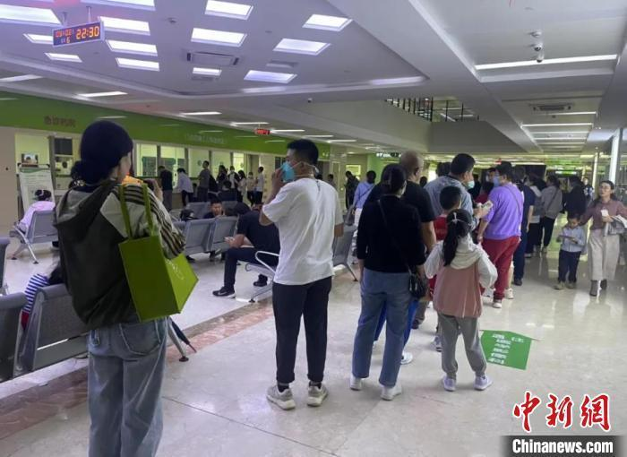

# 内蒙古“雷暴哮喘”引发就诊高峰：有患者喘不过气，有患儿危及生命

中新网呼和浩特9月3日电 (记者 张林虎)“请相关部门好好治理蒿草吧！”3日，在各大社交平台，呼和浩特市不少网友发出了这样的呼吁。

立秋前后，内蒙古进入过敏性鼻炎的高发期，打喷嚏、流鼻涕、鼻子痒、耳朵疼，甚至出现咳嗽哮喘等各种过敏症状，严重影响了民众的正常生活。

_图为医院就诊的患者在排队。内蒙古妇幼保健院供图_

2日傍晚，一场雷雨天气过后，呼和浩特市多家医院哮喘患者数量急速增加，在各医院急诊、儿科、哮喘诊室门前，前来就诊人员排起长队。

9月2日20时许，内蒙古自治区妇幼保健院儿内科急诊及成人急诊就诊患者短时间内超过正常工作负荷，该院紧急启动突发公共卫生事件应急预案，及时救治过敏性哮喘患者，全力保障患者的安全。

据内蒙古自治区妇幼保健院儿内科副主任张玉玲介绍，2日20时许，儿内科急诊一时间涌来400多名患者。

“这些患者多处于学龄前和学龄期，症状为呼吸困难、憋气、大汗，部分患儿由于喘息憋气严重，不能平卧，不能说话，病情危及生命，需要迅速诊断，有效抢救治疗。”张玉玲说。

截至3日上午，该院共接诊过敏性哮喘患者500余人次，目前在院患者病情基本平稳。

与此同时，在呼和浩特市各大医院里，同样有很多因咳嗽喘不上气的病人。因为病人多，有医生还现场用扩音器教哮喘的病人如何买药、用药。

“每到秋季就会鼻塞、鼻痒、喷嚏不止，睡觉时候呼吸不顺畅，昨天突然加重了，气都喘不过来了。”鼻炎患者王微说，希望相关部门能重视起来，解决过敏患者的困扰。

“什么时候才是个头？孩子才5岁，每年都会被鼻炎困扰。我觉得想要彻底改善，就需要彻底解决掉蒿类植物这个过敏源。”患者文光说。

据了解，呼和浩特蒿草比较多，春秋两季，过敏性鼻炎和哮喘病人多。2日暴雨，导致花粉增加，引发“雷暴哮喘”的病人确实增多。

_图为医院就诊的患者在排队。内蒙古妇幼保健院供图_

公开资料显示，“雷暴哮喘”是指雷暴天气导致的哮喘等呼吸道疾病的急性发作。症状严重且病情发展快，一般表现出群体性，许多患者同时发作。其发生机制可能是花粉颗粒在雷暴天气时溶胀、崩解释放大量具有变应原性的碎片，使空气中变应原浓度短时间内明显升高，气道高反应个体暴露后出现哮喘症状。

从2017年起，内蒙古卫健委开展了“气传致敏花粉与过敏性鼻炎患病相关性研究”项目。研究显示，黄花蒿是内蒙古地区最主要的花粉过敏原，内蒙古地区过敏性鼻炎患者临床症状出现的高峰期均集中在7月到9月，其中8月达最高峰。

张玉玲告诉记者，雷暴天气诱发花粉浓度聚集，过敏性哮喘患者进入集中暴发期，患者应随时关注气象部门推送的雷暴天气情况和花粉浓度信息，做好防护，佩戴口罩，尽量减少外出。

“特别是有过敏性鼻炎的或者既往有这种季节性哮喘的孩子，要按医嘱用药，不能随便停药。发生过敏性哮喘时，要及时到就近医疗机构就诊，防止哮喘急性发作和重症哮喘的发生。”张玉玲说。(完)

