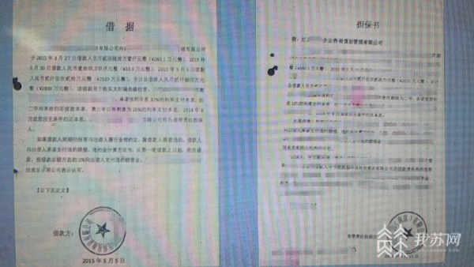

# 南京一公司法人代表伪造借据起诉合作公司，索要5600万被判刑

近日，南京江宁经济技术开发区人民检察院公布了一起虚假诉讼案。某公司法定代表人王某拿着借据起诉到法院，要求某单位偿还借款本金及利息共计5600多万元。结果审查发现，他这一纸借据竟然是伪造的。

王某曾是南京一家咨询公司的法人代表，2014年，王某所在的公司与一家企业共同出资，成立了某环保公司。在职期间，王某利用职权在白纸上盖了企业公章。2018年，王某指使员工利用盖有公章的白纸，伪造了咨询公司向环保公司出借2800万元的借据，以及一张债务承担连带责任的担保书，2019年，王某利用借条借据和担保书向法院提起了民事诉讼，要求环保公司偿还借款以及利息共计是5600余万元。法院在审理过程中，发现有虚假诉讼的嫌疑，就将案件移送给警方处理。

经调查，王某是利用两家公司之间因交易往来，产生的2800万元银行流水作为依据，捏造了虚假借贷一事，企图利用5600余万元的赔偿，偿还掉公司的其他债务。经审理，王某的行为严重妨碍了司法秩序，涉嫌虚假诉讼犯罪，判处有期徒刑二年六个月，罚金人民币25000元。

承办检察官说，案件宣判后，他们也对环保公司进行了走访，给他们提出了几点建议， 第一是印章还是要加强专人管理， 要履行先批准后盖印的程序
；第二就是要公司的财务制度更加完备，2800万元流水当时在会计明细里面资金流水往来的细节记得不是很清楚，实际上如果在民事诉讼初期，有详细的账目，
虚假诉讼的本质可能也就非常清晰地戳破了，就能识破这些小伎俩。

（《零距离》记者/孙艳 编辑/徐玮琪）

