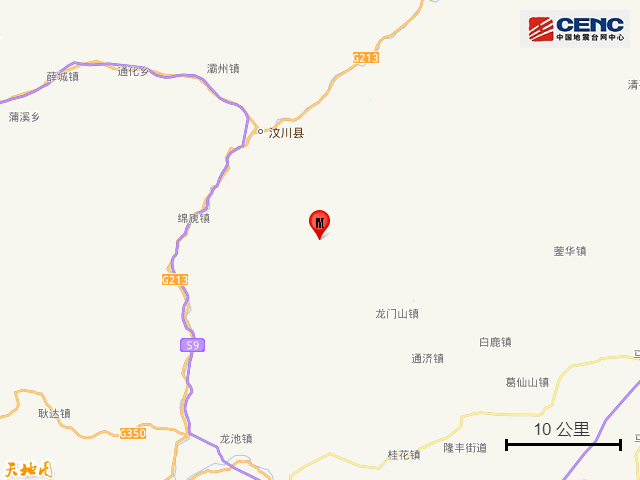
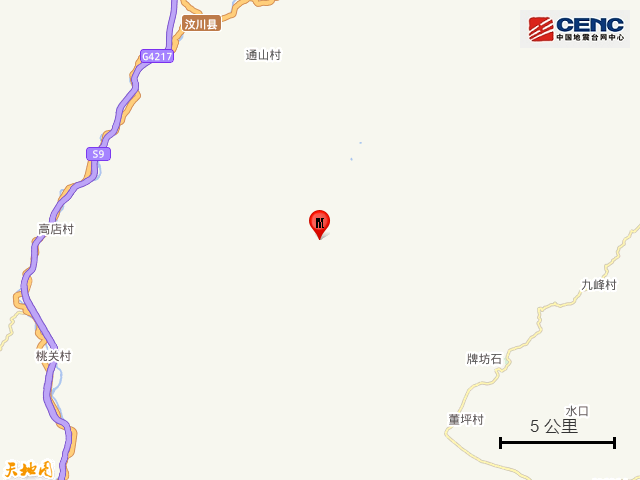
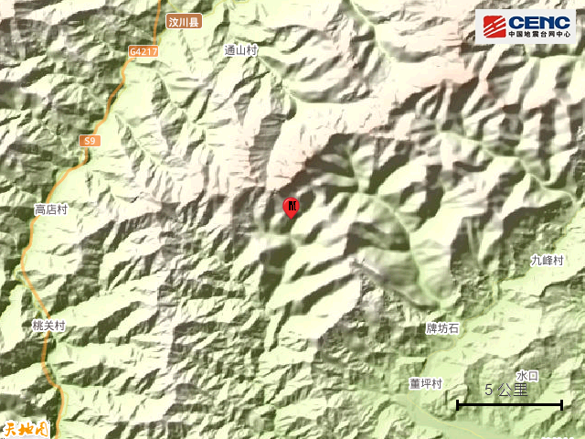
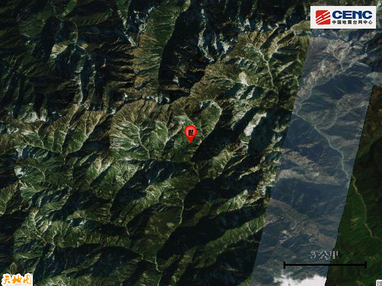
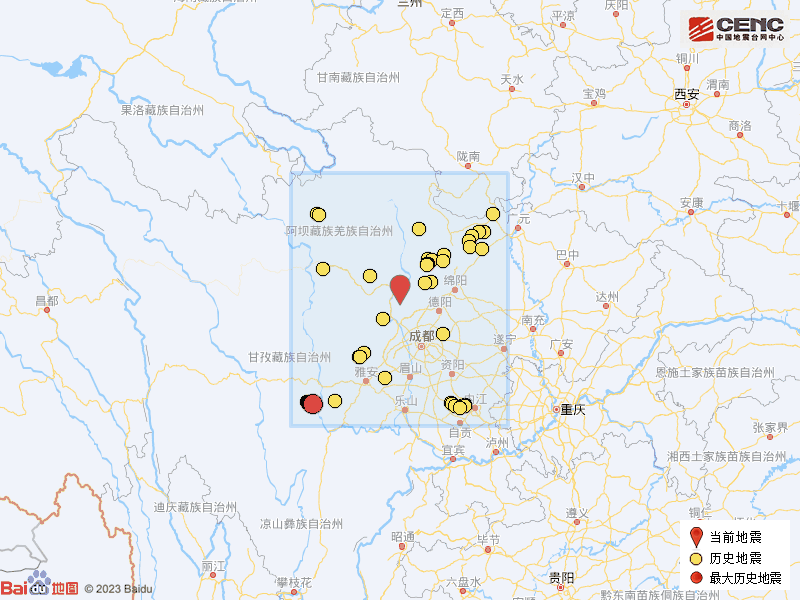

# 四川成都市都江堰市发生3.4级地震，震源深度14公里

据中国地震台网正式测定，9月3日22时30分在四川成都市都江堰市发生3.4级地震，震源深度14公里，震中位于北纬31.33度，东经103.67度。

震中5公里范围内平均海拔约2744米。

根据中国地震台网速报目录，震中周边200公里内近5年来发生3级以上地震共135次，最大地震是2022年9月5日在四川甘孜州泸定县发生的6.8级地震（距离本次震中247公里），按震级大小前50次历史地震分布如图。

