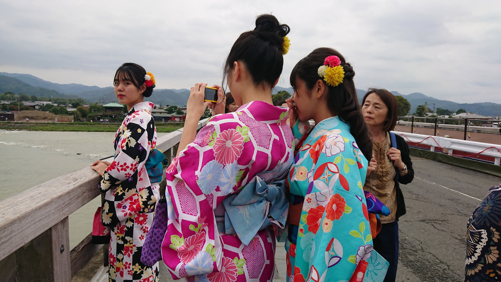
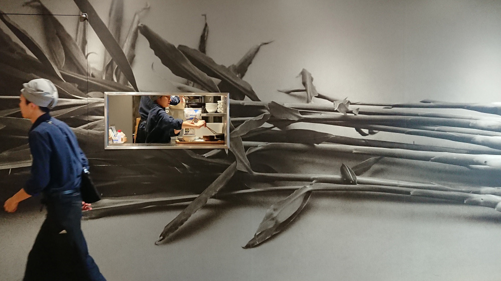

# 核污水排放致赴日旅游降温，旅行社：咨询量大幅减少，退单率达50%

本文来源：时代周报 作者：李杭

近一个月，中国赴日旅游市场经历了一场“过山车”式的起落。

8月10日，文化和旅游部发布《关于恢复旅行社经营中国公民赴有关国家和地区（第三批）出境团队旅游业务的通知》，日本位列其中。该消息公布后，日本一度成为国庆出游搜索热度第一的目的地。

在名单发布后的一段时间内，赴日旅游团的咨询量和订单量持续高涨。据携程数据显示，8月中旬，日本团队游产品预订量环比上月同期增长近九成，预订国庆出发的赴日团队游产品量环比增长超5倍。

_因为文字以及文化与中国相似，日本一度受是中国游客喜爱的旅游目的地 胡同/摄_

然而，转折发生在8月24日。

据多家媒体报道，随着日本排放核污染水入海事件发酵，国内游客取消赴日游订单的现象集中发生。

不过，也有旅游业内部人士向时代周报记者表示并没有出现大规模退单的情况。“只能说在舆论的影响下暂时有降温的倾向，但是未来长期的市场情况，还是要看游客们‘用脚投票’的结果。”上述旅游业内部人士表示。

不去损失，去了忧心

“之前我去过一次日本，感受非常好，本来想今年再去一次，但是现在真的不敢。”广东游客张子莹告诉时代周报记者，但她并没有对“不敢”做深度解读。

张子莹是广东一名90后年轻白领。今年9月，她原本打算和朋友一起去日本旅游，“机票和酒店都已经订好了，想去打卡之前没有去过的东京铁塔、浅草、镰仓、银座等等，结果没想到发生了核污水事件。”张子莹说。

思索再三后，张子莹决定放弃这次出游计划。“主要是担心食品安全问题，虽然我也看了很多客观的分析，但还是不想拿自己的身体去赌。”张子莹坦言。

另一方面，她认为日本核污水排海事件发生后，这趟旅游的意义已经改变了。“旅行的初衷应该是快乐，现在变得做每件事情都要小心翼翼，那何必呢。”张子莹说。所谓的小心翼翼，指的是最近赴日旅游，可能会引起身旁其他人的侧目和质疑，甚至会被贴上某些不必要的标签。

在和朋友明确表达了不打算去旅游的态度后，张子莹得到了朋友的支持。“我负担了全部已经产生的费用，其中包括2个人的退票手续费1600元，已预定的3晚酒店大概4500元，出境支付宝保险两人一共220元，以及两个签证费832元，一共是7152元。”

无论对于白领或是中产，这都是一笔不小的损失，但损失背后的纠结，有时候无法说清。

_旅行就是去别人生活的地方看看。胡同/摄_

与张子莹相反，在社交媒体上，也有不少游客表示，还是会去日本旅行，也有一些人称期待酒店和机票价格因此下降，趁机薅羊毛。

“毕竟行程早就订好了，而且也不想错过宝贵的假期。”来自江苏的游客小溪告诉时代周报记者。

小溪认为，去或不去都是个人选择，要基于每个人的理性判断，“我看了一些机构的评估报告，认为短期旅行的核辐射可以忽略不计，以后也会选择继续去日本旅游。”

正在日本旅游的李先生告诉时代周报记者，从他行程中去到的一些城市和景点来看，并未感受到当地的旅游市场受到比较明显的影响，“在东京地区，特别是迪士尼看到了不少欧美游客，不过中国游客确实没有想象中的那么多。”

“除了核污水影响外，也有一部分原因可能是中国赴日团体游刚刚开放。”李先生分析道。

不过，等到李先生到达关西地区后，他立马向时代周报记者反馈道，“京都、奈良的中国游客还是很多的，我跟一些人聊了聊，他们之中大部分人安排的行程都集中在关西地区，不去东京那边。”

实际上，由于文字和文化相近，越来越多的年轻人和中产会选择自由行，因此旅行团只是去日本旅行的一部分群体。

 _大阪某商场一角。胡同/摄_

退单率达50%

虽然目前并没有数据表明中国赴日游客数在8月份大幅度下跌，但是不少从业者确实已经感受到了赴日游的“降温”。

“8月24日，日本核污水排海事件发生后，赴日旅游团的咨询量大幅度减少，还出现了不少退单情况，退单率大概在50%。”北京一家旅行社的日韩线旅游负责人胡伟告诉时代周报记者。

据胡伟介绍，6月份国内刚刚恢复赴日旅游个人签证时，国内赴日旅游人数曾出现过一个小高峰，赴日团体签证恢复后，赴日旅游人数再次上涨，“8月中旬的时候赴日游产品卖得还是很好的，特别是国庆出发的高价团和9月份高性价比的赴日旅游团”。

_关西的京都、奈良、大阪，串起了日本的过去和现代，一直是中国游客喜爱的线路。胡同/摄_

不过，8月24号日本核污水排海事件发生后，情况开始改变，不少游客纷纷退单。

针对这种情况，胡伟所在的公司提供了无损免费退订政策。“因为与东南亚发生的安全问题导致游客退单的情况类似，对于这种我们无法保证游客百分之百安全的情况，我们都会做退款处理。”胡伟说。

至于收益方面的损失，胡伟表示，目前票损的核算数额还没有出来，“退单的产品大概是两种，一种是一万二左右的国庆期间出发产品，另一种是9月份出发的六千元左右的赴日游产品。总体金额还是不小的。”

对于媒体报道中一些旅行社不再宣传赴日游产品的情况，胡伟表示在其所在的旅行社中并未发生。

“因为从政策规定上来说，国家并没有发布相关的禁止推广规定，所以我们做日韩旅游的部门还是在正常宣传相关产品的，只能说宣传效果与之前相比大打折扣。”胡伟说。

另一位旅游业从业者王先生认为，虽然他所在的公司并未出现大量退单的情况，但是在短期舆论的影响下，赴日旅游肯定会受到影响。

“因为现在很多人都是有一种从众心理在的，如果看到网上很多人退单，大家会想别人都退，那我也退吧；相反，如果看到没什么人退，自己也就不会退。”王先生说。

不过，针对长期的国内赴日旅游市场，胡伟等从业者均认为还需要进行长期的观察。“据我个人判断，今年年内的赴日旅游市场应该是相对比较困难的，但是未来三五年怎么样，目前还不好说。”胡伟说。

胡伟认为，从长期情况来看，还是会有不少游客选择去日本旅行。“一方面因为地理距离相对较近，另一方面日本旅游资源相对丰富，对于游客有较大吸引力，想去的还是会去。”

而针对下一步市场布局，胡伟表示，将从大批量组团的策略调整到只做小团或者精品团，并随着市场的反馈随时调整，减少损失。

从热门旅游地首位到如今订单大幅减少，赴日旅游市场在不到一个月内经历了不小的起伏，而未来的发展曲线何去何从，还要把时间轴拉长来看。

_希望新闻大卖，每日新闻社也在伏见稻荷大社建了许愿台。 胡同/摄_

