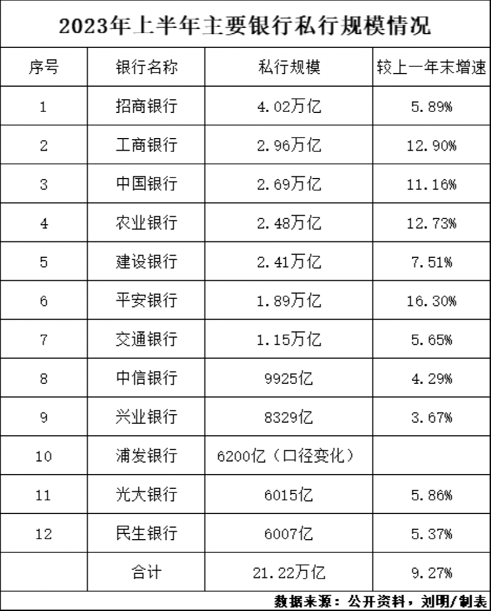
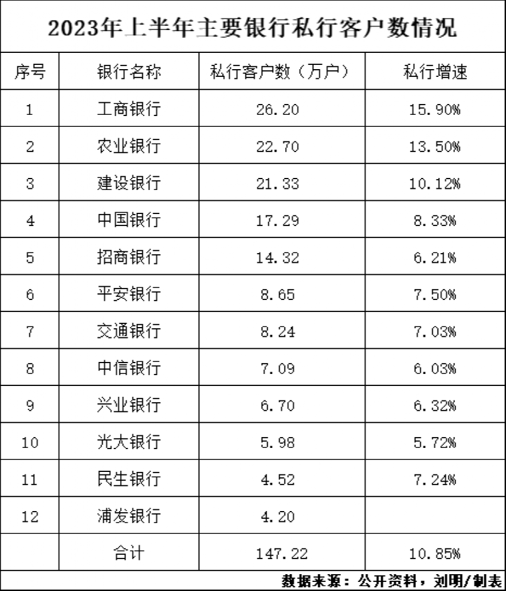

# 银行财报透视私人银行财富账本：工行逼近3万亿 招行户均资产超过2800万

中国基金报 刘明

随着A股2023年半年报披露收官，主要商业银行最新私行财富账本也“晒”了出来。虽然面临复杂的经济形势以及跌宕的股票市场，上半年私行财富继续保持着明显上升态势，12家商业银行私行管理资产规模突破20万亿。

私行财富中，领军的“一哥”招商银行的私行规模测算已经突破4万亿元，仍明显领先于第二梯队的四大行，排名第二的工商银行虽然上半年增速迅猛，规模达到2.96万亿仍未突破3万亿。

中行、建行、农行在仍位居2万亿梯队，其后的平安银行也在保持快速追赶之势，上半年以16.3%的高增速达到1.89万亿私行规模，距离2万亿也不远，平安银行在主要银行的同口径增速中位居第一。

根据招行定期报告，该行私行规模于2018年底突破2万亿元，2021年上半年超过3万亿元，用时两年半，而从3万亿到如今站上4万亿，则用时2年。从A股市场来看2019年到2021年上半年属于牛市阶段，2021年下半年至今属于市场疲弱阶段，仍不改私行财富增长态势。

总量来看，12家银行私行合计管理资产规模高达21.22万亿元；从客户数量来看，12家银行私行客户户数合计为147.22万户。将近150万户的私行客户中，不排除有高净值人群同时在2家及以上的银行私行客户。

有私行人士表示，这两年面临复杂的宏观形势，银行私行客户数量和资产规模仍然呈现出不断增长态势，包括家族信托等财富的增长，显示出在面临着不确定的环境中，高净值人群仍然愿意将财富“存放”在银行体系打理。而目前国内高净值人群预估超过300万，银行私行未来仍然有较大的成长空间。

**私行财富增速不减，招行突破4万亿**

**工行逼近3万亿，平安银行冲刺2万亿**

根据上市银行披露的中报数据，2023年上半年，12家主要的商业银行私人银行的资产管理规模已经达到21.22万亿元。招商银行更是首度突破4万亿元，继续位居榜首，虽然增幅不及第二名的工行，但第一位置依然稳固，仍保持遥遥领先的地位。

招行2023年中报显示，其管理的私人银行客户总资产余额较上年末增长5.89%；而上年末的2022年底，招行披露的管理的私人银行客户总资产37924.36亿元。由此测算，招行2023年上半年私行管理客户资产规模为40158亿元，突破4万亿元，上半年增长了2234亿元。

四大行仍处于“2”时代。第二名的工行上半年增速快于招行，规模达到2.96万亿元，在向3万亿逼近，工行私行上半年规模增长高达3386亿元，较上年末增长12.9%。工行之后，中国银行以2.69万亿的规模保持第三，而农行上半年增长快于建行，私行规模2.48万亿元反超建行位居第四，建行以2.41万亿元位居第五。

平安银行在招行和四大行之后，紧追不舍，上半年较去年底的增幅高达16.3%，增幅在主要银行私行中排第一，规模达到1.89万亿元，规模增长2642亿元；上半年的绝对增长额高于招行。

万亿序列的还有交通银行，为1.15万亿元；中信银行9925亿元，也即将迈入万亿。兴业银行为8329亿元，浦发银行、光大银行、民生银行都超过6000亿元。

从增速来看，2023年上半年较2022年末的增速，半年就有5家私行增幅超10%，实际上增速最快为平安银行，增幅为16.3%；其次四大行中的工行、农行、中行的增幅也超10%，分别为12.9%、12.73%、11.16%。

此外，浦发银行在降低私行统计口径后，预估增速可达16.98%。浦发银行表示，2023年6月底，月日均金融资产600万元以上客户规模超4.2万户，管理客户金融资产超6200亿元。而在2022年报中，该行使用的是800万规模以上门槛，2022年底浦发银行私人银行客户规模（月日均金融资产
800 万元以上（含））2.8 万户，管理私人银行客户金融资产超过5300亿元。

**12大私行客户数150万**

**仍有较大的拓展空间**

12家私行2023年6月底的客户数合计达到147.22万户，其中工商银行客户数最多为26.2万户，农行客户数为22.7万户，建行也首次突破20万户达到21.33万户，中行、招行分别为17.29万户和14.32万户；客户数的增长普遍保持较高增速。

有私行人士表示，相对于中国高净值人群的数量，银行私行还有很大发展空间，这也是近几年私行客户数和规模快速增长的原因。

近日，招行发布《2023中国私人财富报告》也彰显了中国高净值人群情况。报告显示，2022年，可投资资产在1000万人民币以上的中国高净值人群数量达316万人，人均持有可投资资产约3183万人民币，共持有可投资资产101万亿人民币，2020-2022年年均复合增速为10%。

报告预计，未来两年，中国高净值人群数量和持有的可投资资产规模将以约11%和12%的复合增速继续增长。

从户均规模来看，招行以2804万元位居第一，平安银行为2179万元，其他银行在基本都是1000多万元。

2023年上半年银行私行户均资产规模（单位：万元）

**家族信托受高净值人群欢迎**

**发展迅速**

私行是财富管理皇冠上的明珠，私行高端的家族信托业发展更为迅猛。招商银行在半年报中表示，截至报告期末，家族信托业务单数突破万单，业务规模较上年末增长22.79%。

平安银行也表示，上半年协助客户新设立家族信托及保险金信托规模 440.86 亿元，同比增长
39.3%；2023年6月末，协助客户累计设立保险金信托规模突破1000亿元，成为国内规模最大、服务客户最多的保险金信托服务机构。

工商银行表示，家族信托业务加快增长，上半年家族信托累计受托规模达291.8亿元，比上年末增加91.7亿元，增长46%。深圳、河北、青海分行落地保险金信托2.0新模式。

中国银行表示，加快家族信托业务发展，家族信托客户数比上年末增长 52.59%。

编辑：舰长

审核：许闻

