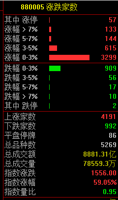
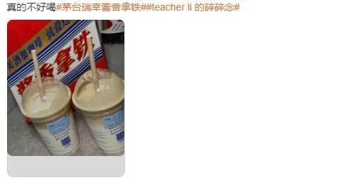

# 三大利好来袭！A股集体反弹沪指涨1.4%，北向资金净买入近70亿元

中国基金报 泰勒

兄弟姐妹们啊，今天瑞幸咖啡杀疯了，A股也红红火火，相信你们都挣钱了，一起来开开心心分析一下今天大涨原因。

三大指数集体反弹，今日成交8849亿元。截止收盘沪指涨1.4%，深成指涨1.41%，创业板指涨0.85%。北向资金净买入68.84亿元。

共4191只个股上涨，992只个股下跌。

周期股全线拉升

家居板块板块暴涨。

华为产业链持续走高

中芯国际尾盘直线拉升，消息面上，外媒发了小作文。

接下来分析一下原因

第一、周末楼市松绑的大利好。一是首套住房执行“认房不认贷”，北上广深四个一线城市均跟进落实；二是扩充地方政府“因城施策”工具箱，下调首付比例和房贷利率下限；三是降低存量首套住房贷款利率。

不过今天A股房地产的表现，并不如港股的。

第二、外资开始流入。北向资金全天大幅净买入68.84亿元，结束连续5日净卖出；其中，沪股通净买入38.26亿元，深股通净买入30.58亿元。

第三、民营经济发展局来了。

9月4日，国家发展改革委副主任丛亮介绍，近日，中央编办正式批复在国家发展改革委内部设立民营经济发展局。

据悉，作为促进民营经济发展壮大的专门工作机构，民营经济发展局旨在加强相关领域政策统筹协调，推动各项重大举措早落地、见实效。

据介绍，民营经济发展局的主要职责是：跟踪了解和分析研判民营经济发展状况，统筹协调、组织拟订促进民营经济发展的政策措施，拟订促进民间投资发展政策。建立与民营企业的常态化沟通交流机制，协调解决民营经济发展重大问题，协调支持民营经济提升国际竞争力。

市场就分析到这啦。

**瑞幸茅台刷屏了**

“美酒加咖啡，就爱这一杯”。4日，贵州茅台与瑞幸咖啡推出的联名咖啡“酱香拿铁
”正式开卖，号称“每一杯都含有贵州茅台酒”，单杯售价19元，部分门店使用优惠后售价更低，但高于店内其他咖啡产品。

整个朋友圈都是瑞幸茅台咖啡刷屏了。泰勒也中午去买了一杯，的确有酒味！

随后泰勒顺便问了一下店员，这一款咖啡是怎么做的，是不是直接把茅台酒倒进去

结果店员直接丢给泰勒一瓶白酒风味奶液，揭开了谜底。泰勒研究了下，上面的配方的确有白酒。

另外，网上也有消息称，这款奶液的确有飞天53度茅台酒。。。

有分析称，表面是茅台和瑞幸的成功，背后其实是香精厂的胜利。瑞幸研发组，专挑香精厂背景的员工。每次爆品的研发，不是依赖舌尖三寸，而是靠大数据下香精的排列组合。

平安证券此前分析，离不开公司数字化的研发体系对公司研发与运营的支持。

8月1日，瑞幸咖啡公布2023年第二季度财报，受到销售量提升、门店加速拓展以及每月交易客户数量增加的推动，今年第二季度瑞幸咖啡总收入为62.01亿元，同比增长88%。二季度实现扭亏为盈，归母净利润为9.99亿元，去年同期亏损1.15亿元。在美国会计准则（GAAP）下营业利润为11.73亿元，营业利润率为18.9%，创历史新高。

瑞幸咖啡上半年总收入为106.38亿元，同比增长86.53%。归母净利润为15.64亿元，去年同期亏损9487.2万元。

