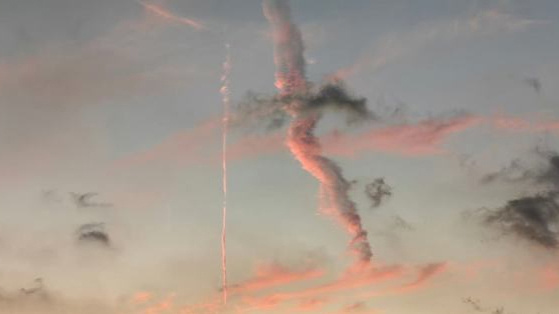
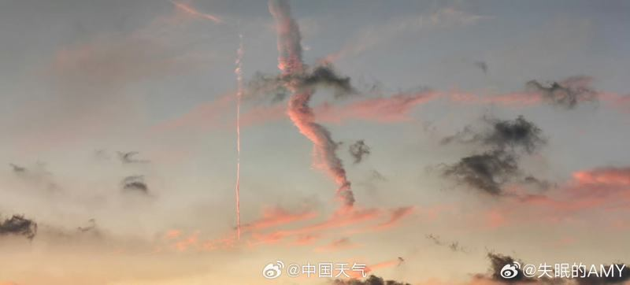

# 上海上空出现“不明飞行物”？气象专家科普来了

9月1日，上海的晚霞引发市民关注，同时，有宝山的市民发现上空突然出现了一“不明飞行物”，似火球般高速坠落，纷纷上传拍到的画面，引起网友热议。

对此，中国气象局公共气象服务中心在官方微博发文，认为像是“飞机的尾迹云”；上海市气象局也推测，可能是尾迹云扩散后形成的。

上海市气象局专家邬锐答复上海辟谣平台表示，根据目前网友提供照片，
**尾迹云的可能性较大。不过，严谨的天文判断要更多证据，比如需要航空等相关部门确认当时经过宝山的航线。**

_网友拍摄到的画面_

据了解，尾迹云俗称“飞机拉烟”。人们常常在晴朗的天空中看到喷气式飞机在高空飞行时，机身后边会出现一条或数条长长的“云带”。其实，这不是喷气式飞机喷出来的烟，而是飞机排出来的废气与周围环境空气混合后，水汽凝结而成的特殊云系，航空飞行界和航空气象学上称之为飞机尾迹。

尾迹云如何形成

气象专家和民航专家表示，喷气式飞机发动机排出的废气，其实含有很多颗粒物，容易形成凝结核。

加上高温废气在6000米至10000米高度上排出后，迅速地在冰冷的高空大气中（通常温度只有-40℃）冷凝，形成水汽，如果空气中本身水汽就很充足，温度和气压又合适，这些新老水汽就会围绕凝结核构成清晰的云带。

尾迹云特征

飞机尾迹云存在时间不会太长，通常很快消失，但在条件有利时，可以存在1小时以上，并能扩展成比较广的云层。飞机尾迹高度的季节变化不很明显，总的说来，冬半年出现的次数多于夏半年。尾迹层的厚度平均在1千米至2千米，下限高度冬季最低，夏季最高。在较厚的飞机凝结尾迹中，不同高度上形成的尾迹长度和浓度也是不一样的。通常在它的底部出现是长度较短而浓度较淡的尾迹，向上逐渐加长变浓，待达到一定高度后，再往上，又变成了断断续续色调浅淡的尾迹。

