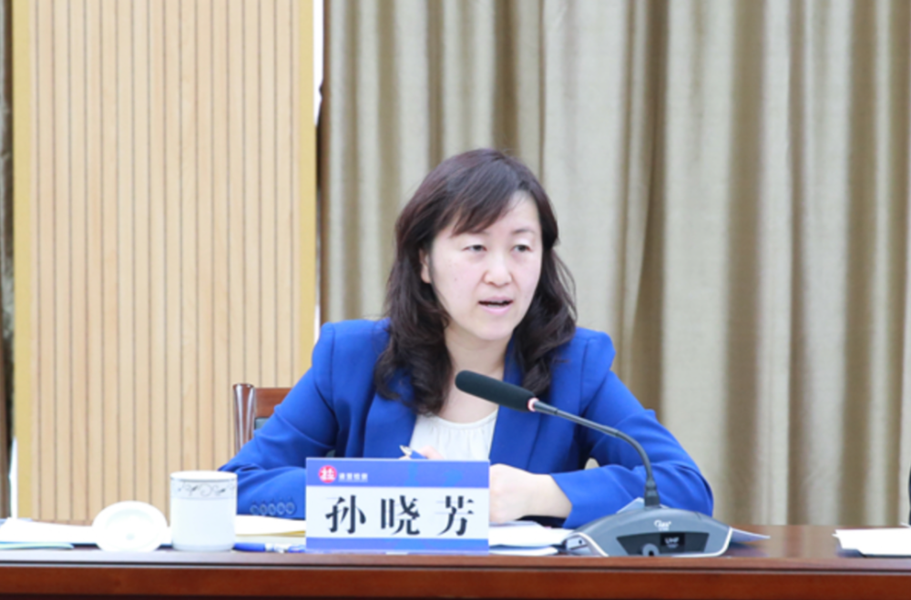
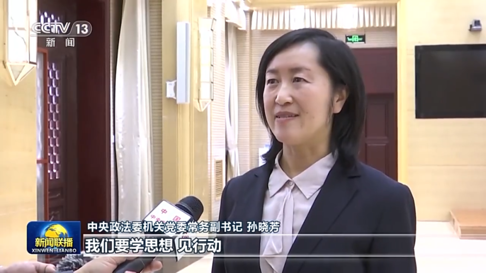
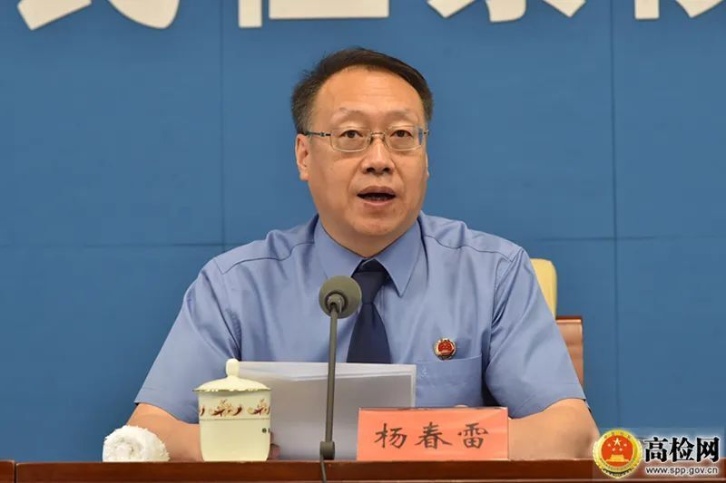

# 中央政法委领导层，再添一位女性成员

**撰文 | 余晖**

政知君注意到，中央政法委领导层有“新面孔”。

据中国长安网“领导机构”栏目更新信息显示，孙晓芳已经出任中央政法委副秘书长。

公开资料显示，孙晓芳长期在中央政法委工作，担任过中央政法委法治建设室(司改办)副主任、中央政法委机关党委(干部局)局长等职务。

孙晓芳曾多次率队赴地方调研。

2017年2月，时任中央政法委法治建设室(司改办)副主任的孙晓芳率队到上海市人民检察院调研；2018年4月，孙晓芳率队到浙江省诸暨市人民检察院调研。

今年4月，孙晓芳还曾登上《新闻联播》。

4月4日，在《新闻联播》中，孙晓芳以“中央政法委机关党委常务副书记”的身份接受采访。

她说，我们要学思想、见行动，树立正确的权力观、政绩观、事业观，增强责任感使命感，不断提高各项本领，紧紧围绕中国式现代化，谋划推进政法工作现代化。

“我们要按照总书记要求，查不足、找差距、明方向，接受政治体检，打扫政治灰尘，纠正行为偏差，不断增强党的自我净化、自我完善、自我革新、自我提高能力。”

更新后的中国长安网“领导机构”栏目显示，王洪祥已不再担任中央政法委副秘书长。

王洪祥，男，汉族，1963年6月出生，今年60岁，湖北仙桃人，他曾在最高检、福建省工作，担任过最高人民检察院政治部主任，福建省委常委、政法委书记，2019年3月任中央政法委副秘书长。

今年3月，王洪祥已担任第十四届全国人大宪法和法律委员会副主任委员。

中国长安网“领导机构”栏目显示，现任中央政法委书记是陈文清，副书记是公安部部长、党委书记王小洪。

中央政法委委员共有7人，分别是：

最高人民法院院长张军

最高人民检察院检察长应勇

中央政法委秘书长訚柏

国家安全部部长陈一新

司法部部长贺荣

中央军委政法委书记王仁华

武警部队司令员王春宁

中央政法委副秘书长共有三人，分别是杨春雷、王贻星、孙晓芳。

中央政法委领导中，共有两位女性，一位是司法部一把手贺荣，另一位是孙晓芳。

贺荣，1962年10月出生，曾在北京市、最高人民法院、陕西省工作。

公开资料显示，她曾担任陕西省委常委、纪委书记，陕西省委副书记，2020年4月任最高人民法院党组副书记、分管日常工作的副院长（正部长级），今年2月任司法部党组书记、部长。

另外，政知君注意到，中央政法委秘书长訚柏和三位副秘书长都是今年履新的。

訚柏出生于1969年，拥有博士研究生学历，中共党员，1991年7月参加工作。

公开资料显示，他曾在云南、青海任职，担任过青海省委常委、政法委书记，青海省委常委、组织部部长、政法委书记，青海省委副书记，2022年7月任中央政法委副秘书长。

今年3月，訚柏以“中央政法委委员、秘书长”的身份亮相。

杨春雷出生于1966年1月，他长期在黑龙江任职，担任过黑龙江省检察院常务副检察长，2018年跨省到陕西，任陕西省检察院党组书记、检察长，2020年任最高人民检察院党组成员、副检察长。

今年1月，杨春雷首次以“中央政法委副秘书长”的身份亮相。

王贻星是今年7月履新的。

公开资料显示，王贻星曾任公安部办公厅副主任、研究室主任、改革办常务副主任等职。

机构改革前，研究室为公安部办公厅下设机构，成为独立的内设机构后，王贻星出任公安部研究室主任。

**资料 ｜ 新华社 人民网 央视 长安网等**

**【版权声明】本文著作权归政知新媒体独家所有，未经授权，不得转载。**

