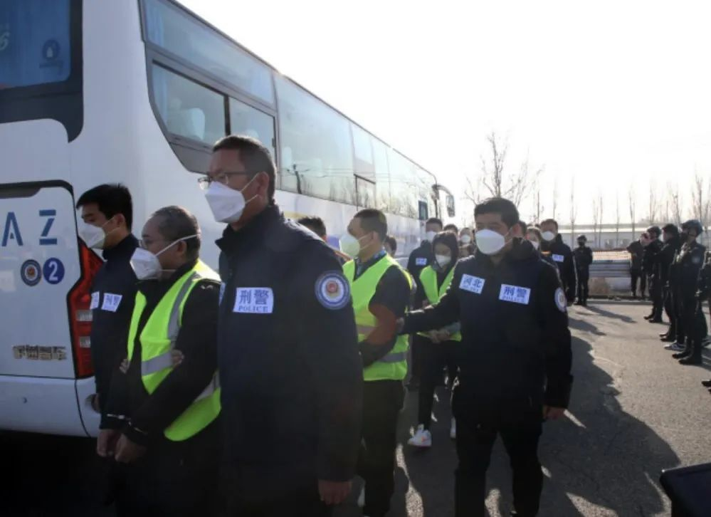

# 你刷的“远征军”视频，可能是电诈套路

_高度自治，赌诈结合。_

作者：鲍志鹏

编辑：冯群星

随着反诈题材电影的上映与各种新闻的发酵，缅北成为眼下公众热议的一个焦点。

据不完全统计，缅北现有超过10万人从事电信诈骗，已成为东南亚乃至全球电信网络诈骗犯罪的温床。

**地下经济的历史溯源**

缅北的地下经济及其支撑的毒品走私、人口贩卖、电信网络诈骗等非传统安全问题，与缅北特殊的历史背景、地理环境及现实条件有关。

长期以来，缅北都作为“金三角”毒品核心产地闻名于世。19世纪英国殖民时期，缅北的罂粟种植就开始普及。

1948年独立以来，缅甸的国内族群冲突未曾停歇，迄今缅甸境内仍活跃着大小20余支民族地方武装（简称民地武）。

常年的武装冲突弱化了中央政府的控制力，使得缅北难以建立起正常稳定的社会经济秩序。

为了支持武装力量的生存发展，果敢同盟军、佤邦联合军、掸邦东部民族民主同盟军等不少民地武诉诸于罂粟种植、毒品以及木材走私，形成了缅北对地下非法经济的依赖。

1988年，缅甸新军人政府上台。为实现国内和平，缅甸联邦政府积极推动民族和解进程，1989年至1994年6年间，缅甸先后有17支民地武与政府签署了停火协议。

作为交换条件，缅甸政府允许民地武获得不同程度的经济特权，部分民地武被允许在辖区内建立特区，实行“划地自管”“高度自治”。

为刺激当地经济，掸邦第一、第二、第四特区等地开始发展博彩产业。不少民地武领导层蜕变为非法经济的既得利益者，并与军方形成了复杂的利益关系。

非法经济产生的丰厚利润也诱发了武装冲突爆发。例如，2009年果敢“八八事件”，其重要导火索之一是当地高层人物围绕赌场等商业利益分配产生了矛盾。

另一方面，随着新军人政府推进经济市场化改革，缅甸军方为了对付反抗军方的民地武，默许支持一些民团武装从事非法经济活动，形成了紧密的裙带关系。

缅北博彩行业兴起的同时，针对中国公民的绑架、拐卖、囚禁等恶性事件开始出现。

从2003年开始，中方宣布禁止中国公民前往缅北从事赌博活动，并采取了一系列专项打击行动，缅北博彩行业一度萧条。

同时，在国际社会积极推动下，缅北开始推广“替代种植”，罂粟种植面积显著萎缩，2007年缅北罂粟种植面积降至1.86万公顷的历史最低点。

对非法产业的打击冲击了缅北民地武等地方势力的经济利益。为了应对大环境的变化，勐拉等民地武控制区开始发展网络博彩以吸引赌客，缅北网络赌博问题由此出现。

**电信网络犯罪的专业化趋势**

除了来自缅甸内部的历史原因，缅北网络诈骗犯罪问题的出现，与全球经济及安全环境紧密相关。

伴随通信技术和互联网的发展，电信网络犯罪在全球范围内呈上升趋势。新冠疫情期间，全球互联网用户的在线时长显著增加，也为全球电信网络犯罪分子创造了可乘之机。

由于中国公安部门打击电信网络犯罪的力度不断增强，且与柬埔寨、菲律宾等国展开跨国联合执法行动，部分犯罪集团开始向缅北转移。

2021年2月1日，缅甸军方以大选结果不公正为由重掌政权，缅甸国内危机爆发并持续至今。当前缅甸军方与反对派之间势同水火，国内政治暴力烈度、民族武装冲突频次显著提高。

_2021年7月，缅甸示威者在街头反对军事政变。_

缅北的安全形势严峻，部分民地武传统的“以毒养军”模式逐渐开始向“以赌养军”“以诈养军”模式转型。一些当地人看到从事网赌、电诈有利可图，已不满足于给电诈集团充当“包租公”，自己也加入其中。

缅北部分地区经济对网赌、电诈产生依赖，电信网络犯罪出现产业化、专业化趋势，一大表现是犯罪集团与当地各势力的关系日趋紧密。

掸邦第二特区、第四特区以及木姐、果敢等政府军控制区先后出现不少由当地武装经营的赌场和电信诈骗园区。

佤邦贺岛经济开发区、勐波经济开发区的电诈活动尤为猖獗。在佤邦勐能县，甚至出现将部分学校教学楼出让给网络诈骗集团，并组织学校师生到电诈集团“兼职”的情况。

随着我方打击力度的不断加大，缅北网赌电诈集团的诈骗方式和引流方式也不断升级，诈骗过程开始呈现接触周期长、诈骗环节多、跨平台实施等特点。

过去，电诈分子或是通过开设“杀猪盘”、开设非法网络赌博盘口等手段直接骗取受害人钱财，或是借婚恋交友、高薪招聘等名义引诱境内人员前往。

近年来，为躲避国内短视频平台审查，涉赌涉诈集团招募有才艺、相貌好的年轻男女组成演出团，利用短视频平台发布演出和旅游宣介视频，利用“远征军”等话题博取流量关注，从而为后期有针对性地开展诈骗活动做铺垫。

新冠疫情期间，人员流动受到限制，不少缅北网络赌博和电诈犯罪集团为了弥补“人手不足”问题，不惜铤而走险，通过人口贩运、绑架、非法拘禁等暴力手段强拉人头。

除中方人员遭绑架外，蒙古、俄罗斯、印度、马来西亚、泰国、新加坡等国都出现了本国公民被骗至缅北和缅东妙瓦底的案例。

面对电信网络诈骗犯罪，中方公安部门和各级政府显著增强了教育宣传力度、开展专项行动，与东南亚国家合作加大打击力度，摧毁跨国电信网络犯罪资金链，挤压了缅北电信网络犯罪集团生存空间。

缅北电信网络犯罪分子转而利用人工智能等技术手段，将诈骗对象范围扩大至欧、美、日、韩等国。部分缅北电诈犯罪园区也出现了向中东等其他地区转移的趋势。

**电诈治理的路径选择**

当前缅北电信网络诈骗问题，建立长效治理机制，维持高压打击态势是应有之义。

2021年，中国公安部会同国家移民局、工信部、人民银行等部门及三大电信运营商开展集中专项整治，仅在当年就拦截偷渡缅北人员1.8万人，教育劝返缅北诈骗窝点人员5.4万人，有效挤压了缅北电信诈骗犯罪空间。

自2021年4月至2022年7月，全国共破获电信网络诈骗案件59.4万起。电信网络诈骗犯罪近年来持续上升势头得到有效遏制，诈赌案件立案数连续14个月同比下降。

外交层面，中方与缅甸保持了密切沟通，多次就中缅合力打击缅境内电诈网赌等犯罪活动进行专题协调。

今年8月，中泰缅老启动打击赌诈联合行动，并决定在泰国清迈建立专项行动综合协调中心，标志着打击网赌电诈国际合作迈入新阶段。

_2023年初，河北公安机关将境外电信网络诈骗头目和重要骨干押解回国。_

加强国际合作，建立机制化的合作平台，是探索网络赌博、电信诈骗问题长效性综合治理路径的关键。同时应该看到，缅北电信网络诈骗问题有着长期存在的土壤，跨境追逃打击在法律和操作层面仍有不小难度。

在缅北不少犯罪分子看来，与贩毒相比，电诈、网赌“风险小，利润高”。一些人尝到所谓“甜头”，仍然执迷不悟。

从全球角度来看，网赌、电诈已有完整的全球化产业链条，因此打击缅北网赌、电诈问题应该推动更广泛的国际合作。

此外，缅北赌诈问题舆情沸腾之下，部分网络自媒体借题发挥，恶意炒作，散播不理性的妖魔化缅甸和东南亚的言论。如何引导公众突破“信息茧房”，在强化防赌反诈意识基础上，建立对缅甸和东南亚客观理性的认识，应该是值得全社会思考的问题。

总监制： 吕 鸿

监 制： 张建魁

主 编： 许陈静

编 审： 苏 睿

