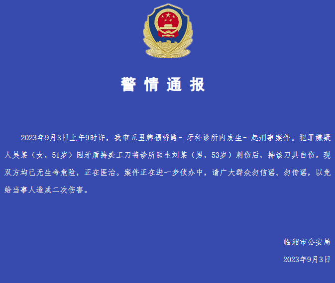

# 女子持刀刺伤牙医后自伤 湖南临湘警方：双方均已无生命危险

**警情通报**

2023年9月3日上午9时许，我市五里牌福桥路一牙科诊所内发生一起刑事案件。犯罪嫌疑人吴某（女，51岁）因矛盾持美工刀将诊所医生刘某（男，53岁）刺伤后，持该刀具自伤。现双方均已无生命危险，正在医治。案件正在进一步侦办中，请广大群众勿信谣、勿传谣，以免给当事人造成二次伤害。

临湘市公安局

2023年9月3日

**此前报道：**

[网传湖南省一女子“杀牙医”，当事牙医朋友回应：刚刚结束手术 ](https://new.qq.com/rain/a/20230903A0781D00)

