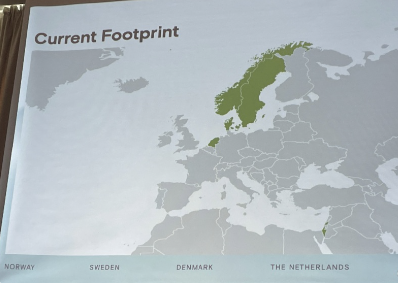
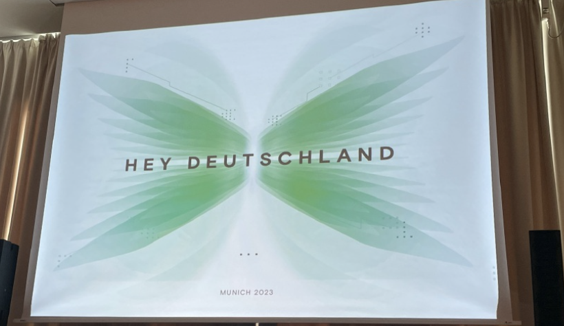
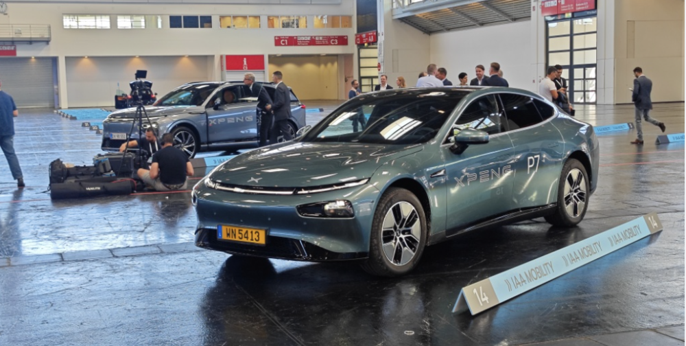
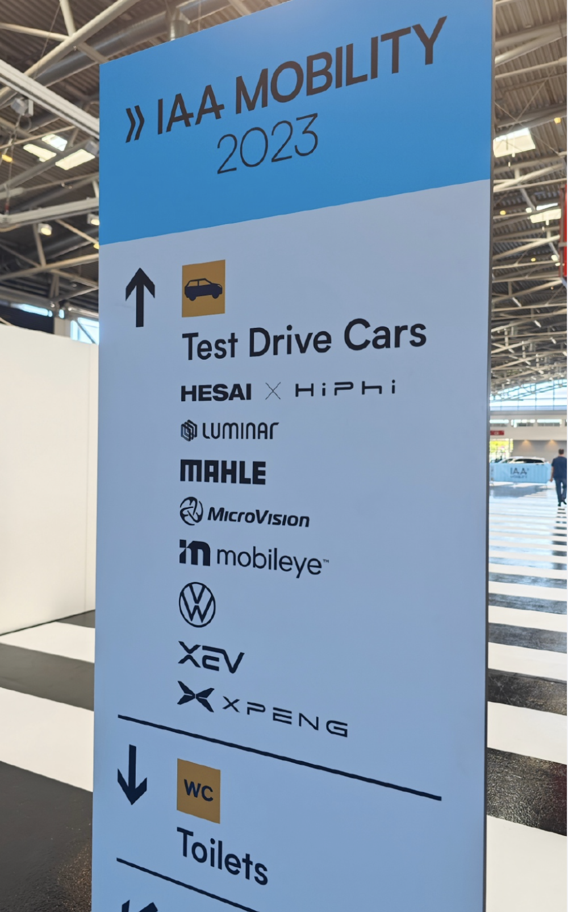

# 小鹏汽车计划明年进军德国、法国、英国市场，慕尼黑车展提供车型试驾

腾讯汽车讯 9月4日消息，在今日开幕的慕尼黑车展上，有媒体报告小鹏汽车公布了欧洲市场扩展战略：明年进军德国、法国、英国市场。

随后，财联社消息称，小鹏汽车副董事长兼总裁顾宏地（Brian Gu）在慕尼黑车展上表示，小鹏计划明年进入德国市场。小鹏汽车国际市场副总裁Eric Xu称，
明年法国也将被纳入小鹏的新市场，如果可能的话也会在明年进入英国市场。小鹏汽车德国负责人Markus
Schrick表示，在德国，小鹏计划通过传统的经销商方式销售，并正在与几家较大的连锁店商谈。

 _来源：电动星球小新_

 _来源：电动星球小新_

据悉，本次慕尼黑车展上，小鹏汽车没搭展台，但是确提供了试驾。

 _现场试驾车型包含小鹏汽车，来源：微博_

