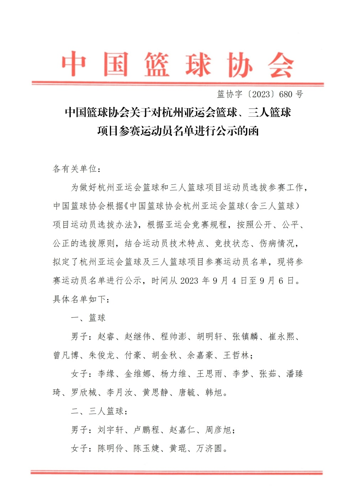
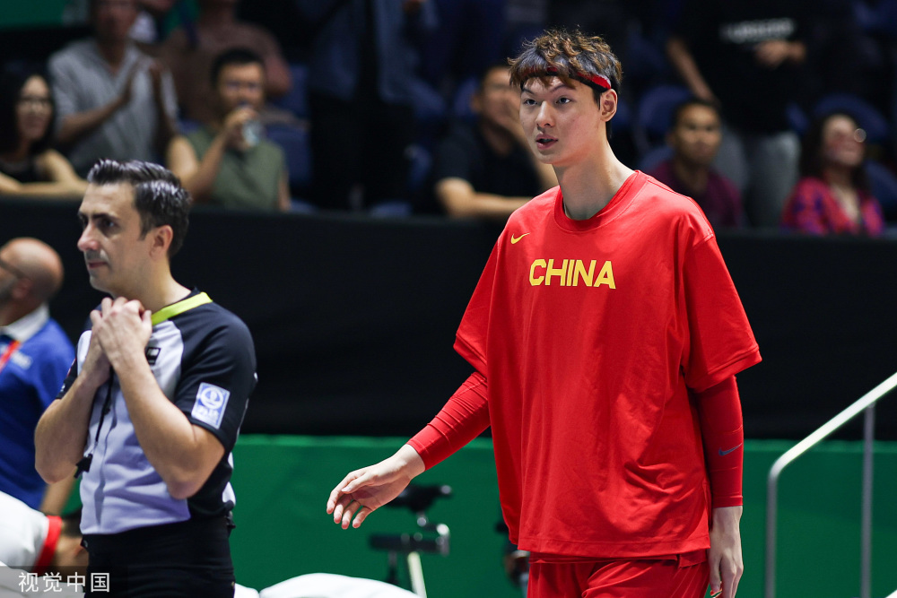
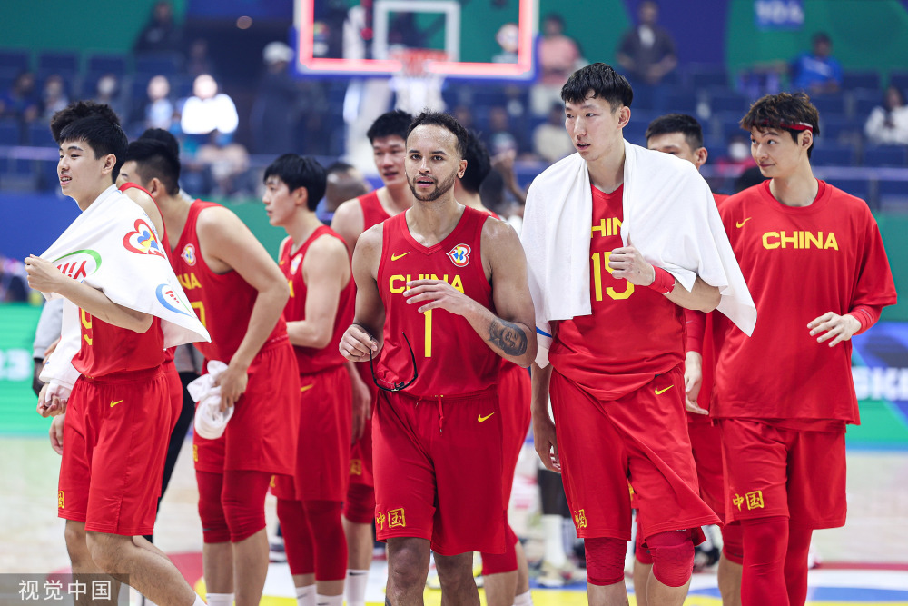
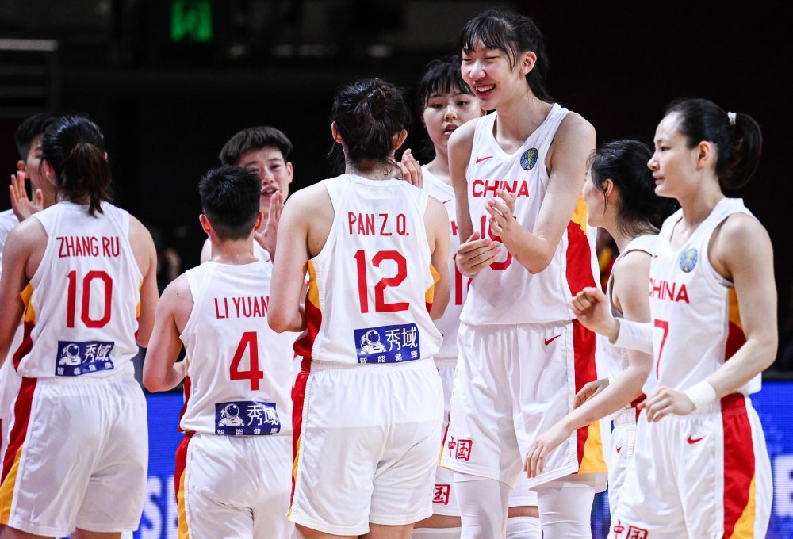

# 篮协公布亚运会篮球大名单：周琦李凯尔缺席王哲林在列 女篮派最强阵

北京时间9月4日，中国篮协公布了杭州亚运会篮球项目各国家队名单，在男篮大名单中，周琦和李凯尔缺席。

中国亚运会男篮参赛名单是：赵睿、赵继伟、程帅澎、胡明轩、张镇麟、崔永熙、曾凡博、朱俊龙、付豪、胡金秋、余嘉豪、王哲林。

相比世界杯，周琦和李凯尔无缘，周琦是因为腰部伤病，李凯尔则是返美备战新赛季。补充了余嘉豪、程帅澎和曾凡博，上述三人也参加了男篮世界杯的集训。

亚运会女篮名单是：李缘、金维娜、杨力维、王思雨、李梦、张茹、潘臻琦、罗欣棫、李月汝、黄思静、唐毓、韩旭，女篮是全主力阵容出战，因伤缺席了亚洲杯的李月汝和黄思静将在亚运会迎来复出，李梦和韩旭也将回国征战亚运会。

三人篮球项目，男篮分别是刘宇轩、卢鹏程、赵嘉仁、周彦旭；女篮分别是陈明伶、陈玉婕、黄琨、万济圆。

这次亚运会中国男女篮在家门口作战，目标都是拿到金牌，中国篮球能包揽这四个项目的金牌吗？应该说，女篮可以说已经把冠军当作囊中之物，至于男篮，在经历了世界杯的惨败之后，如何重振旗鼓相当关键，乔尔杰维奇会继续带领球队征战，力图实现卫冕。

