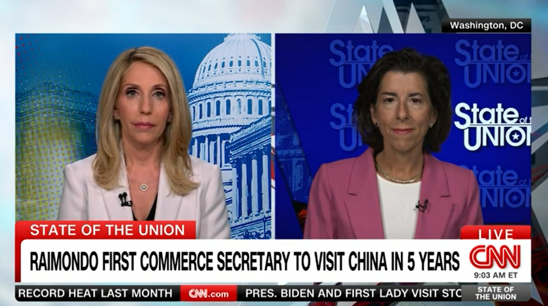

# 美商务部长称美将对华出售芯片，但不卖最顶尖芯片，中方此前多次表态

【环球网报道】美国商务部长雷蒙多于8月30日结束为期四天的访华之行返回美国。据美媒报道，雷蒙多9月3日出现在美国有线电视新闻网（CNN）“国情咨文”节目中。她声称美国将继续向中国出售芯片，但“不会向中国出售我们最顶尖的芯片”。对于美国的一系列芯片出口管制措施，中方此前多次表态，这种做法背离公平竞争原则，违反国际经贸规则，不仅损害中国企业的正当权益，也将影响美国企业的利益。

_雷蒙多9月3日在美国有线电视新闻网（CNN）的“国情咨文”节目发表涉华言论。 视频截图 图源：美国有线电视新闻网_

报道称，雷蒙多在节目中称，美国“永远不会向中国出售我们最顶尖的（人工智能）芯片”。雷蒙多还表示，美国有望在2030年前“拥有一个庞大、深入、世界上最好的半导体生态系统……我们在半导体设计方面已处于世界领先地位。你可以通过人工智能芯片看到这一点。我们在软件领域处于世界领先地位。”

报道提到，目前，美国从中国台湾地区进口大量用于制造高科技产品的半导体芯片。雷蒙多此前曾呼吁减少对台湾芯片依赖。今年4月，她在接受彭博社采访时称，美国在芯片领域过度依赖中国台湾地区不可持续且危险。

对于美国的一系列芯片出口管制措施，中国外交部发言人毛宁去年10月曾表示，美国出于维护科技霸权需要，滥用出口管制措施，对中国企业进行恶意封锁和打压，这种做法背离公平竞争原则，违反国际经贸规则，不仅损害中国企业的正当权益，也将影响美国企业的利益。

另一方面，针对美国对华芯片等产品的出口管制措施，中方已于去年12月在世贸组织提起诉讼。中国商务部表示，美方近年来不断泛化国家安全概念，滥用出口管制措施，阻碍芯片等产品的正常国际贸易，威胁全球产业链供应链稳定，破坏国际经贸秩序，违反国际经贸规则，违背基本经济规律，损害全球和平发展利益，是典型的贸易保护主义做法。

面对美国政府不断收紧对华半导体产业政策，美资芯片三巨头英特尔、高通和英伟达提出了反对意见。彭博社7月21日援引知情人士消息披露，美三大芯片巨头首席执行官CEO同月17日在华盛顿举行会谈时向拜登政府官员表示，美国政府应当研究收紧对华出口限制的影响，并在实施新限制之前暂停实施有关举措。知情人士透露称，在当日会谈中，英特尔公司CEO帕特·基辛格表示，如果没有中国客户的订单，英特尔计划在俄亥俄州建设工厂等项目的必要性就会大大降低。英伟达CEO黄仁勋则表示，限制该公司芯片在华销售，只会让替代产品更受欢迎。另据新华社7月1日报道，美国芯片企业英伟达首席财务官科莱特·克雷斯日前表示，美国限制人工智能芯片对华出口“将令美国这一行业永久丧失机会”。英伟达首席执行官黄仁勋日前接受采访时也表示，中国市场不可代替，退出中国市场不是一种可行选项。

8月27日至30日美国商务部长雷蒙多对中国进行了为期四天的国事访问，期间先后访问北京与上海两座城市。在雷蒙多访华期间，华为公司上周突然预售新款手机Mate60系列，不仅在中国社会激起热烈讨论，在国外也受到高度关注。“一款手机的推出在华盛顿引发担忧，即美国的制裁未能阻止中国取得关键技术进步，”《华盛顿邮报》9月2日的报道称，“这似乎应验了美国芯片制造商的警告，即制裁不会阻止中国，而是会刺激中国加倍努力，打造美国技术的替代品。”

