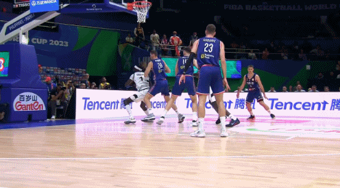
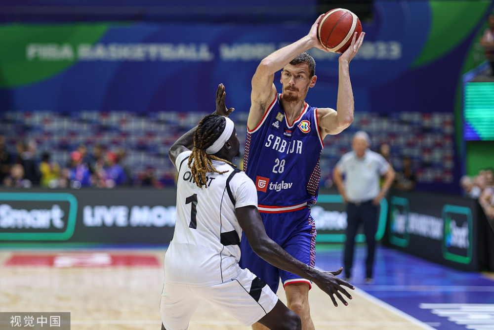
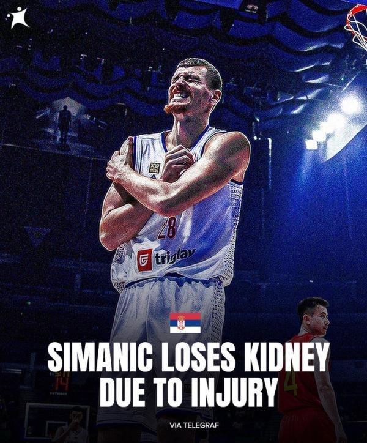

# 菲律宾医院无法找到供血 塞尔维亚男篮球员被肘击后摘除肾脏

正在菲律宾进行的男篮世界杯出现了一场惨剧。

**据塞尔维亚媒体Telegraf.rs报道，球员西马尼奇由于在小组赛塞尔维亚对阵南苏丹的比赛中，遭遇南苏丹球员奥莫特的肘击，无奈摘除了一颗肾脏。**

奥莫特肘击西马尼奇。

**据报道，西马尼奇赛后就被送往菲律宾当地医院进行紧急治疗，但由于无法找到合适的供血，医生只能选择进行肾脏摘除……**

西马尼奇今年25岁，身高2米11，本届世界杯他场均出场6.5分钟。

目前，国际篮联尚未对此事做出回应，后续是否会对球员进行保险赔付也不得而知。

伤人者奥莫特则在赛后表示：“我听说他去了医院，很抱歉，我不是肮脏的球员，我希望你早日痊愈，我为你祈祷。”

“我从来都不是肮脏的球员，我从心底里向你道歉，也向所有看到这个画面的人道歉。”

