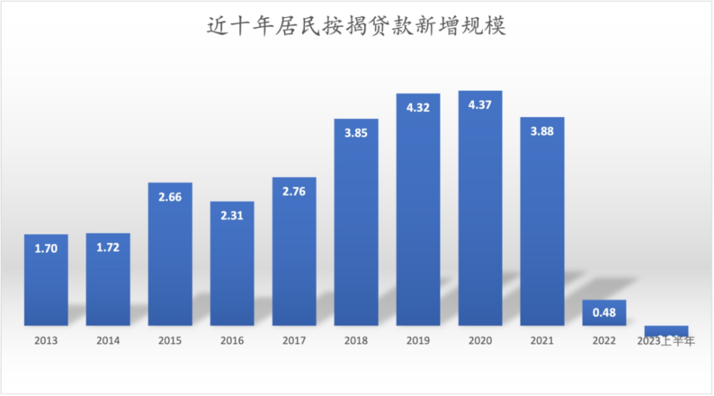
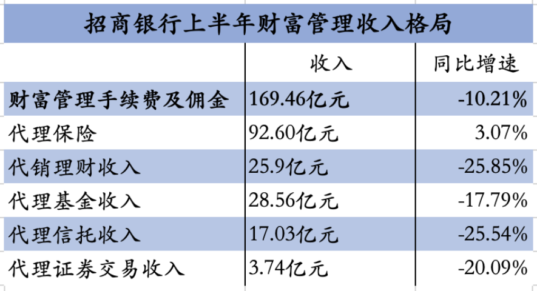
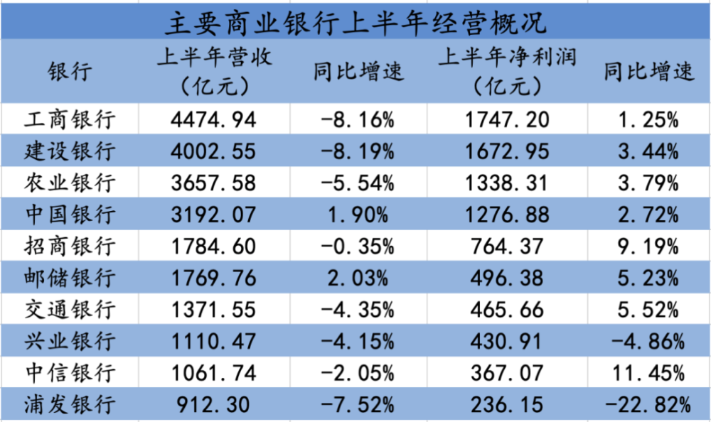

# 行长们慌了，房贷十年来首现负增长，银行利润还有最后一击

 _图源：视觉中国_

作者 | 肖望

编辑 | 陈弗也

出品 | 棱镜·腾讯小满工作室

“银行再不降房贷利率，年底我就提前还贷。”在谈及存量房贷利率是否会下调时，一位房贷客户向作者如此表态。

是下调存量房贷利率，还是应对汹涌的提前还贷潮，正在成为银行行长们必须面对的选择题。而随着银行业2023年中报陆续披露，提前还贷潮的影响有了更确凿的证据。

银行行长们终于妥协了。8月31日，央行、国家金融监管总局联合发布《关于降低存量首套住房贷款利率有关事项的通知》，近20万亿利率高位站岗的房贷终于等来了政策东风。

存量房贷利率下调将对银行业的利润产生直接冲击。而2023年中报显示，商业银行们已经告别躺赚的日子，净利润增速集体放缓，更有银行净利润开始同比出现大幅下滑。

银行2023年的中报里藏着哪些秘密？

**按揭贷款十年来首现负增长**

银行业过往最青睐的住房按揭贷款，正遭遇前所未有的挑战。

作者统计了17家主要上市银行（6家国有大行、9家A股上市股份行以及北京银行、上海银行）的数据发现，上半年17家主要上市银行的个人住房贷款余额较2022年末下降了2271.14亿元，其中四大国有行个人住房贷款余额下降超过2500亿元。中国银行下降尤为明显，其房贷余额较2022年末下降了922.22亿元。

仅有邮储、浙商、中信、平安、华夏和光大等六家银行的按揭贷款余额正增长，其中邮储银行、浙商银行住房贷款余额分别增加622.99亿元、170.50亿元，在银行业中靠前。

房贷余额下降，有部分房贷自然到期结清的缘故，但主要是居民购房需求不振、新增房贷规模有限，更重要的是居民提前还贷潮汹涌。

工商银行方面数据显示，该行上半年住房按揭贷款发放量超过5100亿元，较去年同期还多发放480亿元，但工行住房贷款余额下降576.01亿元。农业银行数据也显示，该行上半年个人住房贷款投放达4755亿元，但房贷余额下降294.83亿元。

邮储银行零售业务总监梁世栋在业绩会上就指出，该行存量按揭贷款中刚需占比较多，超9成都是首套房，单笔的金额也比较小，平均仅40万元，所以提前还贷的压力比同业可能稍稍好一点，这支撑了房贷余额增长。但梁世栋也坦言，提前还款对邮储相对影响小一点，但实际上绝对量也比较大。

央行统计显示，截至2023年6月末，个人住房贷款余额38.6万亿元，同比下降
0.7%。较2022年末余额下降2000亿元，尤其在今年第二季度，房贷余额较第一季度大降3400亿元。这是近十年来住房贷款规模首次负增长。

_据央行统计数据，作者制图_

在今年7月中旬的国新办发布会上，央行货币政策司司长邹澜就指出，今年上半年，个人住房贷款累计发放3.5万亿元，较去年同期多发放超过5100亿元，对住房销售支持力度明显加大。但房贷余额还是减少，主要是因为理财收益率、房贷利率等价格关系已经发生了变化，居民使用存款或者减少其他投资提前偿还存量贷款的现象大幅增加。

**4000万房贷客户有望受益**

今年1月末，郑州在全国率先将首套房贷利率下调到3.8%，即在当时LPR(Loan Prime
Rate，指贷款市场报价利率)基准上减50个基点。随着今年6月20日LPR再降10个基点，郑州市新发首套房贷利率已降至3.7%。而2020年时这一利率一度达到6.12%，购房居民心理落差不可谓不大。

不止是郑州，据新华社报道，截至2月13日，已有近30个城市调整了首套房贷利率，其中多个二线城市开始执行首套房贷款利率最低为3.8%（即LPR减50个基点）的政策。

房贷利率高位站岗，叠加投资渠道匮乏，越来越多居民选择提前还贷。下调存量房贷利率的呼声也越来越高。

招行行长助理彭家文在业绩会上坦言，存量房贷利率下调的背景是提前还贷的量比较大。

从银行经营来看，假设一笔金额100万元、期限30年、利率为6%的房贷，银行在未来30年间可以赚到115.84万元利息。假设可以转换为当前3.7%的利率，则银行未来赚到的利息总额为65.7万元，少赚逾50万元。但6%利率的房贷导致居民提前还款的概率加大，一旦居民提前还款，银行不仅失去未来30年的全部利息收入，而且存款规模也会相应下降，对银行的经营更为不利。

是下调利率少赚些利息，还是利率继续维持高位，但因为提前还贷可能赚不到利息？成为银行行长们必须面对的选择题。

农行副行长林立就表示，（调整存量住房贷款利率）一方面有利于减轻部分存量个人住房贷款客户的财务成本负担，另一方面有利于商业银行平滑提前还贷压力，有利于平稳经营。

林立表示，在有关政策方案明确之后，该行将抓紧制定具体的操作细则，尽快完成合同文本的准备，加紧系统改造调整等方面的工作，积极做好组织实施。

不过，调降存量房贷利率需要监管部门统一的指导方案。8月31日，央行、国家金融监管总局正式下发通知，存量房贷利率如何下调终于有了具体的操作指引。

8月31日以来，农行、工行、招行等多家银行回应，在有关部门指导下，正有序开展存量首套个人住房贷款利率的准备工作。

《上海证券报》援引接近监管的有关人士说法指出，据估算，本次调整涉及的客户可能超过4000万，涉及调整的贷款规模可能达25万亿元。以100万元、25年期、原利率5.1%的存量房贷为例，假设房贷利率降至4.3%，可节约借款人利息支出每年超5000元，显著增加消费能力。

**不买基金、信托，偏爱定期存款和保险**

银行2023年中报里，还藏着居民投资理财和储蓄转向的秘密。

近日，包括微光股份、先锋电子、安邦电气等多家上市公司公告，购买的中融信托相关产品未能按时到期兑付，引发市场对信托产品风险的担忧。

不只是中融信托，近一年多来，多家信托机构的涉房信托产品兑付出现问题，这曾经高净值客户最爱的高收益理财产品，如今唯恐避之不及。

招行行长助理王颖在业绩会上提到，该行再次回检了所有的信托业务，未有任何底层资产涉及到相关的信托机构。

此外，资本市场大幅震荡，导致权益基金发行遭遇冰点，银行代销费用亦大受影响。招行披露，其上半年代理非货币公募基金销售额1526.06亿元，同比下降18.53%，代销基金收入同比下降17.79%。

_据招行2023年中报数据，居民投资风险偏好转向稳健保守，作者制图_

北京一位90后投资者就对作者吐槽，前两年购买的多只股票型基金亏损幅度达到40%，原本想挣点儿钱换房，如今已亏掉了一个卫生间。她直言，自己现在只爱银行大额存单，哪怕下一步利率跌到2%都要去存款。

投资者正大规模转向低风险的保险及定期存款产品。

招行彭家文指出，招行代理保险保费的收入同比增长54.88%，一方面是客户风险偏好降低，保险配置需求增加；另一方面，是大家预计3.5%预定利率的产品会调整，所以加快了配置速度。

彭家文表示，当前在整个客户风险偏好发生变化的情况下，包括理财净值的赎回、资本市场表现不好、权益类产品销售不佳等现象，都表现出客户的需求转向低风险的产品，而且某一个阶段存款就充当了这类低风险产品。

多家银行中报显示，存款规模仍在快速增加，且定期化趋势明显。

以工商银行为例，上半年该行定期存款增加3.63万亿元，增长23.9%；活期存款减少1760.50亿元，下降1.3%。其中，个人定期存款增加1.57万亿元，公司定期存款增加2.06万亿元。

中国银行副行长张毅在业绩会上表示，由于经济恢复是一个渐进性的过程，当前国内居民消费仍有待恢复，民间投资意愿有待进一步提升，工商企业生产资金和个人理财资金的存款化、定期化趋势还将保持一段时间。

**存款利率再降，银行打响利润保卫战**

曾经，银行被指“赚钱赚到不好意思”，但今年开始，营收负增长乃至利润增速下滑成为商业银行的新常态。

国家金融监督管理总局数据显示，2023年上半年，商业银行累计实现净利润1.3万亿元，同比增长2.6%，增速较去年同期下降4.5个百分点。

作者统计的17家主要上市银行中，上半年仅有邮储银行、中国银行和浙商银行三家的营业收入呈小幅正增长，其他14家银行营收均同比下滑。而净利润方面，多家上市银行艰难维持住利润小幅正增长的“颜面”，兴业银行、民生银行及浦发银行净利润则同比下降，其中浦发银行净利润同比大降22.82%，令市场大跌眼镜。

浦发银行在中报中提到，营收、利润下降主要受“资产重定价、市场利率下行、资本市场波动等影响”。

_据WIND数据，作者制图_

利息净收入是银行最主要的营收来源，但受LPR不断下行、银行向实体经济让利、居民存款定期化导致利息支出成本升高等原因影响，银行营收开始遭遇挑战。

农业银行中报就显示，其上半年信贷规模增长导致利息净收入增加382.76亿元，但利率变动导致利息净收入减少480.32亿元，由此上半年利息净收入同比减少97.56亿元。

在瑞银大中华金融行业研究主管颜湄之看来，存量房贷利率下调将是最后一次对银行业息差较大的负面影响。对银行业息差的影响不超过10个BP(即不超过0.1%）。

颜湄之表示，在资产端，监管部门希望银行能给实体经济让利，贷款利率不断下降，考虑到对银行业利润的影响，负债端可能还会继续降低存款利率。

央行在2023年第二季度《中国货币政策执行报告》的专栏文章中指出，商业银行维持稳健经营、防范金融风险，需保持合理利润和净息差水平，这样也有利于增强商业银行支持实体经济的可持续性。

新一轮银行存款利率下调已经开始。

作者注意到，包括工商银行、农业银行、招商银行等多家银行在官网已更新了最新的定期存款利率。以国有大行为例，自9月1日开始，1年期、3年期和5年期定期存款利率分别下调10个基点、25个基点、25个基点至1.55%、2.2%和2.25%。

这意味着，假设一居民在银行100万元存5年，其每年的存款利息将再少2500元。

