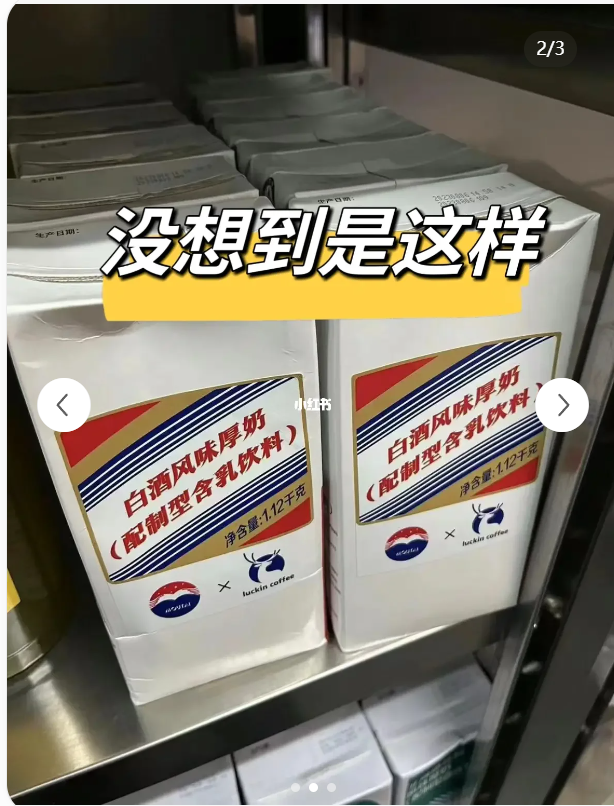

# 茅台瑞幸拿铁刷屏，喝完能不能开车？网友调侃“喝瑞幸的都开不起车”

腾讯新闻《潜望》 作者 何西

在卯足了劲宣传数日后，9月4日一早，“茅台瑞幸酱香拿铁”成为社交媒体顶流。尽管比起瑞幸9.9元/杯的拿铁来说贵了一倍，但凭借着“茅台”两字的加持，定价38优惠后19元的联名款咖啡，变得十分平易近人。

在联名款的发布会上，茅台集团党委书记、董事长丁雄军亲自出席，足见对这一联名活动的重视程度。据丁雄军透露，这款“酱香拿铁”经过专业团队上百次的调试，实现了浓郁的酱香和咖啡醇香的完美融合。

据了解，在咖啡中的茅台，是以白酒风味厚乳的形式加入，并非直接加入酒液，酒精含量为0.5%。这以至于“喝完后能不能开车”的话题也成为讨论的热点之一。不过很快有截图流传，认为喝瑞幸的受众都是没车的年轻人，因此不需要多虑酒驾问题。

这一偏颇的观点背后，实则指出了茅台此次跨界联名想要争取的年轻人群体。在此之前，茅台已经通过冰淇淋等产品，在年轻人群体中热闹了一番。通过低价和多品类，茅台正在尝试将更多的年轻消费者纳入到基本盘中。

同样地，深陷与库迪贴身肉搏战的瑞幸咖啡，也试图通过联名款与对手以示区别，提高品牌形象。

_网传截图_

**从冰淇淋到咖啡，茅台要抓住年轻人**

茅台的跨界尝试，早在一年多前就已经开始。彼时，茅台联手蒙牛做冰淇淋，先后研发了6款产品，定价在60元以上。

为了刺激冰淇淋的销量，茅台还尝试将其与飞天茅台等产品的认购资格绑定，即凡在i茅台APP购买茅台冰淇淋（经典杯型或传统杯型任意口味）单笔订单满12杯及以上，可前往活动页面参与冰爽夏日“随心购”活动，前13000名用户点击“资格领取”可获得53%vol
500ml贵州茅台酒（癸卯兔年）×1瓶、53%vol 500ml贵州茅台酒（珍品）×1瓶、53%vol 500ml茅台1935×2瓶、飞天53%vol
100ml贵州茅台酒（i茅台）×2瓶，以上四款产品“随心购”资格，四款产品可直接购买任意一款。

首次尝试破圈，茅台就尝到了甜头。在今年5月29日举办的茅台冰淇淋上市周年庆典上，丁雄军宣布茅台冰淇淋销量近1000万杯。按均价60元/杯的价格来算，一年创造的销售额便达6亿元。

为了赢得更多的年轻用户，茅台将冰淇淋价格进一步下探。在今年的7月底，茅台与中街集团旗下高端品牌中街1946联合推出茅台冰淇淋新品，不同于此前冰淇淋产品，该产品偏向于零食化，售价29元/支的价格相较茅台冰淇淋更加亲民。

茅台打算在这条路上走得更远。丁雄军透露，贵州茅台将加大研发酒心巧克力、含酒饮品、棒支、软冰等产品，建立不同类型、不同价位、特色显著的产品矩阵。

不管是冰淇淋，还是联名做咖啡，茅台都意在获取更多的基本盘，即向下争取年轻用户。毕竟相比定价1499元，但零售价普遍在2800元左右的飞天茅台来说，定价几十块钱的冰淇淋产品，更易获得。

**瑞幸的算盘：脱离与库迪贴身肉战**

在这次发布会上，瑞幸咖啡CEO郭瑾一透露，瑞幸咖啡门店已突破1.2万家，消费客户数超过1.7亿，月活跃用户超过5000万人。“积极满足年轻用户的消费新需求，始终关注用户长期价值，是瑞幸的一贯追求，”他说，“此次推出的产品是年轻人的第一杯酱香拿铁，也可能是他们第一次品尝到茅台的味道，我们希望通过瑞幸和茅台的共同携手，长期持续为客户提供更高品质、更具价值观的全新消费体验，让越来越多的年轻消费者爱上瑞幸、爱上茅台。”

根据最新的2023年第二季度财报数据显示，瑞幸咖啡以62亿元人民币总营收，超越星巴克在中国市场的59亿元营收，实现单季度营收第一次超越星巴克的“里程碑”。

但数据背后也有隐忧。瑞幸主打的10元价格带，在今年迎来最强劲的对手——从瑞幸出走的原管理团队一手打造的库迪咖啡。

最新的数据显示，8月8日，库迪咖啡门店数已经突破5000家——这距离其首店开业仅仅半年多时间，在连锁咖啡品牌中，扩张速度位列第一。

库迪咖啡与瑞幸在成立之初的打法极其相似且简单粗暴，即利用9.9元的低价策略，加上快速扩张的开店速度，跑马圈地，与瑞幸贴身肉搏。

此前在一次专访中，库迪咖啡首席市场官李颖波透露，尽管中国咖啡市场表象竞争愈加激烈，但实际增长潜力依然巨大，且进入了高速发展期，“我们的开店数恰好也说明了这个模式的成功”。

李颖波为瑞幸咖啡创始成员，随后跟随陆正耀与钱治亚创办库迪咖啡。他回忆，在数年前做瑞幸时，中国咖啡的人均年消费量只有6杯，而且其中有5杯是速溶，1杯是现磨，到了今年这个数字变成了9杯，其中6杯是现磨。“看上去有了六倍的增长，但这个数字依然很低。”

他例举其他国家数据；“先不说欧美国家，日本人均年消费在300多杯，韩国在400多杯，中国的台湾和香港地区也在300多杯的量级。”

而针对“低价营销”的说法，李颖波在剖析成本之后指出，10-15元是目前咖啡市场的合理价格带，“成本主要是原材料、房租、人力、水电杂费，”他具体分析，“原材料包括咖啡豆、糖浆、牛奶、包装材料，这些成本大概是5块5左右，房租在20-30平的小店模式下，日均400杯销量折合每杯成本1块2毛5左右，人工成本也在杯均2块左右，最后加上水电杂费大概杯均2毛，把这些加起来，在规模化的运营之下，咖啡的单杯成本在9块钱以下。”

因此他认为，库迪定价9.9元/杯的促销活动不是依靠低价烧钱在教育市场，而是合理的价位。“优惠券是9.9元，但整个活动期间人均消费会在11-12元之间，这样的价格我们的成本结构能够承受，消费者觉得OK，联营商也有钱赚。”

面对库迪的步步紧逼，原本已经将客单价提高至15元以上的瑞幸咖啡，在今年6月宣布开启新一轮优惠活动，与库迪开打9.9元价格战。在财报电话会上，瑞幸董事长兼CEO郭谨一表示，要把9.9元活动常态化进行下去，“至少持续两年”。

这也是瑞幸咖啡此次联名背后透露出的焦虑。如果仅靠低价，挤压利润的同时，瑞幸咖啡用户也会被局限在低价中，因此才会有今天诸如“喝瑞幸的都开不起车”之类的调侃，即便市场占有率超越星巴克，但在盈利上却被远远甩在后面。

深陷价格战的瑞幸，此次通过与茅台的联名，是否能既赚流量又赚收益，还有待观察。

