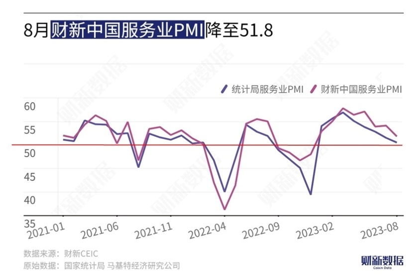

# 8月财新中国服务业PMI录得51.8，外需年内首次出现下滑

【财新网】8月中国服务业扩张略有放缓，外需年内首次跌入收缩区间。

9月5日公布的8月财新中国通用服务业经营活动指数（服务业PMI）录得51.8，较7月下降2.3个百分点，为年内最低，但仍高于荣枯线。此前公布的8月财新中国制造业PMI上升1.8个百分点，部分抵消了服务业PMI回落的拖累，8月财新中国综合PMI微降0.2个百分点至51.7，为2月以来最低。

两个制造业、服务业走势一致，综合PMI走势则并不相同。统计局近日公布的数据显示，8月制造业PMI回升0.4个百分点至49.7；服务业PMI走弱1.0个百分点至50.5，连续两个月创年内新低；综合PMI回升0.2个百分点至51.3。

分项数据显示，8月服务业供需扩张幅度放缓。当月经营活动指数在扩张期间降至年内最低，新订单指数亦略有回落。外需明显走弱，出口业务受挫，8月服务业新出口订单指数年内首次降至临界点以下。

服务业就业维持韧性，8月就业指数与7月基本持平，连续第七个月高于荣枯线。样本企业称，业务需求上升，叠加企业计划扩张，支撑服务业用工增长。不过由于新订单增加，订单积压加剧，8月积压业务指数升至2月来最高。

由于原料、用工、燃料等费用增加，8月服务业成本继续上扬，不过投入价格指数在扩张区间回落至近六个月低点。当月服务业出厂价格维持扩张，但幅度放缓。受访企业反映，出于转移成本压力的考量涨价，但市场竞争仍较为激烈，企业定价能力有限。

内需不足、外需下降，导致服务业企业信心边际走低。8月经营预期指数在扩张区间降至2022年12月来最低。

财新智库高级经济学家王喆表示，8月制造业景气度有所改善，服务业增长势头放缓，经济下行压力依然较大。内部需求不足和弱预期的问题或在更长时间形成负面循环，叠加外需的不确定性，经济下行压力恐不断加大。当前，稳预期和增加居民收入仍是施策重点。内外部经济环境形势日趋复杂，相关支持政策的紧迫性和必要性进一步增加。

