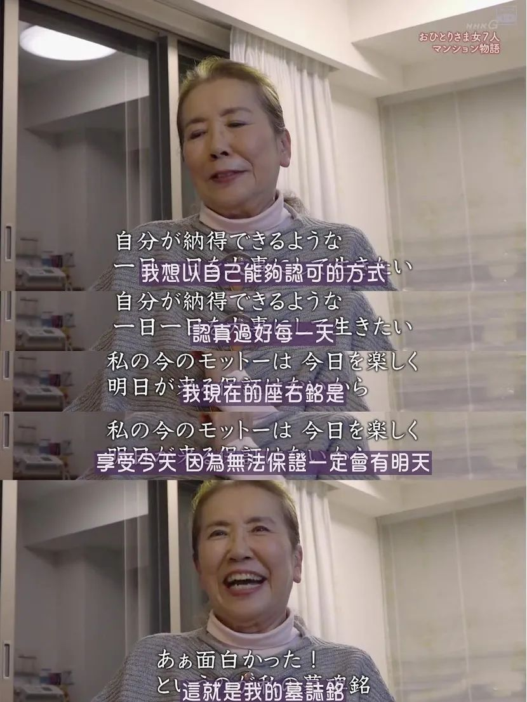
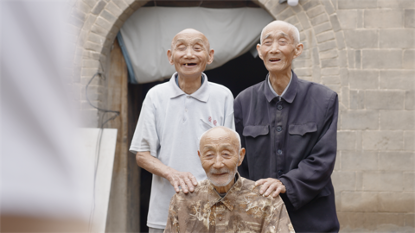
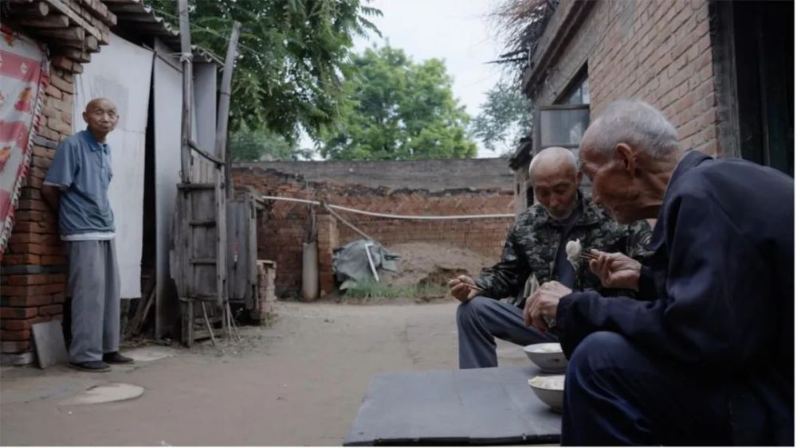
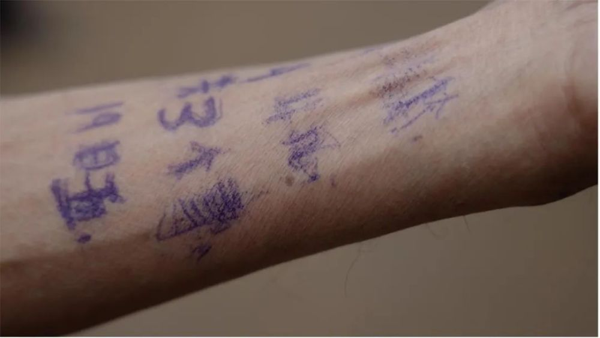
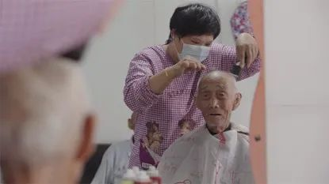
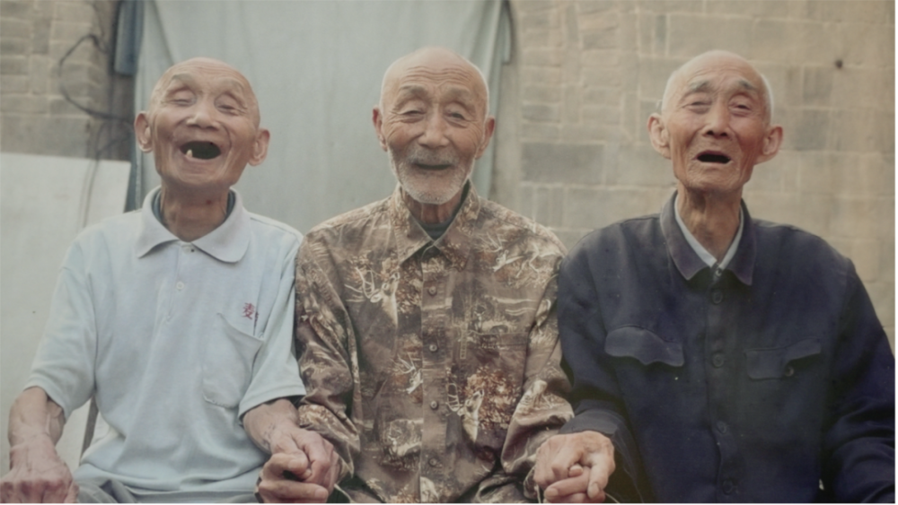

# “抱团养老”成趋势？7位老年独居女性买下7间房，共同生活相互照应

“你是怎么看待上了年纪这件事？”

“会感到排斥吗？还是感到寂寞呢？”

提问者是78 岁的村田幸子，她在日本 NHK
电视台当了几十年主播。她一生未婚，年轻时从未想过的“孤独死”问题，直到她渐渐老去，身体不再如从前一般健康，才摆在她的面前。

最终，她与几位同样独身的好友一起，招募到一共七位共同生活的老年独居女性，选择“抱团养老”。

她们的年龄从 71 岁到 83
岁不等，有的如村田幸子一般终身未婚，也有的曾经短暂踏入过婚姻，职业则分别有营销公关、公务人员、广告策划、新闻记者以及养老院经营者。

唯一的共同点则是： **“我们每一个人，都是一直奋战在工作第一线的女性。”**

她们并没有选择住在一起，而是购买了同一幢公寓的7个单间。她们各自独立生活，也可以一起分享闲暇时光。她们彼此拥有对方的房间钥匙。保证在突发事件发生时，可以第一时间赶到。

日本 NHK
电视台的纪录片《七位一起生活的单身女郎》记录下了她们十年间的故事，记录她们在“老去”这条路上经历的种种挑战，时间本身，是她们给予文章开头那个问题的答案。

在这个小团体成立初始，她们一起签署了一个协议，核心内容就是“自立与共生”。但随着团体成员进一步走向衰老，新的问题出现了，已经有成员因为患癌需要住院疗养而搬离了公寓，再也没有回到这个团体中来。

她们一起探讨了死亡，也尊重彼此对于衰老和死亡的态度。

纪录片不长，但她们的“抱团养老”生活还在继续，选择了常规观念之外的养老方式，她们的生活总会遇到新的难题，但什么是真正意义上的完美养老方式呢？

恐怕没人能给出答案。

在面对老去与死亡的考卷上，没有人能真正说出一句： **“我准备好了。”**

但这个问题许多时候，也比我们想象地更紧迫一些。

截至2022年底，我国60岁及以上非网民群体占非网民总体的比例为37.4%，较全国60岁及以上人口比例高出17.6个百分点。

第七次全国人口普查结果显示，我国60岁及以上人口占18.7%。预计“十四五”时期，我国60周岁及以上老年人口将超过3亿，占总人口比例将超过20%，我国将进入中度老龄化社会。

到 2035 年左右，我国 60 岁及以上老年人口将破 4 亿，占比超 30%。

照片里的三位老人，亦终身未婚，生活在河北省晋州市长召村。

如同麦地里长出的三株老树，三位“老光棍”组成了一个特殊的家庭。

事实上，这样的家庭在广袤的中国农村也并不罕见。

不同于《七位一起生活的单身女郎》，平均年龄 79 岁的他们是亲兄弟。尹国才，84岁，二叔尹国增，79岁，三叔尹国章，74岁。

村里人都知道，老尹家的哥三不是没过过好日子。幼时，三兄弟家境还算殷实，在父母的庇护下享了些福，

无奈命运多舛，和生活在那个年代的许多人一样，他们面对生活，充满不可逾越的无力感。

大叔、二叔年少离家，分别去了深圳和山西打工，大叔在深圳出了场车祸，撞聋了耳朵，撞瘸了腿，二叔去过的地方更多，他去山西盖过房子，去天津挖过海河，最后因为年纪失去工作，两人最终回了家乡，住进了父母留下的老宅里。

三叔留在父母身边。父母给他盖了房子，两年前的一场大雨，冲垮了小院。三叔无力修缮，也只得投靠了大叔和二叔，三兄弟聚在一个屋檐下过日子。

兄弟三人最后都没能讨上媳妇，一辈子也就过成了现在这样。

**“那时候年纪大了，老了。赶的时机不好，就不结了。穷，没钱。”** 二叔尹国增这样总结三人打了一辈子光棍的原因。

他是三人当中最勤快、也最能干的一个。

在这个特殊的家庭里，大叔和二叔搭伙吃饭，二叔是负责采购、做饭、打扫的那个，他悉心照顾着大叔的身体，从一日三餐的安排，到饭菜的软硬程度，都在二叔的心里装着。房屋虽然简陋，但至少看起来整洁。

三叔则单独起灶。大叔评价三叔是个“糊涂人，脑瓜子不好使”。三个人共同的记忆只存在于幼年。
**中间的青年与中年，仿佛从人生里被抹去了，只剩下一天一天需要努力活着的当下。**

每到赶集的日子，三叔会蹭哥哥们的电动三轮车去集上逛逛。三叔最常买的就是卷子和面条，因为他不会做饭，这是最容易糊口的食物。

怕忘记日子，他把重要的事都写在手臂上。虽然到了集上还是各买各的东西，“亲兄弟明算账”，但哥哥们还是会把电动三轮后排的宽敞位置空出来留给弟弟。

这样的日子好像平静的一湖水，偶尔也会被“外人”的举动泛起涟漪。

2022 年99公益日，1406767名爱心网友捐出2400万朵小红花，让关爱万名孤寡老人的“爷爷奶奶陪伴计划”公益项目落地。

尹家三兄弟也成为其中的受益者。

志愿者们带二叔和三叔去村里的理发店理了发，他们觉得：“他们仨也老了，也没有自己的子女，兄弟之间互相照顾吧，也没有仪式感什么的，咱们带他们整理整理仪态。”

于他们来说，这也是理发店开业十几年来的第一次踏足。

“好呀，好的不行了。”三叔兴奋地说。

理发后，二叔和三叔回家帮大叔洗了衣服，还收拾了院子，因为志愿们说，第二天会给他们拍摄一张全家福。

三兄弟平时很少照相，三人的合照更是不曾有过。

这一张全家福是人生的第一次，但愿不是人生的最后一次。

近日，腾讯公益推出了一系列关注孤寡老人的短片，讲述一个与“孤寡”完全对立的主题——老伴儿。尹家三兄弟的故事，正是这一系列的第一集。

在这个系列里，还记录了收养了 15 岁唐氏儿童的 60
岁老人、为照顾98岁母亲终身未娶的66岁老人、收养了一院子小动物的单身老人、免费为村里离世老人扎纸人的独居老人，和用移动 KTV
设备打造出小小流动舞台的文艺大爷。

《老伴儿》通过6位老人的真实故事，让我们看见中国农村里的孤寡老人，他们在晚年与各自的伴儿依偎前行。

在大世界中他们奋力守护着自己的小天地，他们不再与世隔绝，他们用个人的生命体验教会了我们如何面对世界。

**就如同其中一位老人所说的那样，只要在世上还有牵挂，那就不算一个人。**

**“勇气是面对知道需要害怕什么或者希望什么时体现的力量，而智慧是审慎的力量。”**

在《最好的告别：关于衰老与死亡，你必须知道的常识》一书里，美国波士顿的哈佛大学医学院外科教授、世界卫生组织（WHO）全球病患安全挑战项目负责人阿图·葛文德指出：“在年老和患病的时候，人至少需要两种勇气。第一种勇气是面对人终有一死的事实的勇气——寻思真正应该害怕什么、可以希望什么的勇气。但是更令人却步的是第二种勇气——依照我们发现的事实采取行动的勇气。”

总有人正年轻，但我们每个人终将老去。

“老去”离我们并不遥远，关注他们，也是关心我们的未来。

