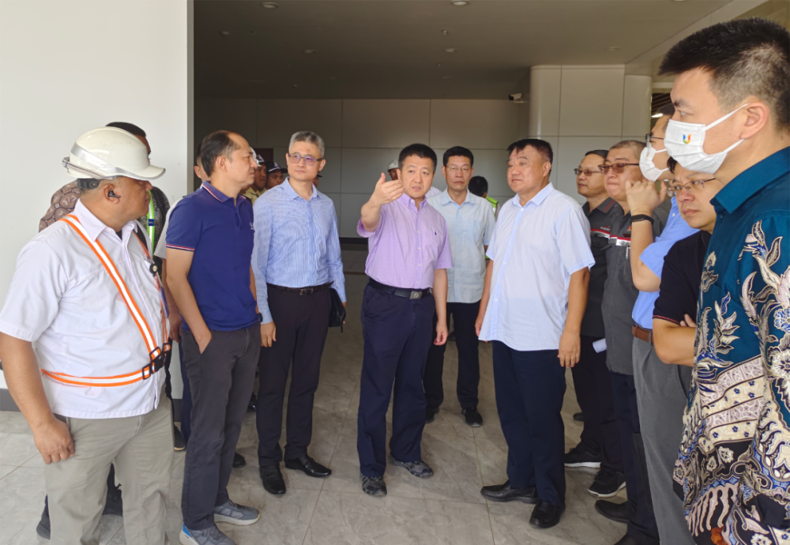

# 专访中国驻印尼大使陆慷：中印尼元首会晤，为何必谈雅万高铁

从2022年7月印尼总统佐科访华，到11月二十国集团（G20）峰会期间的习近平主席同佐科总统会晤，再到今年7月底佐科总统来成都出席第31届世界大学生夏季运动会开幕式并访华，一年时间里，中印尼两国元首举行了三次面对面的会晤。每一次会晤中，雅万高铁都是双方元首会谈到的一个重要话题。

由中印尼合作建设的这条高铁，连接起印尼首都雅加达和旅游名城万隆。这不仅是印尼的第一条高铁，也是中国和印尼在新时代合作的一个标志性项目，以及“一带一路”倡议提出十年来海外合作的一个旗舰项目。

自2022年2月出任中国驻印尼大使后，约一年半时间里，陆慷多次前往高铁建设的现场考察。今年8月初，在雅万高铁通车前夕，《中国新闻周刊》在雅加达的中国驻印尼大使馆对陆慷进行了专访。陆慷表示，雅万高铁项目建成的一个标志性意义，就是让印尼公众、社会真正感受中国速度，还有“一带一路”共商共建共享理念所带来的实际成果。

_陆慷接受本刊专访。摄影/本刊记者 李志全_

让印尼真正感受中国速度

**中国新闻周刊：雅万高铁即将通车，你不久前试乘过一次。作为中国驻印尼大使，你第一次乘坐中国和印尼合作的高铁，有什么不一样的体验和感受吗？**

**陆慷：** 雅万高铁已经成为中国和印尼在新时代合作的一个标志性项目，也是“一带一路”海外合作的一个旗舰项目。

一个多月前，佐科总统对中国进行了一年来的第二次访问，在成都同习近平主席进行了一年来的第三次面对面的会晤。在每一次两国元首会晤中，雅万高铁都会提到。在成都的会晤中，因为雅万高铁即将迎来顺利竣工、开通运营的关键节点，雅万高铁自然又成了一个重要话题。

6月22号，我同中国国铁集团的刘振芳董事长，以及印尼海洋与投资统筹部长卢胡特、交通部长布迪、西爪哇省省长利德万等印尼政府官员一同试乘雅万高铁。试乘期间，列车运行速度突破355公里/小时，达到当前世界高铁商业运行的最快速度。这在印尼甚至是东南亚、全球媒体上都引起广泛关注。

当时的体验，我总的感觉是跟在中国国内乘坐高铁没有什么太大的差别，都是非常安全、舒适、迅捷。过去，从雅加达到万隆一般需要三个半小时，现在一下子缩短为40多分钟。说到感受，可能要比在国内乘坐高铁多了一些，毕竟这是在国外第一次乘坐中国设计的、与印尼合作建造的高铁项目。我还特别感受到印尼朋友的兴奋之情，有人还把硬币放在小桌板上测试高铁的平稳性。在印尼的社交媒体上，当时有很多民众发布了他们在沿线拍摄的视频、照片，并发表评论，印尼社会也普遍对雅万高铁有了更多的期盼。

**中国新闻周刊：你出任中国驻印尼大使以来，大约一年半的时间里，多次前往雅万高铁的项目现场。对于中国和印尼来说，雅万高铁的建成通车是否都具有特殊的意义？**

**陆慷：**
今年是一个比较特殊的年份，是中印尼建立全面战略伙伴关系十周年，也是习近平主席提出“一带一路”、包括在雅加达提出21世纪海上丝绸之路十周年。这10年里，中印尼关系快速发展。有一个直观的数据，恰恰在这10年间，中国连续10年成为印尼的最大贸易伙伴。去年，中印尼贸易额达到1491亿美元，逼近1500亿美元。可以说，这样的发展速度是惊人的。

经贸之外，两国在政治、人文等各个领域的关系都取得了长足发展。

当然，大家比较关注的肯定是两国间的重大合作项目，包括刚才我们提到的雅万高铁项目。我个人感觉，雅万高铁项目的建成，有一个标志性的意义，就是让印尼公众、社会真正感受中国速度，还有“一带一路”共商共建共享理念所带来的实际成果。

雅万高铁建成以后，原本从雅加达到万隆的时间将会从三个半小时缩短到40分钟，这会对这两个印尼重要的经济枢纽带来人员、物资流通上的便利，减少时间成本，并会促进沿线经济的发展。

按照印尼方现在的测算，高铁建成后，直接增加的就业岗位将达到3万个。我觉得这还只是初步的数字，更重要的是雅万高铁投入运营后将形成新的经济增长点，所产生的经济规模效应更值得期待。

**中国新闻周刊：雅万高铁创下了很多“第一”，但换一个角度看，这也意味着会遭遇很多新的挑战。雅万高铁最终能克服重重挑战建成通车，对于中印尼合作，甚至是对于中国和东盟合作，有什么样的启示？**

**陆慷：**
首先说，这么大的一个合作项目，在过程中遇到这样那样的问题，毫不奇怪。更何况，这是中国高铁第一次全系统、全要素、全产业链在海外建设项目，全线采用中国技术、中国标准。但印尼的地质条件、气候条件还有国情民情跟国内差异非常大，再加上高铁跟普通铁路完全是两个概念，印尼社会需要一个过程去接受。过去三年里，新冠疫情还对人员的交往和物流都形成了很大干扰。所有这些，都会对工程建设、双方团队的合作带来困扰。

但从我去年到印尼后，约一年半的时间里，我所看到的是两国政府都有坚定的信心，一定要克服困难，精诚合作，把这个项目往前推进。我也看到，印尼社会对这个项目的支持度和热情越来越高。我更看到，两国建设团队始终能够团结合作，排除各种各样的干扰，坦率地讲，这甚至包括一些外部杂音的干扰。

说到这中间有什么可以在中印尼合作、中国和东盟甚至是更大范围合作中进行推广的经验，我觉得就是中方提出“一带一路”倡议之初的基本理念，也就是共商、共建、共享。“一带一路”要因地制宜，同各国的发展战略对接，形成共同发展的合力。从这个意义上来讲，雅万高铁实现了我们推进“一带一路”合作的宗旨。

**中国新闻周刊：雅万高铁建成通车会在印尼甚至是东盟地区形成示范效应吗？接下来中国高铁走出去的步伐，你觉得会加快吗？**

**陆慷：** “一带一路”建设都是基于不同国家、不同发展需求来进行的。有的地方可能适合建高铁，有的地方可能适合普通铁路。这个要因国而异，因地而异。

_9月1日，陆慷（中）对雅万高铁项目进行考察。供图/中国驻印尼大使馆_

用事实回击杂音

**中国新闻周刊：现在外界有一种担心，明年2月份印尼大选后雅万高铁后续的运维合作是否会面临变数？**

**陆慷：**
首先，大选本身是印尼的内政。但我也可以分享一个信息，佐科总统所领导的政府，在印尼各类民调中的支持度非常高，这就反映出佐科总统所奉行的致力于国家发展、改善民生的政策，还有积极寻求对外合作的政策，总体上是得到民众的认可和支持的。

我相信，任何负责任的政府，一定会把民众的福祉、国家的发展放在首位。我也相信，只要这个大方向是确定的，凡是有利于印尼发展、能给民众带来实实在在好处的的举措，会继续得到印尼社会的支持。

**中国新闻周刊：你在近期的一次演讲中提到，同一些西方国家相比，中国企业往往干得多、说得少。在这点上我们还需要更加努力。具体到雅万高铁的建设过程中，甚至是在印尼的中资企业，是否普遍面临着这样的问题？如何去提高，你有没有一些具体的建议？**

**陆慷：** 现在参与印尼发展的中资企业非常多，在同中资企业打交道的过程中，我也鼓励他们能够经常地跟公众、媒体、智库多沟通多接触。

中印尼之间现在开展了很多合作，经常会有一些杂音，炒作所谓的债务陷阱，还有环保问题，有些炒作是无中生有，有些是无限放大。用这些杂音来干扰中印尼之间的合作，这种情况是有的。

面对这样的情况，一个有效的办法就是通过跟媒体、公众的积极沟通，告诉公众真实的情况是什么，把事实披露出来。不仅是在雅万高铁项目上，在其他很多合作项目上，我们做了一些很好的尝试。

在中国驻印尼使馆的积极鼓励下，去年10月印度尼西亚中国商会总会发布了《2020-2022年印尼中资企业社会责任报告》，介绍了中资企业多年来在印尼的投资合作所带来的经济效益、社会效益，包括增加就业、新的经济增长点，包括从事的一些社会公益活动，内容详实，让关心中印尼合作的方方面面的人士了解到了更多真实的情况。

**中国新闻周刊：所以说，雅万高铁的价值，不仅是在推动经济和社会发展层面的，对于中国和印尼的人文交流，也是一个标志性工程？**

**陆慷：**
这是一个很好的话题。现在中印尼双方只要谈到合作，雅万高铁基本上是必谈的话题。很多人从这个项目中不仅看到了它所带来的经济社会效益，还看到了中国自身作为发展中国家按照中国式现代化的理念一步步发展成现在这样的一个大的经济体，同时中国也愿意通过共建“一带一路”等合作，向其他国家特别是发展中国家分享我们的发展成果，分享一些先进的发展理念，也增进了印尼民众对中国的认识。

**中国新闻周刊：我们这次在中资企业走访时还遇到了一个在中资企业工作的印尼年轻人，因为受到中国社交媒体的启发，看好在印尼进行直播带货的机遇，计划去创业。你怎么看印尼年轻人这样的改变？**

**陆慷：**
我到印尼这一年半来，能直观地感受到电子商务、数字经济在印尼发展得非常快。印尼在推动工业化和城镇化发展的同时，也致力于在发展数字化经济、推动产业数字化转型方面追赶世界的先进的水平，呈现出勃勃生机，也给中国企业在这些领域同印尼展开合作提供了巨大潜力。

印尼是一个人口众多的国家，有2亿7000多万人口，而且年轻化程度非常高，平均年龄是29.7岁，不到30岁，电子商务和数字经济的市场前景是非常广阔的。

亚洲人更加懂得亚洲

**中国新闻周刊：今年刚好是中印尼全面战略伙伴关系的10周年，雅万高铁通车是否意味着中印尼合作进入一个新阶段？**

**陆慷：** 应当说经过10年的发展，中印尼的双边关系总体上已经迈上一个新台阶。

去年7月，即便是在疫情防控的背景下，佐科总统应习近平主席邀请对中国进行访问，当时两国元首达成了一个重要共识，就是要共同努力建设中印尼命运共同体，为两国关系的高水平发展谋划新蓝图。

对于中印尼合作，过去大家更多关注的是一些基础设施领域的合作、贸易额的增长，但现在，正如习近平主席在成都会见佐科总统时候所提到的，在新能源汽车、智慧城市等领域，中国和印尼也都开展了合作。这些也符合中方所提出的将继续致力于通过更高水平开放推动“一带一路”更高质量发展的方向。

**中国新闻周刊：如果说雅万高铁是中印尼合作的一个样板工程，是否可以说，中印尼合作对于中国-东盟合作来说也是一种样板式的合作？**

**陆慷：**
在东盟国家中，印尼是块头比较大的，影响也比较大。中印尼之间一些重大合作所产生的积极成效，会让其他国家从中借鉴一些有益的经验。“一带一路”合作本身就不是要另起炉灶，而是从一开始就明确是同各国的发展战略进行因地制宜的对接。所以，中国同其他国家开展合作，从根本上来说还是要看对象国自身的需求，会采取符合其国情的方式。

**中国新闻周刊：印尼对于亚洲世纪的前景是不是格外看好？**

**陆慷：**
印尼国防部长普拉博沃去年在香格里拉对话会上有一场很受关注的讲话，强调了亚洲人实际上更加懂得亚洲，亚洲人更加在乎亚洲的和平、稳定和发展，应以“亚洲方式”解决国与国之间分歧。我相信这反映了很多印尼人的想法。

**中国新闻周刊：我们经常说，让其他国家分享中国发展的红利。换一个角度来说，印尼目前的发展又会给中国提供什么样的红利？**

**陆慷：**
中国必然走开放发展的道路，按照中央所提出的将在两个循环中实现高质量的发展。对印尼来说，他们在对外贸易、外部投资方面的需求是非常旺盛的。我的感觉是，在很多领域和产业的合作上，中国和印尼现在已经成了高度紧密联系的经济联合体。

从更大的范围来说，在过去的10年乃至20年的时间里，中国和包括印尼在内的东盟国家达成了自贸协定，后面又升级成了2.0版的自贸协定。可以说，包括印尼在内，东盟国家与中国之间的经贸联系已经密不可分。RCEP（区域全面经济伙伴关系协定）的达成和实施，实际上又为中国同东盟国家发展范围更广的经贸合作提供了动力。

很多人都不买“去风险”的账

**中国新闻周刊：中国和印尼作为地区甚至全球性的大国，难免也有分歧，包括在南海议题上。但近些年，很少能看到双方矛盾激化的情况。双方如何有效管控这样的分歧？这方面有没有一些值得其他东盟国家借鉴的地方？**

**陆慷：** 任何国家之间，即便是好朋友之间，有不同的看法、有分歧是很正常的，关键就是能够知道如何正确的处理国与国之间的关系。

从中方来说，我们一直主张是建立一个新型的国际关系，要建立在相互尊重、平等互利、合作共赢的基础之上。从印尼方来说，印尼是一个有重要影响的区域大国甚至是世界大国，印尼更加看重的是它独立自主的外交政策，不会因一些外来因素的干扰就发生转变。

在我看来，如果说有什么经验可以借鉴，对所有其他国家来说，可以借鉴的一个重要经验就是，一定要坚持采取符合本国人民利益、符合本地区和平稳定和发展利益的思路来处理国与国之间关系，包括妥善地处理双方可能存在的一些分歧。

**中国新闻周刊：你刚才提到外部干扰，现在在西方比较流行一种“去风险”的话语。在你和印尼同行的沟通过程当中，也会经常来聊到这样一个话题吗？他们是持什么样的态度？**

**陆慷：**
我可以负责任地说，不管是印尼政府官员还是经济界、学术界人士，很多人都清楚，一些国家所称的“去风险”无非就是想“去中国化”。这样的概念，或者说这样的一个幌子，即便是在一些美欧西方国家，实际上也遭到了质疑和反对。原因很明显，这种说辞背后的一个基本思路就是逼迫选边站队。要割裂在全球化中形成的相互联系、相互合作的模式，这不符合各个经济体的利益，尤其不符合很多国力还有所欠缺的不发达经济体的利益。

在印尼，我所感受到的是，很多人根本不买这样的账，不认同这样的理念，反对搞小院高墙，反对搞选边站队。他们这方面的意志是非常坚定的。

**中国新闻周刊：从中国、印尼发展的特点来说，是不是双方会存在比较多的共通性？**

**陆慷：**
客观上，中印尼两国都是发展中国家，而且是重要的发展中国家，也是重要的新兴经济体。两国也有着非常相似的历史经验，在发展阶段上来说，现在双方也有加强合作、共同发展的需求。

主观上，两国现在在国际事务中秉持着相近的一些理念，比如说都奉行独立自主的外交政策，都致力于本地区乃至更大范围内的世界和平、稳定、合作、发展，都主张多边主义，反对搞排他性安排甚至是逼迫各个国家选边站队等不利于国际合作的做法，都致力于推进全球化向着更加公正、平衡、可持续、包容的方向发展。

从我出任中国驻印尼大使以来这一年半时间里，我能深深地感受到，在各个领域，这些主观和客观层面的多重因素是两国合作能够很好地向前推进的重要保障。

**中国新闻周刊：今年是“一带一路”倡议提出十周年，中国也将举办第三届“一带一路”国际合作高峰论坛。你怎么看“一带一路”倡议十年来取得的成果，还有共商共建共享理念对于当今世界的价值？**

**陆慷：** 我相信这个理念会一直持续的贯穿下去的。这也是为什么10年来“一带一路”建设能够不断蓬勃发展，赢得越来越多合作伙伴的关键原因。

到今年年中，已经有150多个“一带一路”倡议的参与国，有30多个国际组织参与，达成了200多份合作文件。据世界银行估计，到2030年，“一带一路”合作能够使700多万人摆脱绝对贫困，3000多万人摆脱中度贫困。

我相信，只要本着秉持公正客观的态度，所有人都会承认“一带一路”的成果和利好，也都会积极推动“一带一路”建设更好地向前发展。今年将召开第三届“一带一路”国际合作高峰论坛，我相信，在新的形势下，在总结过去10年经验的基础上，“一带一路”会沿着高质量发展的路径向前推进。

**中国新闻周刊：第三届“一带一路”国际合作高峰论坛即将举办，中印尼合作又会迎来一个“高峰时刻”吗？**

**陆慷：**
中印尼之间任何一次高层交往和两国之间重要合作的过程中，我们都会看到会产生一些具体的成果。作为中国驻印尼大使，我当然期待着在接下来的重大活动中，会出现更多实实在在的合作成果。

记者：徐方清 李志全

