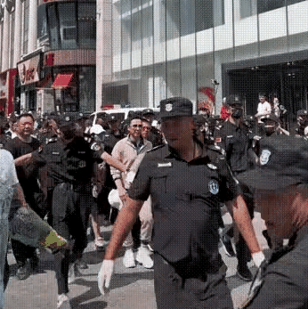
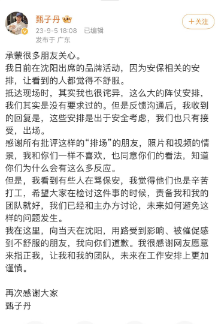

# 刚刚，甄子丹道歉

近日，60岁甄子丹现身沈阳参加品牌活动，被众多安保人员成群结队护着前行，安保人员还高声呵斥围观者，引发争议，不少网友吐槽排场太大。

今天傍晚，他发文回应此事，表示“这么大的阵仗安排，我们其实是没有要求过的”，主办方告诉他，这些安排是出于安全考虑，“我们也只有接受，出场”。

甄子丹还表示，不希望网友指责保安：“我觉得他们也是辛苦打工”，“责备我和我的团队就好。”他向受到影响的朋友道歉，并感谢网友的指正。

来源：橙柿互动

