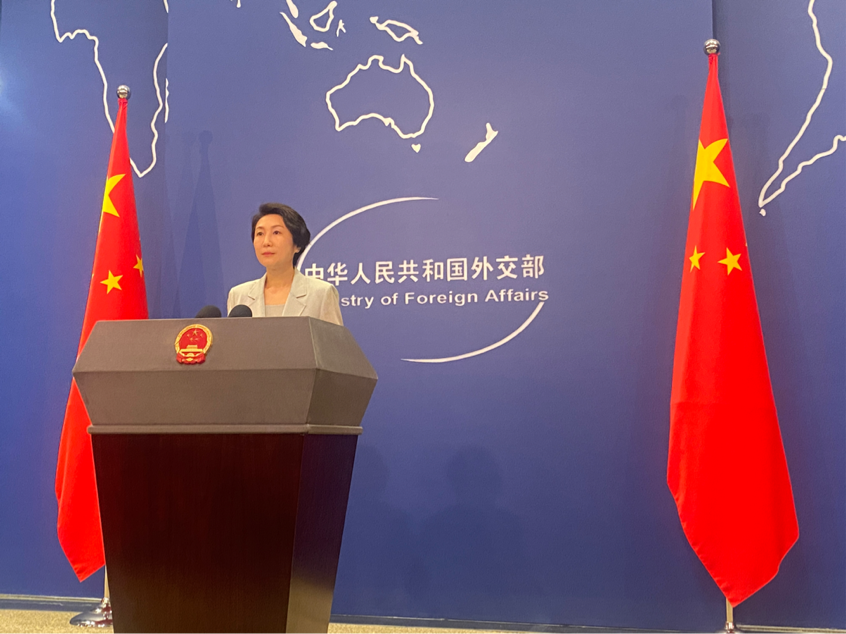
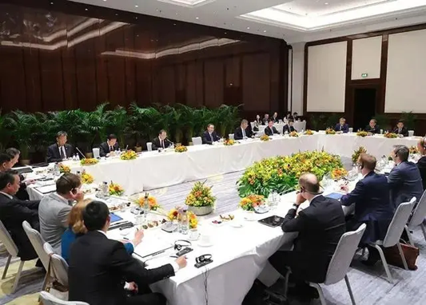
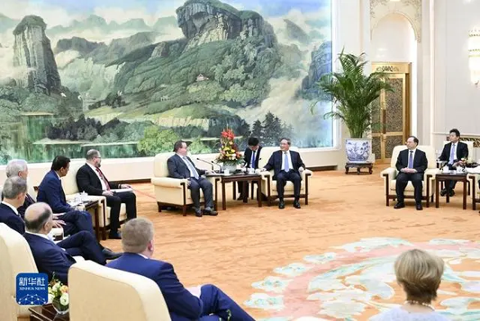
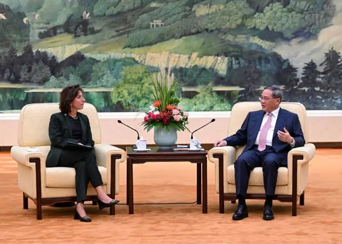

# 外交部官宣李强总理出席G20，外媒最关注这些问题

9月4日的外交部例行记者会上，发言人毛宁官宣了李强总理将于9月9日至10日出席在印度首都新德里举行的二十国集团领导人第十八次峰会，引发现场中外媒体的共同关注。

发言人表示，G20是国际经济合作的主要论坛，中方对此高度重视，期待通过峰会就此凝聚共识，“对外传递信心，共促繁荣发展”。

当前世界经济下行压力加大，各国对于合力应对国际经济和发展领域突出挑战都有自己的考量，外界也很关心中国会聚焦哪些议题，并在此次G20峰会上扮演怎样的角色。

**中国迎来“外交热” 为经济发展“穿针引线”**

其实梳理时间线不难看出，近来李强总理“行程满满”，出访和会见了不少商贸界人士。有分析认为，中国这一轮“外交热”，都是为了“稳”字当头谋发展。

6月18日至23日，李强总理对德国进行正式访问并参与第七轮中德政府磋商，以及对法国进行正式访问并出席新全球融资契约峰会。李强在柏林同德国工商界代表座谈交流时指出，“防风险”和“合作”不是对立的，“不合作才是最大的风险，不发展才是最大的不安全”。

8月21日，李强在北京会见美中贸易全国委员会成立50周年访华团。李强指出，中国开放的大门只会越开越大，将持续扩大市场准入，落实好外资企业国民待遇。

8月29日，在与美国商务部长雷蒙多的会见中，李强再次指出，中美经贸关系的本质是互利共赢。

9月1日，李强在人民大会堂会见国际货币基金组织总裁格奥尔基耶娃。李强表示，我们将进一步强化政策协同，促进经济增长，同时坚持改革开放不动摇，优化民营企业发展环境，推动外贸稳规模优结构，更大力度吸引和利用外资。格奥尔基耶娃则强调，中国经济对世界经济增长的贡献率达三分之一。

值得注意的是，在这一系列外交行程中，“合作开放”频频出现，这意味着什么？这四个字又是否会延续到即将到来的G20峰会上，成为中方的关键词？

中国社会科学院亚太与全球战略研究院副研究员孙西辉告诉直新闻，“稳字当头，稳中求进，推动经济运行整体向好”是这一届中央政府的一个施政方略，其中特别强调“稳增长”“稳物价”“稳就业”等这些信号，从李强总理的一系列外事活动中，也能够清晰的反映出这一方面的动向。

“所以我们在G20峰会上关注的议题，不外乎就是加强与各国的经贸、金融等领域的合作，同时跳出以往传统的贸易和投资，结合当前的一些新特点，比如说强调环保绿色发展，为了应对气候变化进行融资，强调实现和推动全球的可持续发展等等。”

某种意义上，这也与此前印度方面的表态不谋而合。印度方面称，希望G20把关注的焦点放置于绿色发展、环保生活方式、数字化转型，具有包容性和弹性的经济增长。

有分析认为，从李强总理近期一系列的外事活动，到出席G20峰会，都在为中国经济贸易发展争取更多的机会，注入了新的动力，起到“穿针引线”的作用，同时也有力回击了近期西方媒体唱衰中国经济的论调。

**印度计划邀请非盟成为G20正式成员国**

G20峰会在即，印度想拉非盟“入伙”，也成为备受关注的话题。

实际上去年12月1日，印度开始担任G20轮值主席国当天，总理莫迪就发表长文明确“发展中国家将成为关注重点”。莫迪上周末接受媒体采访时再次称非洲是印度在G20中考虑的“首要优先项”。

他提到了印度与非洲的文化纽带、在反殖民上的共同经历，强调只有所有力量都加入才能推动全球发展。去年12月，美国总统拜登在华盛顿主办的美国-
非洲峰会上也表示，美国支持非洲联盟在G20获得永久成员地位。

对此，中国也持支持态度，事实上中国正是第一个提出该议题的国家，早在5年前，中国外交部长王毅就在中非合作论坛上对非盟加入G20国家表示了支持。

此后中方也持续支持非盟加入G20。2022年11月15日，习近平主席在G20领导人第十七次峰会中提出，中方支持非洲联盟加入二十国集团。非盟轮值主席、塞内加尔总统萨勒表示，感谢中方为塞方和非洲国家提供的宝贵帮助，并第一个公开支持非盟加入二十国集团倡议。

回顾过去，习近平主席多次向非盟峰会致贺电，多次会见非盟领导人，在长期交往互动中，双方建立了一系列代表性机制，包括2008年建立的中国-
非盟战略对话机制、2015年成立的中国驻非盟使团、2018年成立的非盟驻华代表处等。

中国还任命政府特使出席非盟首脑会议，了解非盟及非洲各国重点关注议题，推动中非在重大国际和地区问题上的合作。

例如在中非保持传统合作的基建设施方面，2012年，中非盟共建“非洲跨国跨区域基础设施建设合作伙伴关系”；随后，在双方推动下，非盟会议中心、非盟总部综合服务中心等设施建成，亚吉铁路、肯尼亚内马铁路一期等一大批改善非洲交通基础设施的旗舰项目顺利完工。

2021年12月，中国与非盟签署共建“一带一路”合作工作协调机制的谅解备忘录，中非盟共建“一带一路”进入了实施落地的新阶段。

而在公共卫生合作上，2014年，中国向非盟提供大批物资用于抗击埃博拉病毒。2015年10月，中国明确提出支持非盟及各个非洲国家建立健全疾病预防控制体系。

非盟委员会主席法基高度评价中非合作成果，表示“中国已经赢得了非洲人民的心，非洲人民不会忘记”。

**美印拉拢非盟，或动机不纯**

据尼日利亚《每日信报》9月3日报道，应印度总理莫迪的邀请，尼日利亚总统提努布将在当地时间4日启程前往印度，出席G20领导人峰会。尼日利亚正在考虑申请加入G20，并在磋商后作出决定。

有分析认为，印度希望通过G20成为“全球南方”领头羊。

孙西辉表示，自冷战时期开始，印度就以第三世界领导者的身份自居，到现在为止依然如此，非盟是典型的发展中国家的代表，国家数量多、人口多。但值得注意的是，印度邀请非盟参加G20峰会，“不代表着新德里就把重心放在发展中国家上，也有可能是想以此拉拢更多的发展中国家来支持印度，保障它所谓‘发展中国家领导者’这种地位”。

而从美国的角度来看，拜登政府之所以突然唱高调支持非盟加入G20，也是某种程度上基于国际博弈的考量，希望拉拢非洲等发展中国家，从而“削弱对手在国际社会的合作空间”。

作者丨丁舒航，深圳卫视直新闻驻京记者

