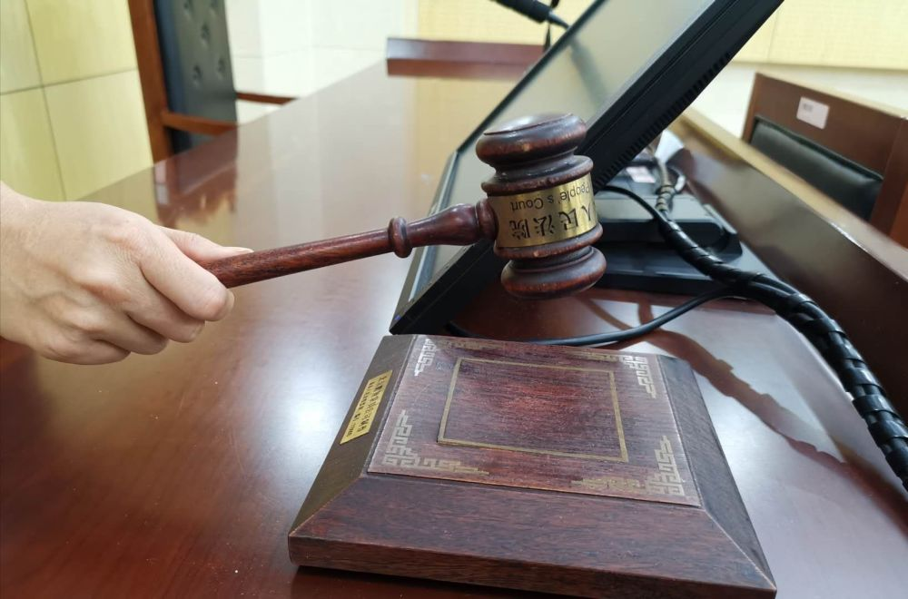

# 女子花80多万接受“血液净化”后不适，发现机构无资质，起诉要求退款

据上海一中院消息，近日，上海市第一中级人民法院审结一起纠纷上诉案，最终认定消费者与医疗美容机构签订的涉及“血液净化”医疗服务合同无效，维持一审判决，该机构三位股东应根据出资范围各自返还张女士治疗款16万元、12.5万元、21.5万元。

**女子“血液净化”后身体不适**

2017年7月，张女士参加了秀丽医疗美容（以下简称秀丽医美）主办的讲座，讲座上“专家”介绍称，秀丽医美的“血能动力疗程”，可通过专业机器设备将治疗者血液导出至仪器设备中“净化”“排毒”，再导回至身体中，以达到美容养颜的功效，且有利于恢复重要器官功能。工作人员还现场展示了通过“净化”血液排出的脏物质。

张女士非常心动，几经考虑，请秀丽医美为她“量身打造”了主打“血液净化”的“血能动力疗程方案”，包括血能靶向治疗、血能动力激活、肠道毒素清理等项目。后秀丽医美又向张女士提供了治疗时间安排表。张女士在确认方案后，分数次向秀丽医美转账共计84.2万余元。

2017年7月至2018年10月期间，张女士多次在秀丽医美法定代表人和业务员的陪伴下接受治疗。然而张女士在做完全部的“血能动力疗程”后，身体状况并没有“好转”和“变轻松”，反而出现了全身乏力、双眼红肿、精神萎靡等状况。无奈之下，张女士只得又前往正规医院进行一年多的治疗和调理，身体才逐渐恢复。

**发现机构无资质 起诉要求退还其全部治疗款**

张女士十分气愤，觉得自己不光耗费精力，巨额治疗款也打了水漂。她了解发现，2005年发布的《卫生部关于加强“血液疗法”管理的通知》（以下简称《卫生部通知》）中称，对于既无基础研究结论，又未经过临床研究的“血液疗法”，一律停止临床应用。张女士又进一步咨询上海某区卫健委，该机构书信答复张女士：秀丽医美并未向有关行政部门申请“血液疗法”的备案或者审批。

张女士由此认为，自己被实施的“血能动力疗程”是未经审批的违法项目。因原秀丽医美已经注销，张女士便将三位股东告上法庭，请求确认其与秀丽医美签订的医疗服务合同无效，三位股东退还其全部治疗款84.2万余元。

**法院：合同无效 三位股东根据出资范围各自返还**

一审法院经审理后认为，张女士与秀丽医美确实存在医疗服务合同关系。从“血能动力治疗方案”及治疗时间安排表中的内容来看，张女士所受的治疗显然属于“血液疗法”的内容，而秀丽医美却并无相关资质。根据转账记录显示张女士向秀丽医美转账共计84.2万余元，其中包括肠道毒素清理和皮肤系统排毒7.92万元，这两个项目张女士未能提供证据证明违反卫生行政部门规定，所以相应项目费用应酌情予以扣除。

一审法院判决，张女士与秀丽医美之间的医疗服务合同无效，秀丽医美应返还张女士76.2万余元，但因秀丽医美已注销，故由三位股东根据出资范围各自返还张女士16万元、12.5万元、21.5万元。

原秀丽医美三位股东不服，认为“血能动力疗程”并未直接对血液进行处理，并非“血液疗法”，也不应当参考《卫生部通知》，遂上诉至上海一中院。

上海一中院经审理后认为本案争议焦点为案涉医疗服务合同的效力如何认定。本案中，结合案涉血能动力治疗方案、治疗时间安排表中的内容来看，“血能动力疗程”包含血能靶向治疗、血能动力激活、血液循环细胞等内容。据张女士的陈述，这些内容均涉及将血液抽出来进行过滤以及向静脉血液滴注不明的液体等操作，三位股东曾在庭审中表示对张女士陈述的上述治疗过程无异议。而这些内容涉及对血液的处理，属于《卫生部通知》规定的通过采集患者血液，进行“净化”等处理，对患者进行“血液疗法”。

由于三位股东未能提供证据证明原秀丽医美以及实际提供案涉医疗服务的医疗机构已取得“血液疗法”的审批资格，涉案合同中关于“血液疗法”的诊疗内容应属无效。秀丽医美为获取利润违规执业，危害不特定消费者的健康权益，主观过错明显，应承担合同无效后款项返还责任。

最终，上海一中院驳回上诉，维持原判。

（北京青年报记者 李铁柱）

