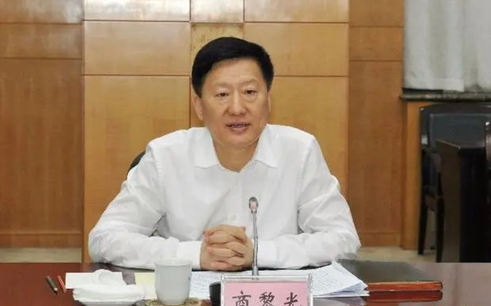

# 山西省委副书记商黎光被查！3天前还在参加会议

9月5日，中央纪委国家监委网站发布消息：山西省委副书记商黎光涉嫌严重违纪违法，目前正接受中央纪委国家监委纪律审查和监察调查。

**商黎光简历**

商黎光，男，汉族，1963年11月生，河北巨鹿人，1984年6月加入中国共产党，1981年9月参加工作，中央党校研究生院在职研究生班法学专业毕业，中央党校在职研究生学历，新加坡南洋理工大学高级管理人员工商管理硕士学位。

据山西新闻联播报道， 9月2日，第6期“三晋大讲堂”在太原举行。省委书记蓝佛安、省政协主席吴存荣、省委副书记 **商黎光** 出席。

来源：中央纪委国家监委网站、山西新闻联播报道

编辑：刘玉红

