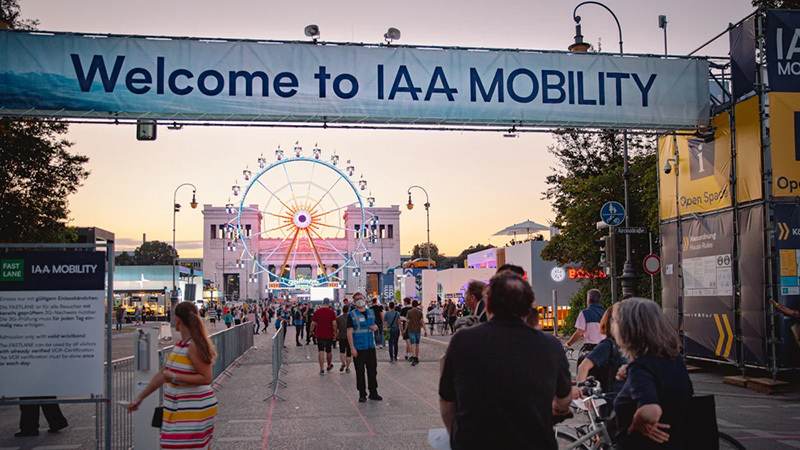
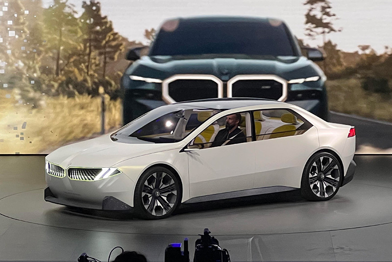
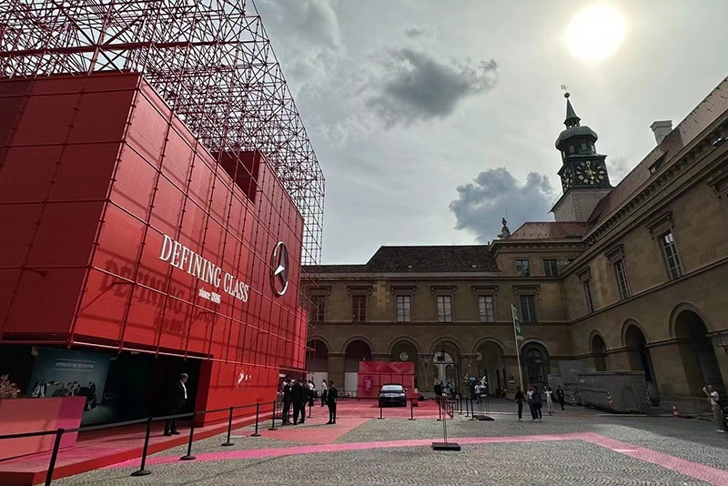
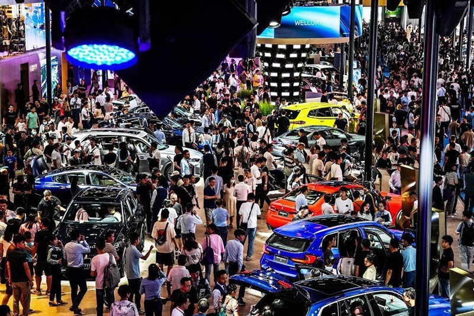

# 慕尼黑车展上演最强中国阵容，宝马奔驰们真急了，喊出“二次创业”

腾讯新闻《远光灯》 作者 刘坎顺

如果说2023上海车展是“国货之光”的高光时刻，那么紧随其后的成都车展则是中国汽车智能化转型的再加速，而在9月初的欧洲大陆，一场“不服输”的重大全球性车展——慕尼黑车展也因为中国车企组团亮相同样火爆了起来。

于当地时间9月4日开幕的2023慕尼黑车展（IAA MOBILITY
2023），是欧洲市场在今年内最重大的一场全球性车展。之所以会“异常火爆”，是因为慕尼黑车展的前身正是大名鼎鼎的法兰克福车展，其由德国汽车工业协会主办，曾经是两年一度、固定在德国的法兰克福举办，但从2021年起，主办地点改至慕尼黑，车展的名字也随之更变为了IAA
Mobility。

其实可以把2023慕尼黑车展看作是2023上海车展相互竞争的对象，这里有一些相似，也有一些区别。相似的是中国车企也在“包机”去德国积极参展，但本质的区别在于，中国车企赴德是想“占领”欧洲新能源车市场。

这点从今年中国企业参加慕尼黑车展的数量上就能看出——相比上一届翻了两倍，也称得上是历史上最强参展IAA的中国阵容。据官方参展商资料显示，在700多家参展商中，中国汽车产业出海企业大概50多家。

**“第二次创业”？宝马奔驰们急了**

整车企业方面，比亚迪、零跑、小鹏、阿维塔、东风风行、上汽等汽车企业构成了中国车主力阵容。而供应链方面，则有宁德时代、孚能科技、黑芝麻智能、地平线。另外，还有像亿咖通、轻舟智航等智能化解决方案的供应商也在积极参展。

这无疑给德系本土的车企和供应商们带来了巨大的压力。首先倍感危机的是德系豪华品牌——宝马和奔驰，其中BMW提前在9月2日便发布了全新电动MINI
Cooper和电动MINI
COUNTRYMAN，不仅带来了全新设计、全新智能交互、全新数字化体验，同时还表示MINI将更专注于电动化，2025年实现50%电动化，2030年实现100%电动化。

随后在慕尼黑车展开幕前夕，BMW又全球首发了宝马新世代概念车，并表示这将是新一代电动车平台车型的预演，2025年将量产，先期将投产一款轿车和一款SUV车型，量产版的新世代车型也将于2026年在中国国产，以及后续还将基于宝马新电动车平台陆续推出6款新车型等。甚至在发布会现场，BMW在大量宣布最新的技术之外，还提到这将是宝马的“第二次创业”。

而奔驰也将发布旗下全新入门级豪华概念车奔驰CLA，并表示，这款奔驰CLA概念车是基于全新的MMA平台打造，并会使用MB.OS操作系统，全面打通车辆功能，将信息娱乐、智能驾驶辅助以及自动驾驶辅助功能推向新高度，并将会重新定义奔驰的电动车。

与此同时，大众集团也发布了ID.
GTI概念车，新车首次将GTI系列带入电动出行时代，并基于MEB平台大众ID.2all概念车打造，量产版计划将于2027年上市。

关注汽车行业的人对今年4月上海车展的“盛世”时刻还记忆犹新：3000多名外国人“打飞的”集聚上海，其中以德国车企最下血本。大众集团不仅包下两架飞机，同时还将集团及大众汽车品牌、奥迪、保时捷的董事会成员一并带了过来；梅赛德斯-
奔驰则从德国带来了近300人的团队前来参展，而宝马则包机拉来了近半数的集团董事会成员了解电气化的变革。

彼时，行业内的共识是，中国汽车智能化转型的再加速，已经威胁到了欧洲的车企“豪强”们。

如今，这些德系“豪强”们在经历过4月上海车展后，便迫不及待的对自家产品、平台、智能化等多方面进行提速，否则未来不仅难以在中国市场上再续曾经的辉煌，甚至连自家的欧洲市场都会沦陷。毕竟，中国已经成为了世界第二大汽车出口国，有数据显示，中国汽车出口总量在2022年突破300万辆大关，其中，2022年欧洲销售的电动汽车中，有16%是从中国进口。

国内乘联会的最新数据则表示，在2023年上半年，中国对欧洲汽车出口量占中国整车出口总量的比重从2018年的5.7%升至39.1%。面向2030年，盖世汽车研究院预测认为，中国出口欧洲市场汽车有望提升至264万辆，年复合增长率22%。相信这些数据对于欧洲车企来说，就是无形的压力。

**核心是卖车！中国车企也有近虑**

不过历经上海车展“狂欢”之后，尽管在慕尼黑车展继续给宝马奔驰一众大佬们施压，但国内各大车企依旧摆脱不了为卖车发愁。因此在迎接车市传统“金九银十”销售旺季之时，此前本来就以“高销量”特点荣升为A级车展的成都汽车展览会，便成为了各大车企忙于冲刺全年销量目标的主战场。

成都车展在去年由于疫情缘故举办过“寿命最短”的一届之后，再到今年的第二十六届汽车展览会，从行业定义的车展属性上就已经发生了变化。以往车企参展还是非常重视新技术、全新车型和新战略的发布，但近2年来，明显感觉到车企实则在参“展”，但已经更侧重“销”了。这也让成都车展逐渐回归到了地方车展独有的特点——“促销大卖场”。

从行业定义的车展属性来看，一方面，2023成都车展在开幕首日（媒体日），共129个品牌、近1600辆展车参展，但相比去年的首发车型减少了24款，发布会也减少6场。重磅新车和发布会同步的减少，基本可以表明2023成都车展在车企眼中的重要程度有所降低。

再从成都车展现场来看，最直观的就是展馆外以往大幅的车企宣传海报几乎不见踪影，相反馆内询问是否买车的销售人员更多了。据一位豪华品牌销售人员表示，往年成都车展，展馆外都会有不少品牌悬挂巨幅广告，但今年这些宣传广告基本没有了，因为车企想将更多精力放在卖车上，这点也更加务实。

在媒体日当天，腾讯新闻《远光灯》观察后发现，无论是不愁卖的比亚迪，还是丰田、本田等合资品牌，或是沃尔沃、凯迪拉克等豪华品牌，销售人员均在卖力寻找潜在购车客户。更有销售人员在隔壁展台前的通道上，甚至在展馆主通道上，便开始询问参观者是否愿意来自家展台看看，“抢客”大战时刻在上演。

一位合资销售人员表示，尽管当天是媒体日，但销售主管还是要求我们不能放过任何一个机会，每个人都可能是潜在客户。

同时，车企在“销售”力度方面还是诚意十足。部分车型的限时综合优惠高达数万元，甚至有些豪华品牌在享受较大折扣的同时，还能洽谈更多优惠。另外，还有些刚上市的新车，相比老款就已经自降了售价，在当期内购车还可享受其它优惠等等。

纵观以上，2023成都车展之所以会上演车企“抢单”的原因，来自不减的车市压力。有数据显示，在今年上半年，国内汽车市场累计产销分别为1324.8万辆和1323.9万辆，同比分别增长9.3%和9.8%。虽然整体销量增长，但据统计，20家A股和港股整车上市汽车公司半年报中，12家企业营业收入下滑。

而终端市场的情况就更不乐观了。有数据统计表明，今年上半年，完成销量目标的经销商占比仅为24.9%，43.1%的汽车经销商半年销量任务完成率不足80%。值得一提的是，今年上半年经销商亏损比例为50.3%、盈利比例为35.2%、持平比例为14.5%。而去年同期，经销商亏损比例为45.2%，2021年则为17.5%。

其实从今年8月开始，就已经有不少车企开始再次推出促销政策来刺激市场销量了。而在此之前，乘用车市场信息联席会秘书长崔东树也表示过，在今年内车市促销的现象仍将持续存在。

再回到2023慕尼黑车展的中国整车企业方面，尽管国内销量之王的比亚迪只是展出了6款已在国内销售的车型，还包括了豪华子品牌的腾势D9，但像新势力造车的零跑汽车，其内部代号为B11的中大型SUV，以及阿维塔的第二款新车阿维塔12均选择了在欧洲首发，这不仅给欧洲车企成功制造了焦虑，更重要是提升国内品牌车型的知名度，为摆脱内卷压力、出海扩大市场做足准备。

总之，2023年的下半场才刚刚开始，尽管成都车展回归到了“大卖场”的事实，但至少从新车型上能看到中国汽车智能化转型的再加速。同时，欧洲的慕尼黑车展也展示出了德国车的“反击”，至少豪华品牌都是在玩真的。那么，在接下来11月的广州车展，期待中国车企还能给我们带来更多新颖的技术和超前的表现。

